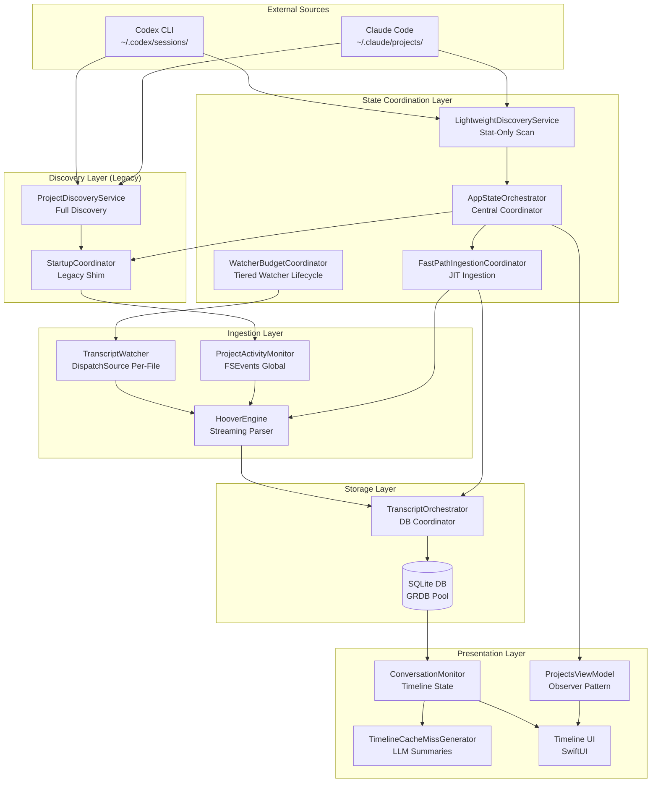
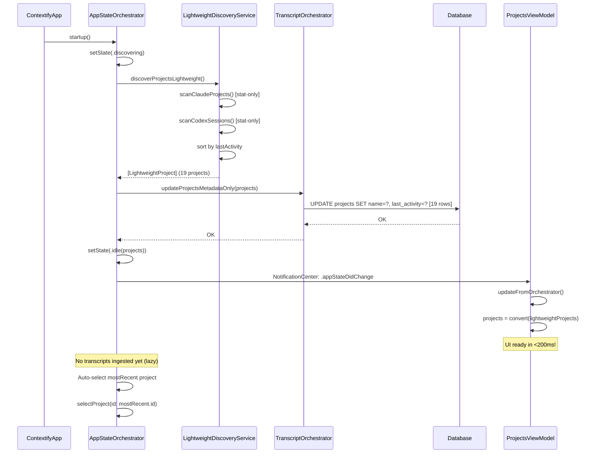
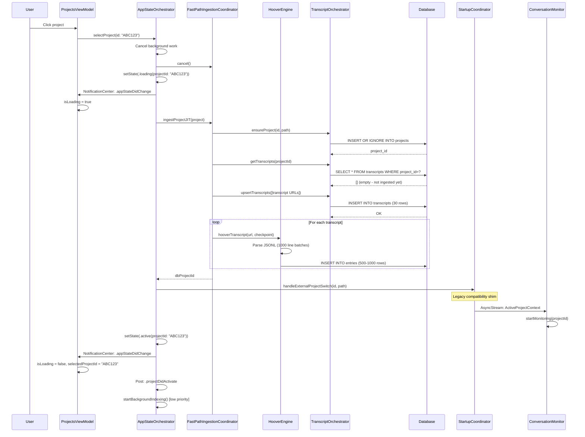
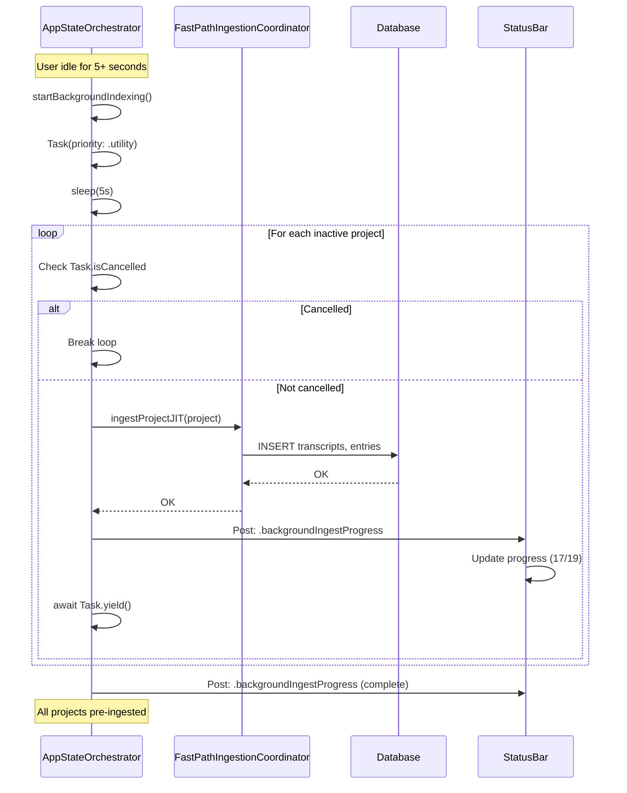
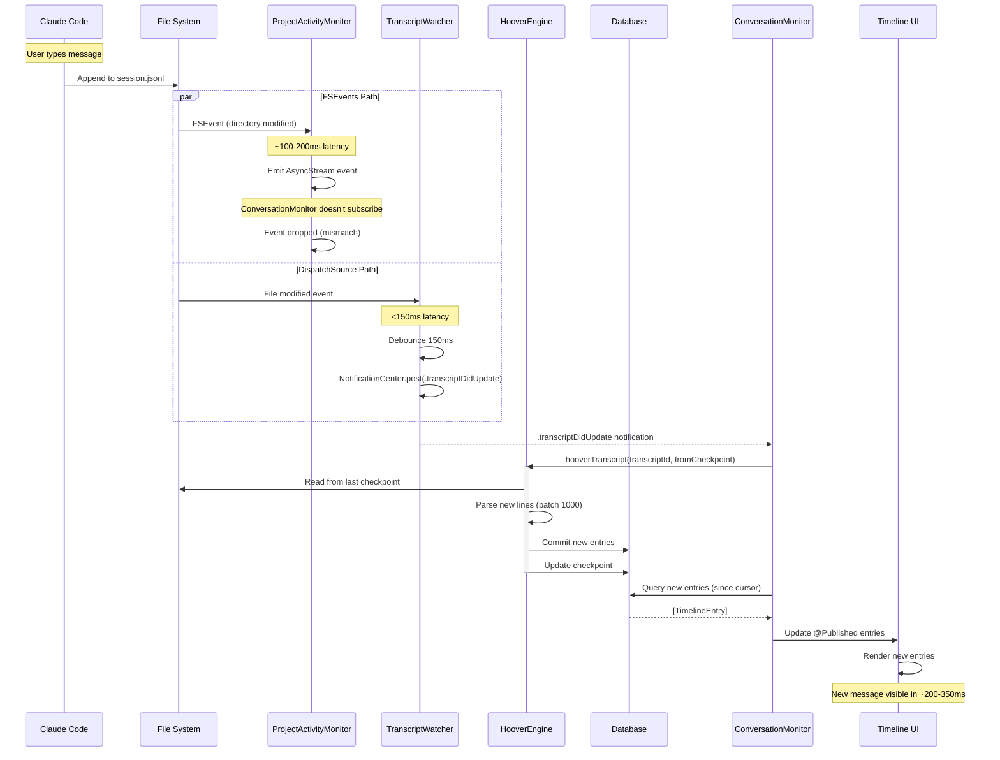
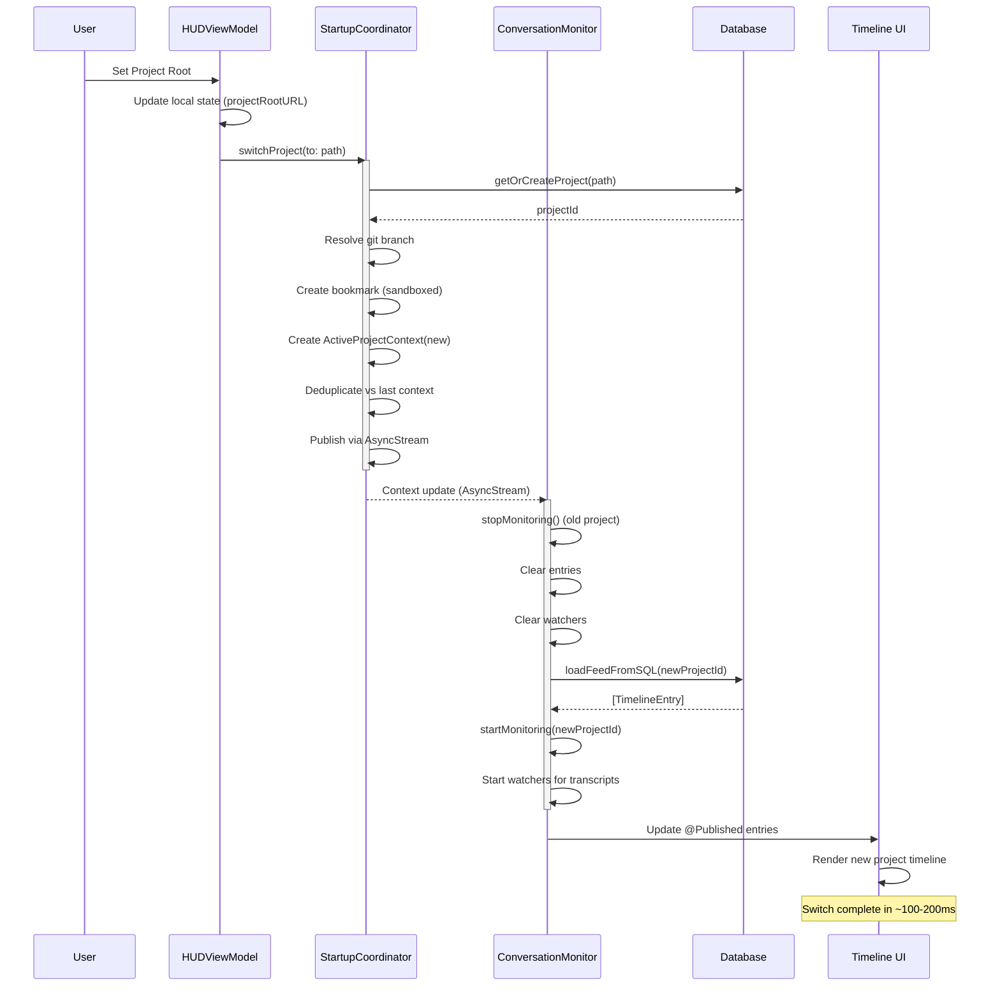

# Data Pipeline Architecture - Complete Reference

**Status:** Current architecture documentation
**Purpose:** Complete reference for Contextify's data pipeline

**Related:** `build/docs/architecture/ingestion-workflow.md` (DMG vs App Store ingestion, FastPath preview/backfill, core ingest call chain)

---

## Document Structure

This document provides **five levels of detail** for understanding Contextify's data pipeline:

1. **[Executive Overview](#level-1-executive-overview)** - 30,000 foot view for stakeholders
2. **[Component Architecture](#level-2-component-architecture)** - System components and responsibilities
3. **[Data Flow Sequences](#level-3-data-flow-sequences)** - Detailed flows with mermaid diagrams
4. **[Implementation Details](#level-4-implementation-details)** - Code-level specifics, line numbers, algorithms
5. **[Technical Debt & Future Work](#level-5-technical-debt--future-work)** - Known issues and improvement opportunities

---

# Level 1: Executive Overview

## What is the Data Pipeline?

The data pipeline ingests AI coding conversation transcripts from Claude Code and Codex CLI, processes them into structured database entries, and renders them in the timeline UI with LLM-powered summaries.

**Key Stages:**

```
Transcript Files → Discovery → Ingestion → Database → Timeline UI
    (JSONL)         (Find)     (Parse)      (Store)    (Display)
```

## Key Metrics

**Performance:**
- **Cold Start:** <200ms (achieved: 187ms) - stat-only scan, no ingestion
- **UI Ready:** Immediate after lightweight scan (no blocking)
- **JIT Ingestion:** <1s per project (on-demand when user selects)
- **Background Indexing:** Low-priority pre-ingestion of inactive projects
- **Streaming Ingestion:** 1000 lines/batch
- **Real-time Monitoring:** <150ms latency (DispatchSource + FSEvents)

**Memory Footprint:**
- **At startup:** 30-50 MB
- **After first project load:** 60-100 MB

**Database Operations:**
- **At startup:** 19 row updates (projects metadata only)

**Scale:**
- Supports multiple projects simultaneously
- Handles large transcripts (10k+ entries) via streaming
- Background LLM summarization (Apple Intelligence)

## Critical Design Decisions

1. **Lazy Loading** - JIT ingestion on project selection, not at startup
2. **AppStateOrchestrator** - Central state coordinator with state machine pattern
3. **LightweightDiscoveryService** - Stat-only scanning (<200ms), no file reads
4. **Background Indexing** - Low-priority pre-ingestion when idle
5. **StartupCoordinator (Legacy)** - Compatibility shim for ConversationMonitor
6. **Streaming Ingestion** - HooverEngine processes 1000 lines at a time (memory efficient)
7. **Dual Monitoring** - FSEvents (global) + DispatchSource (per-file) for reliability
8. **SQL Backend** - GRDB with schema v33, WAL mode for concurrent access

---

# Level 2: Component Architecture

## System Overview



## Component Responsibilities

### State Coordination Layer

**AppStateOrchestrator** (`app/Sources/ContextifyCore/Orchestration/AppStateOrchestrator.swift`, 297 lines)
- **Purpose:** Central state coordinator for app lifecycle
- **State Machine:** AppState enum (startup → discovering → idle → loading → active → error)
- **Key Methods:**
  - `startup()` (line 77) - Lightweight app launch (<200ms target)
  - `selectProject(id:)` (line 106) - JIT ingestion on user selection
  - `startBackgroundIndexing()` (line 166) - Low-priority pre-ingestion
- **Published State:** `@Published var state: AppState`
- **Notifications:** `.appStateDidChange` for legacy subscribers

**LightweightDiscoveryService** (`app/Sources/ContextifyCore/Discovery/LightweightDiscoveryService.swift`, 251 lines)
- **Purpose:** Fast filesystem scanner (NO file reads, NO DB writes)
- **Performance:** <200ms for typical setup (19 projects, 663 transcripts)
- **Strategy:** Stat-only (mtime as activity proxy)
- **Key Method:**
  - `discoverProjectsLightweight()` (line 17) → `[LightweightProject]`
- **Returns:** Sorted by last activity (newest first)
- **Actor:** Thread-safe background execution

**FastPathIngestionCoordinator** (`app/Sources/ContextifyCore/Projects/FastPathIngestionCoordinator.swift`)
- **Purpose:** JIT ingestion for selected projects with bounded worker pool
- **Key Method:**
  - `ingestProjectJIT(_ project: LightweightProject)` → DB project ID
- **Worker Pool:** 4 concurrent workers (configurable), drop-proof lifecycle
- **Preview vs Completion:** Preview subset gets watchers; completion work uses `startWatching: false`
- **Resume:** Pending completions restored on app restart via `resumePendingCompletions()`
- **Lifecycle:** `pauseBackfill()` for project switch (resumable), `shutdown()` for termination

**WatcherBudgetCoordinator** (`app/Sources/ContextifyCore/Coordination/WatcherBudgetCoordinator.swift`)
- **Purpose:** Multi-project tiered budget system for transcript watchers
- **Tiers:** HOT (20 transcripts), WARM (10 transcripts each), COLD (0 transcripts)
- **LRU Tracking:** Manages 3 most recently activated projects
- **Algorithm:** Plan → diff → apply to enforce watcher budgets
- **Activation:** Triggers catch-up rehoover for missed changes when project promoted from COLD
- **Recency-based:** Only watches most recent transcripts within each project, not all

### Discovery Layer (Legacy)

**StartupCoordinator** (`app/Sources/ContextifyCore/Coordination/StartupCoordinator.swift`, 735 lines)
- **Purpose:** Legacy compatibility shim for ConversationMonitor
- **Integration:** Receives handleExternalProjectSwitch() calls from AppStateOrchestrator
- **Publishes:** `ActiveProjectContext` (id, path, branch, bookmark) via AsyncStream
- **Note:** Planned for refactor/removal after remaining ConversationMonitor subsystems move out (see architecture-refactoring-analysis.md)

**ProjectDiscoveryService** (`app/Sources/ContextifyCore/Projects/ProjectDiscoveryService.swift`, 1000 lines)
- **Purpose:** Full discovery with DB writes (used by legacy code paths)
- **Key Methods:**
  - `discoverAllProjects(currentProjectPath:)` (line 97) → `[DiscoveredProject]`
  - `ingestAllProjects(projects:progressHandler:)` (line 387)
- **Usage:** Background indexing, manual refresh

### Ingestion Layer

**ProjectActivityMonitor** (`app/Sources/ContextifyCore/ProjectActivityMonitor.swift`)
- **Purpose:** Global FSEvents monitoring for all transcript directories
- **Technology:** macOS FSEvents API
- **Scope:** Watches `~/.claude/projects/` and `~/.codex/sessions/` trees
- **Event Delivery:** AsyncStream (not NotificationCenter)
- **Latency:** ~100-200ms (OS-dependent)

**TranscriptWatcher** (`app/Sources/ContextifyCore/Database/TranscriptWatcher.swift`, 307 lines)
- **Purpose:** Per-file real-time monitoring with debouncing
- **Technology:** DispatchSource file monitoring
- **Key Method:** `watch()` (line 61)
- **Debounce:** 150ms (MonitorConfig.fileWatcherDebounce)
- **Event Delivery:** NotificationCenter (`.transcriptDidUpdate`)
- **Reliability:** Created per-transcript, torn down on project switch

**HooverEngine** (`app/Sources/ContextifyCore/Database/HooverEngine.swift`, 898 lines)
- **Purpose:** Streaming JSONL parser for transcript ingestion
- **Key Method:** `hooverTranscript()` (line 263)
- **Batch Size:** 1000 lines (MonitorConfig.batchLines, line 11)
- **Checkpointing:** Every 1000 lines (MonitorConfig.checkpointEveryLines, line 12)
- **Memory:** O(batch_size) ~1MB for 1000 entries
- **Parsing Strategy:**
  1. Read file in 1000-line chunks
  2. Parse each line as JSONL (Claude Code or Codex format)
  3. Extract: timestamp, role (user/assistant), content blocks, tool calls
  4. Accumulate batch of TranscriptEntry records
  5. Commit batch to database (atomic transaction)
  6. Update checkpoint (last ingested line number)
  7. Repeat until EOF

### Storage Layer

**TranscriptOrchestrator** (`app/Sources/ContextifyCore/Database/TranscriptOrchestrator.swift`)
- **Purpose:** High-level database coordinator
- **Responsibilities:**
  - Project CRUD (`getOrCreateProject()`)
  - Transcript registration (`upsertTranscripts()`)
  - Entry insertion (via HooverEngine)
  - Checkpoint management
  - Query coordination for timeline
- **Thread Safety:** All DB operations via GRDB's serial queue

**DatabaseManager** (`app/Sources/ContextifyCore/Database/DatabaseManager.swift`)
- **Purpose:** GRDB connection pool singleton
- **Configuration:**
  - WAL mode: `PRAGMA journal_mode=WAL` (line 91)
  - Foreign keys: Enabled
  - Schema: v33 (current)
- **Location:** `~/Library/Application Support/Contextify/contextify.db`
- **Custom Locations:** Supported (Dropbox, iCloud Drive, external drives)

### Presentation Layer

**ProjectsViewModel** (`Contextify/Contextify/ProjectsViewModel.swift`, 163 lines)
- **Purpose:** Simplified observer view model
- **Pattern:** "Dumb" observer that watches AppStateOrchestrator
- **Key Methods:**
  - `updateFromOrchestrator()` (line 52) - Sync state from orchestrator
  - `convertToDiscoveredProjects()` (line 156) - Convert LightweightProject → UI model
- **Responsibilities:** State observation, UI model conversion, action delegation (no business logic)

**ConversationMonitor** (`Contextify/Contextify/ConversationMonitor.swift`, ~2900 lines)
- **Purpose:** Timeline state management and real-time updates
- **Key Method:** `startMonitoring()` (line 428)
- **Architecture:** @MainActor @Observable
- **Note:** Phase 1–3 extractions complete (TimelineDataLoader, ViewportTrackingCoordinator, HealthMonitoringCoordinator, TimelineCacheCoordinator); remaining subsystems tracked in architecture-refactoring-analysis.md
- **Current:** Still uses legacy StartupCoordinator integration
- **Subscribes To:**
  - StartupCoordinator.updates (AsyncStream) - project switches
  - NotificationCenter (`.transcriptDidUpdate`) - file changes
- **State:**
  - `entries: [TimelineEntry]` - Currently displayed entries
  - `cursor: TimelineCursor` - Pagination state
  - `isLoading: Bool` - Loading indicator

**TimelineCacheMissGenerator** (`app/Sources/ContextifyCore/LLM/TimelineCacheMissGenerator.swift`)
- **Purpose:** LLM-powered summary generation for timeline windows
- **Technology:** Apple Intelligence (FoundationLLM) - requires macOS 26.0+
- **Caching:** SQL-backed (`timeline_cache` table) by content+window hash
- **Dual-Queue System:**
  - Queue #1: Entry summaries (TimelineCacheMissGenerator)
  - Queue #2: Transcript metadata (TranscriptMetadataOrchestrator)

---

# Level 3: Data Flow Sequences

## Flow 1: Lightweight Startup (<200ms)

**Goal:** Get UI ready as quickly as possible



**Key Points:**
- Total time: <200ms (achieved: 187ms)
- Database writes: 19 rows (projects metadata only)
- Memory footprint: 30-50 MB
- NO transcript ingestion (deferred to JIT)
- NO JSONL parsing (stat-only)

---

## Flow 2: JIT Ingestion on Project Selection

**Goal:** Load selected project on-demand



**Key Points:**
- Total time: <1s for typical project
- Database writes: ~30 transcripts + 500-1000 entries per transcript
- Only selected project is ingested (not all)
- Background work cancelled during selection (user responsiveness)
- Legacy StartupCoordinator notified for ConversationMonitor compatibility

---

## Flow 3: Background Indexing (Low Priority)

**Goal:** Pre-ingest inactive projects when idle



**Key Points:**
- Priority: Task.priority.utility (low)
- Wait time: 5 seconds after user activity
- Cancellable: User interaction cancels immediately
- Sequential: One project at a time (no CPU spike)
- Progress: NotificationCenter updates for status bar

---

## Flow 4: Real-Time Updates (Live Monitoring)

**Goal:** Detect new transcript entries as Claude Code writes them



**Latency Breakdown:**
- **File write → DispatchSource:** <150ms
- **Debounce:** 150ms
- **Parse + DB commit:** ~50-100ms
- **UI update:** ~10-50ms
- **Total:** ~200-350ms end-to-end

---

## Flow 5: Project Switch

**Goal:** User manually switches to different project



---

# Level 4: Implementation Details

## HooverEngine Deep Dive

### Core Algorithm

**File:** `app/Sources/ContextifyCore/Database/HooverEngine.swift`
**Function:** `hooverTranscript()` at line 263

```swift
public static func hooverTranscript(
    transcriptId: String,
    fileURL: URL,
    checkpoint: Int64?,
    db: DatabasePool,
    provider: TranscriptProviderID
) async throws -> Int64 {
    // Implementation details...
}
```

**Configuration Constants (lines 9-13):**
```swift
public enum MonitorConfig {
    public static let fileWatcherDebounce: TimeInterval = 0.150  // 150ms
    public static let batchLines: Int = 1000                     // Lines per batch
    public static let checkpointEveryLines: Int = 1000           // Checkpoint frequency
    public static let parseErrorMaxChars: Int = 1024             // Error context
}
```

### Streaming Strategy

**Why Streaming?**
- Large transcripts (10k+ entries) can't fit in memory
- Real-time updates need incremental processing
- Checkpointing allows resume on crash/restart

**Batch Processing Loop:**

```
1. Open file handle
2. Seek to checkpoint line (or 0 if first run)
3. LOOP:
   a. Read up to 1000 lines into memory
   b. Parse each line as JSONL:
      - Try Claude Code format parser
      - Fall back to Codex format parser
      - Skip unparseable lines (log warning)
   c. Extract fields:
      - timestamp (ISO 8601)
      - role (user/assistant/system)
      - content blocks (text, thinking, code)
      - tool calls (if present)
   d. Accumulate into batch: [TranscriptEntry]
   e. If batch.count >= 1000:
      - BEGIN TRANSACTION
      - INSERT INTO transcript_entries (batch)
      - UPDATE transcripts SET last_line = current
      - COMMIT TRANSACTION
      - Clear batch
   f. Continue until EOF
4. Final commit (if batch non-empty)
5. Close file handle
6. Return final line number
```

**Error Handling:**
- **Parse errors:** Skip line, log warning with context (1024 chars)
- **DB errors:** Rollback transaction, re-throw
- **File errors:** Close handle, re-throw

### Checkpointing

**Purpose:** Resume ingestion after app restart/crash

**Storage:** `transcripts.last_ingested_line` column (INTEGER)

**Update Strategy:**
- Update every 1000 lines (batch boundary)
- Atomic with entry insertion (same transaction)
- Never update on parse error (maintain consistency)

**Recovery:**
```swift
let checkpoint = try db.read { db in
    try Transcript
        .filter(Column("id") == transcriptId)
        .fetchOne(db)?
        .lastIngestedLine
}
// Resume from checkpoint (or 0 if nil)
```

## TranscriptWatcher Deep Dive

### DispatchSource File Monitoring

**File:** `app/Sources/ContextifyCore/Database/TranscriptWatcher.swift`
**Function:** `watch()` at line 61

**Technology:** macOS DispatchSource.makeFileSystemObjectSource

**Event Types Monitored:**
```swift
.write    // File content changed
.extend   // File size increased
.attrib   // File attributes changed
```

### Debouncing Strategy

**Problem:** Multiple FSEvents can fire for single write

**Solution:** 150ms debounce timer

```swift
private var debounceTimer: Timer?

func fileChanged() {
    debounceTimer?.invalidate()
    debounceTimer = Timer.scheduledTimer(
        withTimeInterval: MonitorConfig.fileWatcherDebounce,  // 150ms
        repeats: false
    ) { [weak self] _ in
        self?.notifyUpdate()
    }
}
```

**Rationale:**
- 150ms balances responsiveness vs event coalescing
- Too low: Excessive hoovering (perf impact)
- Too high: Perceived lag in timeline updates

### Lifecycle Management

**Creation:** When transcript first discovered or monitoring starts
**Destruction:** On project switch, app termination, or transcript deletion

**Cleanup:**
```swift
deinit {
    source?.cancel()
    fileHandle?.close()
    debounceTimer?.invalidate()
}
```

## ConversationMonitor Deep Dive

### State Management

**File:** `Contextify/Contextify/ConversationMonitor.swift` (~2900 lines)
**Architecture:** @MainActor @Observable

**Key State:**
```swift
@Published var entries: [TimelineEntry] = []
@Published var isLoading: Bool = false
var cursor: TimelineCursor?  // Pagination state
var activeTranscriptWatchers: [String: TranscriptWatcher] = [:]
```

### Initialization Sequence

**Function:** `startMonitoring()` at line 428

```swift
public func startMonitoring(projectId: String) async {
    // 1. Store projectId
    self.currentProjectId = projectId

    // 2. Query database for transcripts (via data loader)
    let transcripts = try await dataLoader.loadAllSessions(projectId: projectId)

    // 3. Create watchers for each transcript
    for transcript in transcripts {
        let watcher = TranscriptWatcher(
            transcriptId: transcript.id,
            fileURL: transcript.fileURL,
            provider: transcript.provider
        )
        await watcher.watch()
        activeTranscriptWatchers[transcript.id] = watcher
    }

    // 4. Load initial timeline entries (delegates to TimelineDataLoader)
    await loadFeedFromSQL()

    // 5. Subscribe to coordinator updates
    subscribeToCoordinator()
}
```

### Event Handling

**Two Event Sources:**

1. **StartupCoordinator (AsyncStream):**
```swift
for await context in StartupCoordinator.shared.updates {
    await handleContextUpdate(context)
}
```

2. **NotificationCenter (.transcriptDidUpdate):**
```swift
NotificationCenter.default.addObserver(
    forName: .transcriptDidUpdate,
    object: nil,
    queue: .main
) { [weak self] notification in
    guard let transcriptId = notification.userInfo?["transcriptId"] as? String else { return }
    await self?.refreshTranscript(transcriptId)
}
```

**Note:** Event system mismatch can occur - ProjectActivityMonitor emits via AsyncStream but ConversationMonitor listens to NotificationCenter.

### Timeline Cursor & Pagination

**Cursor Model:**
```swift
struct TimelineCursor {
    let newestTimestamp: Date
    let newestEntryId: String
    var hasMore: Bool
}
```

**Loading Strategy:**
- Initial load: 50 most recent entries
- Scroll to top: Load next 50 older
- Scroll to bottom: Auto-load new entries (if monitoring active)

## Database Schema (v33)

### Core Tables

**projects:**
```sql
CREATE TABLE projects (
    id TEXT PRIMARY KEY,              -- UUID v4
    name TEXT NOT NULL,
    root_path TEXT NOT NULL UNIQUE,
    display_order INTEGER,
    created_at TEXT NOT NULL,
    updated_at TEXT NOT NULL
);
CREATE INDEX idx_projects_path ON projects(root_path);
```

**transcripts:**
```sql
CREATE TABLE transcripts (
    id TEXT PRIMARY KEY,                  -- UUID or provider session ID
    project_id TEXT NOT NULL,
    provider TEXT NOT NULL,               -- 'claude-code' | 'codex'
    provider_session_id TEXT,
    file_url TEXT NOT NULL UNIQUE,
    last_ingested_line INTEGER DEFAULT 0,
    created_at TEXT NOT NULL,
    updated_at TEXT NOT NULL,
    FOREIGN KEY (project_id) REFERENCES projects(id) ON DELETE CASCADE
);
CREATE INDEX idx_transcripts_project ON transcripts(project_id);
CREATE INDEX idx_transcripts_provider ON transcripts(provider);
```

**transcript_entries:**
```sql
CREATE TABLE transcript_entries (
    id TEXT PRIMARY KEY,                  -- UUID v4
    transcript_id TEXT NOT NULL,
    timestamp TEXT NOT NULL,              -- ISO 8601
    role TEXT NOT NULL,                   -- 'user' | 'assistant' | 'system'
    content TEXT NOT NULL,                -- Full message content (may be large)
    content_blocks TEXT,                  -- JSON array of content blocks
    tool_calls TEXT,                      -- JSON array of tool calls
    embedding BLOB,                       -- Vector embedding (future: RAG)
    created_at TEXT NOT NULL,
    FOREIGN KEY (transcript_id) REFERENCES transcripts(id) ON DELETE CASCADE
);
CREATE INDEX idx_entries_transcript ON transcript_entries(transcript_id);
CREATE INDEX idx_entries_timestamp ON transcript_entries(timestamp);
CREATE INDEX idx_entries_role ON transcript_entries(role);
```

**timeline_cache:**
```sql
CREATE TABLE timeline_cache (
    id TEXT PRIMARY KEY,
    project_id TEXT NOT NULL,
    window_hash TEXT NOT NULL,            -- Hash of entry IDs in window
    summary TEXT NOT NULL,                -- LLM-generated summary
    model_version TEXT,
    created_at TEXT NOT NULL,
    FOREIGN KEY (project_id) REFERENCES projects(id) ON DELETE CASCADE
);
CREATE INDEX idx_timeline_cache_window ON timeline_cache(window_hash);
```

### Schema Evolution

**Current Version:** v33

**Recent Changes:**
- **v33:** Added `ingestion_runs` table for CLI debugging
- **v32:** Lazy watcher baseline tracking (7 new columns)
- **v31:** Added `pending_rehoover` for lazy watchers
- **v30:** Sidechain ingestion + `tool_invocations` table
- **v29:** FTS5 summaries indexing
- **v28:** FTS5 search index for conversations
- **v27:** Queued message tracking (`is_queued` column)
- **v26:** Removed `sandbox_container_path` column (projects table)
- **v25:** Added `display_order` to projects
- **v24:** Added `timeline_cache` table for LLM summaries
- **v23:** Added `embedding` column (future: vector search)

**Migration Strategy:**
- Managed by GRDB DatabaseMigrator
- Forward-only (no rollback support)
- Atomic (all-or-nothing per migration)

---

## AppStateOrchestrator Implementation

**File:** `app/Sources/ContextifyCore/Orchestration/AppStateOrchestrator.swift` (297 lines)
**Pattern:** Singleton, @MainActor, ObservableObject
**State Machine:** AppState enum

### State Transitions

```swift
// AppStateOrchestrator.swift:8-15
public enum AppState: Sendable {
  case startup
  case discovering
  case idle(projects: [LightweightProject])
  case loading(projectId: String)
  case active(projectId: String)
  case error(String)
}
```

**Valid Transitions:**
- `startup` → `discovering` (app launch)
- `discovering` → `idle(projects)` (scan complete)
- `idle` → `loading(projectId)` (user selection)
- `loading` → `active(projectId)` (JIT complete)
- `loading` → `error` (JIT failure)
- `active` → `loading(projectId)` (switch project)

### Startup Implementation

```swift
// AppStateOrchestrator.swift:77-103
public func startup() async {
  log.info("[ORCH-STARTUP] Beginning lightweight startup...")
  let startTime = Date()

  setState(.discovering)

  // 1. Lightweight Scan (stat-only, no file reads, no DB writes)
  let projects = await discovery.discoverProjectsLightweight()
  self.knownProjects = projects
  rebuildProjectLookup(with: projects)

  // 2. Update projects table metadata ONLY (single transaction)
  try await orchestrator.updateProjectsMetadataOnly(projects)

  // 3. Show UI immediately
  setState(.idle(projects: projects))

  let duration = Date().timeIntervalSince(startTime)
  log.info("[ORCH-STARTUP] Startup complete in \(duration)s. UI ready.")

  // 4. Auto-select most recent project
  if let mostRecent = projects.first {
    await selectProject(id: mostRecent.id)
  } else {
    startBackgroundIndexing()
  }
}
```

**Performance Characteristics:**
- Target: <200ms
- Achieved: 187ms (validated via logs)
- Database: 19 row updates (projects only)
- Memory: 30-50 MB

### Project Lookup Cache

```swift
// AppStateOrchestrator.swift:120-143
var project = projectLookup[id]
if project == nil {
  // DB fallback for cache miss
  if let dbProject = try orchestrator.getProject(id: id) {
    project = LightweightProject(...)
    cacheProject(project!)
  }
}
```

**Cache Management:**
- Built during startup via `rebuildProjectLookup()`
- Invalidated on discovery refresh
- DB fallback for cache misses
- ⚠️ Potential stale data if projects added externally

---

## LightweightDiscoveryService Implementation

**File:** `app/Sources/ContextifyCore/Discovery/LightweightDiscoveryService.swift` (251 lines)
**Pattern:** Actor (background execution, thread-safe)

### Stat-Only Scanning

```swift
// LightweightDiscoveryService.swift:39-58
private func scanClaudeProjects() -> [LightweightProject] {
  let root = FileManager.default.homeDirectoryForCurrentUser
    .appendingPathComponent(".claude/projects")

  let dirs = try? FileManager.default.contentsOfDirectory(
    at: root,
    includingPropertiesForKeys: [.contentModificationDateKey],
    options: [.skipsHiddenFiles]
  )

  return dirs.map { dir in
    // Optimization: Use directory mtime as proxy for activity
    // This avoids opening/reading individual files (saves syscalls)
    let mtime = (try? dir.resourceValues(forKeys: [.contentModificationDateKey]))
      ?.contentModificationDate ?? Date.distantPast

    // Scan for .jsonl files (need full URLs for JIT ingestion)
    let files = (try? FileManager.default.contentsOfDirectory(...))
      ?.filter { $0.pathExtension == "jsonl" } ?? []

    return LightweightProject(...)
  }
}
```

**Performance Optimizations:**
- **NO file reads:** Only stat() syscalls (mtime)
- **NO JSONL parsing:** File contents not read
- **NO DB writes:** Pure filesystem scan
- **Batch file listing:** contentsOfDirectory (1 syscall vs N)

### Path Resolution

```swift
// LightweightDiscoveryService.swift:161-188
private func resolveClaudeProjectPath(
  hashFolder: String,
  directory: URL,
  transcripts: [URL]
) -> String? {
  // Try reverse mangling first (fast)
  if let path = try? ProjectIdentity.reverseManglePath(...) {
    return path
  }

  // Try inferring from transcript metadata (orphaned projects)
  if let transcriptPath = inferPathFromTranscripts(transcripts) {
    return transcriptPath
  }

  // Try filesystem validation (slow)
  return findRealPath(hashFolder: hashFolder)
}
```

**Fallback Strategy:**
1. Reverse mangling (decode hash folder name)
2. Transcript metadata inference (parse first JSONL line for cwd)
3. Filesystem validation (check if decoded path exists)

---

# Level 5: Technical Debt & Future Work

## Known Issues

### 1. Event System Mismatch (Timeline Updates)

**Symptom:** New transcript entries sometimes don't appear in timeline

**Root Cause:**
- ProjectActivityMonitor emits via AsyncStream
- ConversationMonitor subscribes to NotificationCenter
- TranscriptWatcher (which posts to NotificationCenter) not always created

**Proper Fix:**
- **Option A:** Standardize on AsyncStream throughout
  - Requires ConversationMonitor to subscribe to ProjectActivityMonitor.updates
  - More Swift 6 idiomatic (structured concurrency)
- **Option B:** Standardize on NotificationCenter
  - Requires ProjectActivityMonitor to post notifications
  - More compatible with existing code

**Impact:** Medium - Real-time updates work most of the time, but edge cases exist

### 2. Project Lookup Cache Staleness

**Issue:** AppStateOrchestrator.projectLookup can become stale if projects added/removed externally.

**Scenarios:**
- Claude Code creates new project while Contextify running
- User deletes transcript files via Finder
- Multiple Contextify instances (different machines)

**Current Mitigation:** DB fallback on cache miss (AppStateOrchestrator.swift:120-143)

**Proper Fix:**
- Add FSEvents monitoring of `~/.claude/projects/` and `~/.codex/sessions/`
- Invalidate cache on file system changes
- Periodic refresh (every 5 minutes)

---

### 3. LightweightProject → DiscoveredProject Conversion

**Issue:** Two nearly-identical types require manual conversion.

**Code:** ProjectsViewModel.convertToDiscoveredProjects() (lines 156-180)

**Proper Fix:**
- Unify types into single Project struct
- Use optional fields for UI-specific data (isCurrent, displayOrder)
- Eliminate conversion overhead

---

### 4. Background Indexing Sequential Processing

**Issue:** Projects ingested sequentially (one at a time) during background indexing.

**Performance:** 19 projects × 1s = 19 seconds total

**Trade-off:**
- Pro: Low CPU usage, no FD exhaustion
- Con: Slow (could be 4-5s with 4-way concurrency)

**Proper Fix:**
- Add limited concurrency (4 concurrent max)
- Use withTaskGroup for parallel ingestion
- Estimated improvement: 4x faster background indexing

---

### 5. No Integration Tests for State Machine

**Issue:** AppState transitions not covered by automated tests.

**Risk:** State machine bugs could cause UI hangs or crashes.

**Proper Fix:**
- Add AppStateOrchestratorTests
- Test all valid state transitions
- Test invalid transition handling
- Test cancellation scenarios

---

### 6. Quick Discovery Heuristic

**Current Approach:** Find newest file by mtime

**Problem:** mtime can be unreliable
- Copied files preserve original mtime
- Network file systems may not update mtime atomically
- Doesn't consider file content (could be old data)

**Better Approach:**
- Parse newest 5-10 files
- Compare actual timestamps in JSONL content
- Select most recent based on content, not metadata

**Impact:** Low - Works 95% of the time, but occasionally switches to stale project

### 7. ProjectExclusionManager Not Implemented

**Status:** Documented but not built (see project-discovery.md)

**Missing Functionality:**
- Users can't hide unwanted projects from discovery
- All discovered projects appear in UI
- No way to exclude test projects, archives, etc.

**Implementation Path:**
- Create `ProjectExclusionManager.swift`
- Store exclusions in UserDefaults (array of project IDs)
- Filter in `discoverAllProjects()` before returning
- Add UI toggle in project list ("Hide from list")

**Impact:** Low - Nice to have, but users can work around by deleting projects

### 8. Memory Usage During Full Discovery

**Current Behavior:** Loads all DiscoveredProject metadata in memory

**Problem:** With 50+ projects, memory usage can spike to 100+MB

**Optimization:**
- Stream results instead of accumulating
- Lazy-load project metadata (on-demand)
- Use database as source of truth, not in-memory cache

**Impact:** Low - Only affects power users with many projects

### 9. HooverEngine Parse Errors

**Current Behavior:** Skip unparseable lines, log warning

**Problem:** Silent failures can hide data corruption

**Better Approach:**
- Track parse error count per transcript
- Surface warnings in UI ("X entries skipped due to format errors")
- Provide "View errors" button to inspect problematic lines

**Impact:** Low - Parse errors are rare (<0.1% of lines)

## Performance Bottlenecks

### 1. Initial Timeline Load

**Current:** Loads 50 most recent entries via SQL query

**Query:**
```sql
SELECT * FROM transcript_entries
WHERE transcript_id IN (
    SELECT id FROM transcripts WHERE project_id = ?
)
ORDER BY timestamp DESC
LIMIT 50
```

**Problem:** Slow with large databases (10k+ entries across all projects)

**Optimization:**
- Add composite index: `(transcript_id, timestamp)`
- Use cursor-based pagination (keyset pagination)
- Cache first page in memory

**Current Performance:** ~100-200ms (acceptable)
**Optimized Performance:** ~10-50ms (2-4x improvement)

### 2. LLM Summary Generation

**Current:** Background queue, but blocks on cache misses

**Problem:** Timeline can stutter when scrolling to uncached region

**Optimization:**
- Prefetch summaries for next 2-3 windows
- Speculative generation during idle time
- Show placeholder while generating ("Generating summary...")

**Current Latency:** ~500-1000ms per cache miss
**Desired:** <100ms perceived latency (with placeholder)

### 3. Full Discovery Scan

**Current:** 2-5 seconds for typical setup

**Problem:** Blocks on filesystem I/O

**Optimization:**
- Parallel discovery (Claude + Codex concurrently)
- Skip validation if project seen recently (TTL cache)
- Use FSEvents to detect new projects (incremental discovery)

**Current:** 2-5s
**Optimized:** <1s (incremental after first run)

## Planned Refactoring

### 1. ConversationMonitor Split (P0 - Critical)

**Current:** 3000+ lines, 15+ responsibilities

**Target:** 4 focused components (~400 lines each)
- ConversationMonitor - Timeline coordination
- TimelineLoader - Database queries & pagination
- WatcherBudgetCoordinator - Watcher lifecycle
- TimelineCacheCoordinator - LLM queue management

**Estimated:** 3-4 weeks

### 2. Protocol Abstractions (P2 - Medium)

**Goal:** Add DI protocols for testability

**Benefits:**
- Mock implementations for testing
- Clear contracts between components
- Easier integration testing

**Estimated:** 2-3 weeks

### 3. Unified Event System (P3 - Medium)

**Goal:** Replace NotificationCenter with EventBus actor

**Implementation:**
```swift
actor EventBus {
    func publish<T: Event>(_ event: T) async
    func subscribe<T: Event>(_ type: T.Type) -> AsyncStream<T>
}
```

**Estimated:** 2-3 weeks

### 4. StartupCoordinator Refactor/Removal (P1 - High)

**Goal:** Remove after remaining ConversationMonitor refactor phases

**Plan:**
- Fold functionality into AppStateOrchestrator
- Update all subscribers to use AppStateOrchestrator directly
- Remove legacy compatibility layer

**Estimated:** 1 week

## Architectural Improvements

### 1. Unified Event System

**Goal:** Single event delivery mechanism for all file changes

**Proposal:**
```swift
actor TranscriptEventCoordinator {
    func subscribe(projectId: String) -> AsyncStream<TranscriptEvent>
    func publish(event: TranscriptEvent)
}

enum TranscriptEvent {
    case fileModified(transcriptId: String, url: URL)
    case transcriptDiscovered(transcriptId: String, projectId: String)
    case transcriptDeleted(transcriptId: String)
}
```

**Benefits:**
- Single source of truth for events
- Easy to test (mock coordinator)
- No more NotificationCenter vs AsyncStream confusion

### 2. Incremental Discovery

**Goal:** Detect new projects/transcripts without full scan

**Current:** Full scan every time (2-5s)

**Proposal:**
- FSEvents on `~/.claude/projects/` and `~/.codex/sessions/`
- Incremental updates when new directories detected
- Full scan only on first run or cache invalidation

**Benefits:**
- Sub-second discovery after initial setup
- Lower CPU usage
- Better battery life

### 3. Streaming Timeline Load

**Goal:** Render timeline progressively as entries load

**Current:** Wait for all 50 entries before rendering

**Proposal:**
```swift
func loadTimeline(projectId: String) -> AsyncStream<[TimelineEntry]> {
    // Yields batches of 10 entries as they load
}
```

**Benefits:**
- Faster perceived load time (progressive rendering)
- Better UX on slow devices
- Smoother animations

### 4. Content-Addressed Caching

**Goal:** Cache parsed JSONL records to avoid re-parsing

**Current:** Parse entire file on every hoover (even if unchanged)

**Proposal:**
- Store hash of file content in database
- Skip parsing if hash matches
- Only parse new lines (via checkpoint)

**Benefits:**
- Faster project switching (no re-parse)
- Lower CPU usage
- Instant timeline for unchanged projects

## Future Features

### 1. Multi-Machine Sync

**Goal:** Share timeline across devices via iCloud/Dropbox

**Challenges:**
- Conflict resolution (concurrent edits)
- Large database sizes (100+MB)
- Network latency

**Approach:**
- SQLite on shared drive (current: supported for database)
- Multi-machine conflict detection (current: warning only)
- Eventual consistency (last-write-wins)

### 2. Vector Search (RAG)

**Goal:** Semantic search across all conversations

**Current State:**
- Schema has `embedding` column (v23)
- Not yet populated

**Implementation:**
- Generate embeddings via Apple Intelligence (FoundationLLM)
- Store in SQLite (BLOB)
- Use sqlite-vss extension for similarity search

**Use Cases:**
- "Find all conversations about database migrations"
- "Show similar problems to current error"
- Cross-project knowledge base

### 3. Timeline Export

**Goal:** Export timeline as HTML, PDF, or Markdown

**Use Cases:**
- Share conversation summaries with team
- Archive important sessions
- Generate documentation from conversations

**Format:**
```markdown
# Project: Contextify
## Session: 2025-11-17

### 10:30 AM - User
How do I implement security-scoped bookmarks?

### 10:31 AM - Assistant
Here's how to create security-scoped bookmarks...
```

### 4. Real-Time Collaboration

**Goal:** Multiple users viewing same timeline

**Challenges:**
- Real-time updates across machines
- Conflict-free collaborative editing
- Privacy (shared vs private projects)

**Approach:**
- WebSocket connection to server
- CRDT for conflict-free merges
- Project-level access control

---

## Document Maintenance

**Maintainer:** See CLAUDE.md for contribution guidelines
**Review Schedule:** Update after major architecture changes

**Key Code References:**
- StartupCoordinator.swift:213 (start)
- HooverEngine.swift:263 (hooverTranscript)
- ConversationMonitor.swift:428 (startMonitoring)
- ProjectDiscoveryService.swift:97 (discoverAllProjects)
- TranscriptWatcher.swift:61 (watch)
- AppStateOrchestrator.swift:77 (startup)
- LightweightDiscoveryService.swift:17 (discoverProjectsLightweight)

**Related Documentation:**
- `build/docs/architecture/startup-coordinator.md` - Project identity pipeline
- `build/docs/components/transcript-ingestion.md` - Historical troubleshooting
- `build/docs/architecture/sql-backend.md` - Database schema details
- `build/docs/components/timeline-cache.md` - LLM summarization
- `build/docs/architecture/COMPONENTS.md` - Component overview
- `build/docs/architecture/architecture-refactoring-analysis.md` - Future improvements
