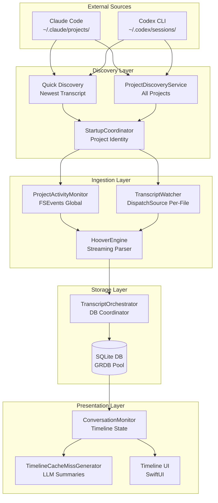
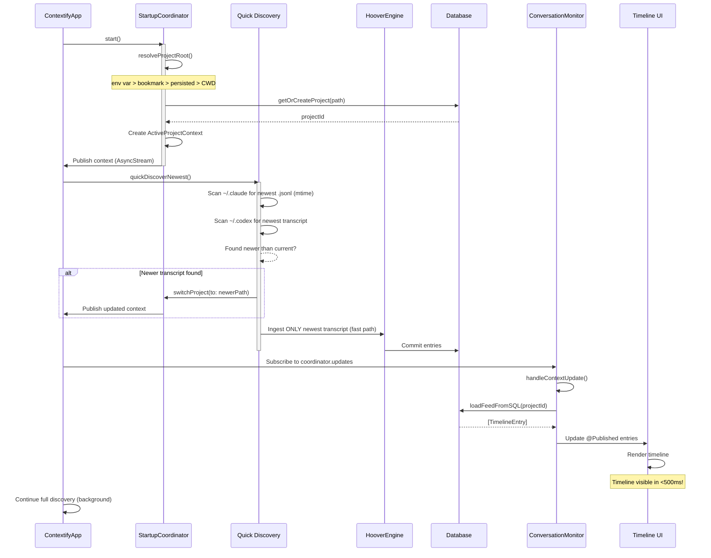
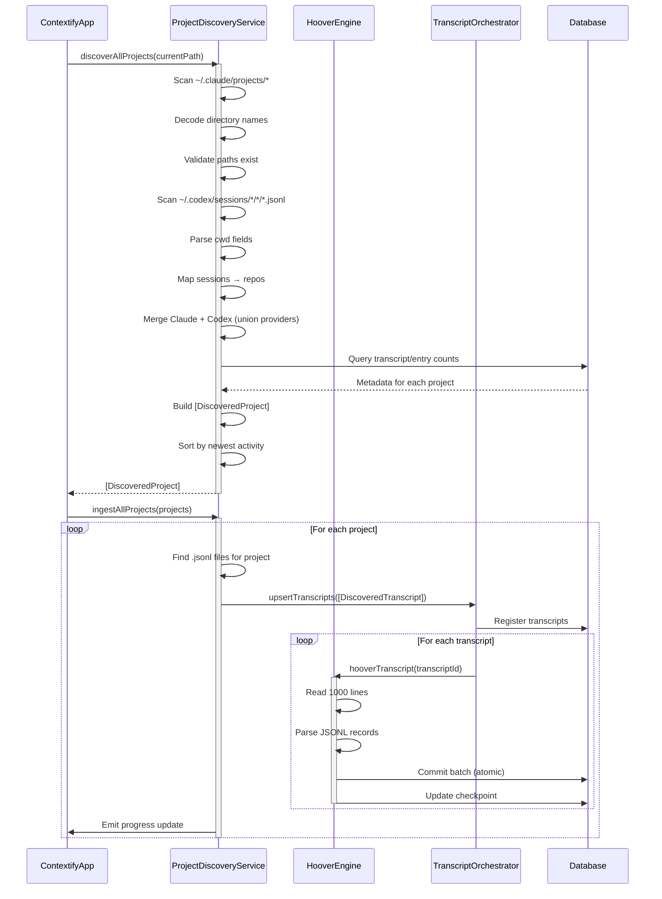
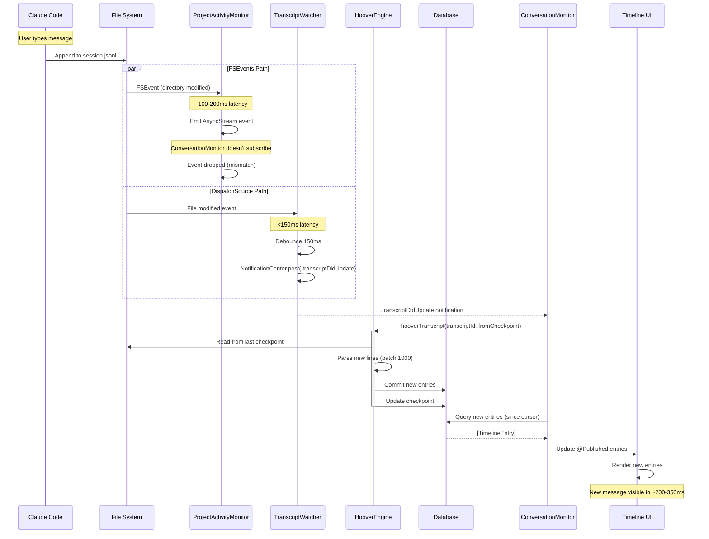
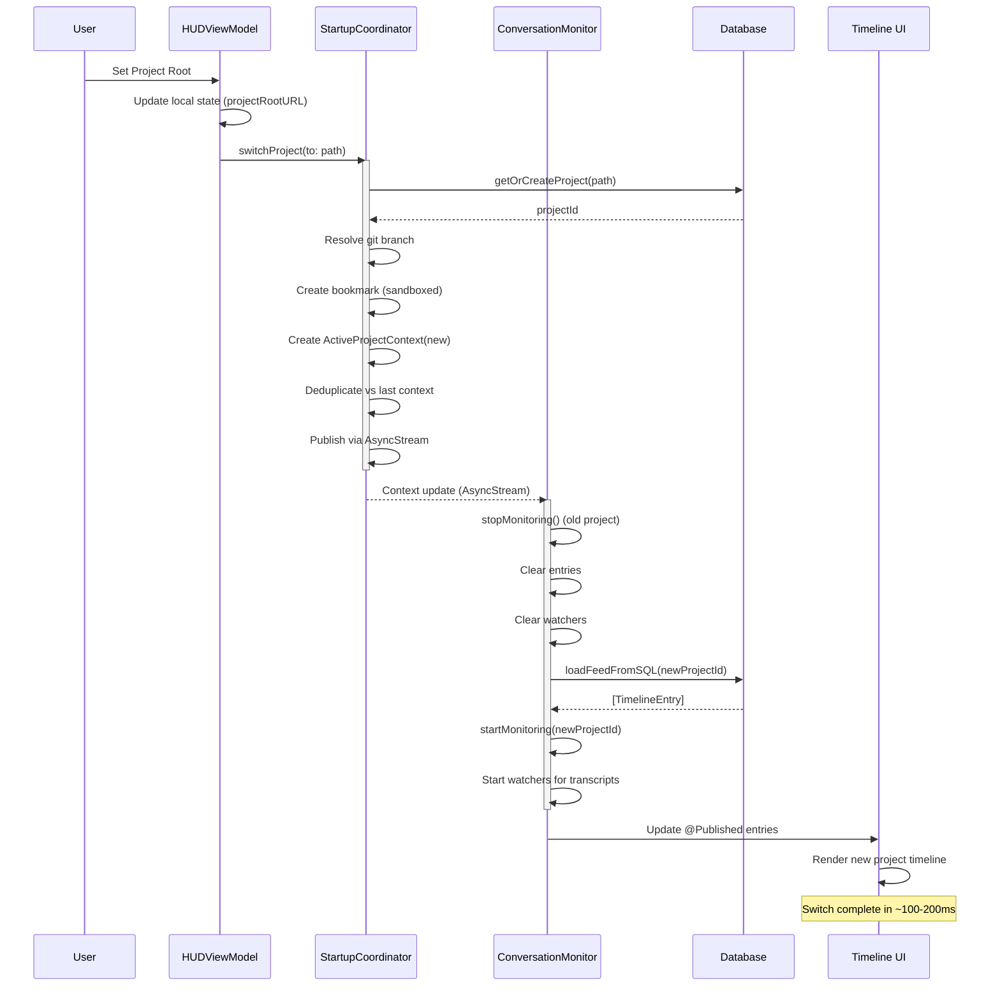

# Data Pipeline Architecture - Complete Reference

**Status:** Current as of 2025-11-17
**Replaces:** `data-flow.md` (archived 2025-11-17)
**Version:** 2.0 (reflects Nov 2025 architecture)

---

## Document Structure

This document provides **five levels of detail** for understanding Contextify's data pipeline:

1. **[Executive Overview](#level-1-executive-overview)** - 30,000 foot view for stakeholders
2. **[Component Architecture](#level-2-component-architecture)** - System components and responsibilities
3. **[Data Flow Sequences](#level-3-data-flow-sequences)** - Detailed flows with mermaid diagrams
4. **[Implementation Details](#level-4-implementation-details)** - Code-level specifics, line numbers, algorithms
5. **[Technical Debt & Future Work](#level-5-technical-debt--future-work)** - Known issues and improvement opportunities

---

# Level 1: Executive Overview

## What is the Data Pipeline?

The data pipeline ingests AI coding conversation transcripts from Claude Code and Codex CLI, processes them into structured database entries, and renders them in the timeline UI with LLM-powered summaries.

**Key Stages:**

```
Transcript Files → Discovery → Ingestion → Database → Timeline UI
    (JSONL)         (Find)     (Parse)      (Store)    (Display)
```

## Key Metrics

**Performance:**
- **Cold Start:** ~200-500ms (quick discovery)
- **Full Discovery:** ~2-5s (all projects)
- **Streaming Ingestion:** 1000 lines/batch
- **Real-time Monitoring:** <150ms latency (DispatchSource + FSEvents)

**Scale:**
- Supports multiple projects simultaneously
- Handles large transcripts (10k+ entries) via streaming
- Background LLM summarization (Apple Intelligence)

## Critical Design Decisions

1. **StartupCoordinator** - Single source of truth for project identity (Nov 2025)
2. **Quick Discovery** - Lightweight mtime scan for immediate timeline (Nov 17, 2025)
3. **Streaming Ingestion** - HooverEngine processes 1000 lines at a time (memory efficient)
4. **Dual Monitoring** - FSEvents (global) + DispatchSource (per-file) for reliability
5. **SQL Backend** - GRDB with schema v26, WAL mode for concurrent access

---

# Level 2: Component Architecture

## System Overview



## Component Responsibilities

### Discovery Layer

**StartupCoordinator** (`app/Sources/ContextifyCore/Coordination/StartupCoordinator.swift`, 735 lines)
- **Purpose:** Single source of truth for active project
- **Publishes:** `ActiveProjectContext` (id, path, branch, bookmark) via AsyncStream
- **Key Methods:**
  - `start()` (line 213) - Initial project resolution
  - `ready()` (line 308) - Blocking wait for context
  - `switchProject(to:)` (line 350) - User-initiated project change
- **Resolution Order:** env var → bookmark → persisted path → CWD

**Quick Discovery** (`ProjectDiscoveryService.quickDiscoverNewest()`, line 210)
- **Purpose:** Fast cold-start timeline (<500ms)
- **Strategy:** Lightweight mtime scan of newest .jsonl files
- **Added:** 2025-11-17 to address 47.5s UI freeze
- **Workflow:**
  1. Scan `~/.claude/projects/` for newest .jsonl (mtime)
  2. Scan `~/.codex/sessions/` for newest transcript with cwd extraction
  3. If newer than current project → switch via StartupCoordinator
  4. Ingest single newest transcript for immediate timeline
  5. Continue with full discovery in background

**ProjectDiscoveryService** (`app/Sources/ContextifyCore/Projects/ProjectDiscoveryService.swift`, 1000 lines)
- **Purpose:** Comprehensive multi-project discovery
- **Key Methods:**
  - `discoverAllProjects(currentProjectPath:)` (line 97) → `[DiscoveredProject]`
  - `ingestAllProjects(projects:progressHandler:)` (line 387)
- **Discovery Algorithm:**
  1. Scan `~/.claude/projects/*` directory names
  2. Reverse-map encoded directory names to project paths
  3. Validate paths exist on disk
  4. Scan `~/.codex/sessions/YYYY/MM/DD/*.jsonl` tree
  5. Parse `cwd` fields to map sessions → repos
  6. Merge Claude + Codex results (provider union)
  7. Query database for metadata (transcript/entry counts)
  8. Sort by newest activity first

### Ingestion Layer

**ProjectActivityMonitor** (`app/Sources/ContextifyCore/ProjectActivityMonitor.swift`)
- **Purpose:** Global FSEvents monitoring for all transcript directories
- **Technology:** macOS FSEvents API
- **Scope:** Watches `~/.claude/projects/` and `~/.codex/sessions/` trees
- **Event Delivery:** AsyncStream (not NotificationCenter)
- **Latency:** ~100-200ms (OS-dependent)

**TranscriptWatcher** (`app/Sources/ContextifyCore/Database/TranscriptWatcher.swift`, 307 lines)
- **Purpose:** Per-file real-time monitoring with debouncing
- **Technology:** DispatchSource file monitoring
- **Key Method:** `watch()` (line 61)
- **Debounce:** 150ms (MonitorConfig.fileWatcherDebounce)
- **Event Delivery:** NotificationCenter (`.transcriptDidUpdate`)
- **Reliability:** Created per-transcript, torn down on project switch

**HooverEngine** (`app/Sources/ContextifyCore/Database/HooverEngine.swift`, 898 lines)
- **Purpose:** Streaming JSONL parser for transcript ingestion
- **Key Method:** `hooverTranscript()` (line 263)
- **Batch Size:** 1000 lines (MonitorConfig.batchLines, line 11)
- **Checkpointing:** Every 1000 lines (MonitorConfig.checkpointEveryLines, line 12)
- **Memory:** O(batch_size) ~1MB for 1000 entries
- **Parsing Strategy:**
  1. Read file in 1000-line chunks
  2. Parse each line as JSONL (Claude Code or Codex format)
  3. Extract: timestamp, role (user/assistant), content blocks, tool calls
  4. Accumulate batch of TranscriptEntry records
  5. Commit batch to database (atomic transaction)
  6. Update checkpoint (last ingested line number)
  7. Repeat until EOF

### Storage Layer

**TranscriptOrchestrator** (`app/Sources/ContextifyCore/Database/TranscriptOrchestrator.swift`)
- **Purpose:** High-level database coordinator
- **Responsibilities:**
  - Project CRUD (`getOrCreateProject()`)
  - Transcript registration (`upsertTranscripts()`)
  - Entry insertion (via HooverEngine)
  - Checkpoint management
  - Query coordination for timeline
- **Thread Safety:** All DB operations via GRDB's serial queue

**DatabaseManager** (`app/Sources/ContextifyCore/Database/DatabaseManager.swift`)
- **Purpose:** GRDB connection pool singleton
- **Configuration:**
  - WAL mode: `PRAGMA journal_mode=WAL` (line 91)
  - Foreign keys: Enabled
  - Schema: v26 (current as of Nov 2025)
- **Location:** `~/Library/Application Support/Contextify/contextify.db`
- **Custom Locations:** Supported (Dropbox, iCloud Drive, external drives)

### Presentation Layer

**ConversationMonitor** (`Contextify/Contextify/ConversationMonitor.swift`, 3054 lines)
- **Purpose:** Timeline state management and real-time updates
- **Key Method:** `startMonitoring()` (line 428)
- **Architecture:** @MainActor @Observable
- **Subscribes To:**
  - StartupCoordinator.updates (AsyncStream) - project switches
  - NotificationCenter (`.transcriptDidUpdate`) - file changes
- **State:**
  - `entries: [TimelineEntry]` - Currently displayed entries
  - `cursor: TimelineCursor` - Pagination state
  - `isLoading: Bool` - Loading indicator

**TimelineCacheMissGenerator** (`app/Sources/ContextifyCore/LLM/TimelineCacheMissGenerator.swift`)
- **Purpose:** LLM-powered summary generation for timeline windows
- **Technology:** Apple Intelligence (FoundationLLM) - requires macOS 26.0+
- **Caching:** SQL-backed (`timeline_cache` table) by content+window hash
- **Dual-Queue System:**
  - Queue #1: Entry summaries (TimelineCacheMissGenerator)
  - Queue #2: Transcript metadata (TranscriptMetadataOrchestrator)

---

# Level 3: Data Flow Sequences

## Flow 1: Cold Start (App Launch)

**Goal:** Get timeline visible as fast as possible



**Timeline:**
- **0-200ms:** StartupCoordinator resolves project identity
- **200-500ms:** Quick discovery finds newest transcript + ingests
- **500ms:** Timeline UI renders with newest entries
- **500ms-5s:** Full discovery continues in background

## Flow 2: Full Discovery (Background)

**Goal:** Discover all projects and transcripts across machine



**Performance:**
- **~2-5 seconds** for typical setup (3-5 projects, 10-20 transcripts)
- **Scales linearly** with number of transcripts
- **Memory efficient:** Streaming parser uses fixed 1MB buffer

## Flow 3: Real-Time Updates (Live Monitoring)

**Goal:** Detect new transcript entries as Claude Code writes them



**Latency Breakdown:**
- **File write → DispatchSource:** <150ms
- **Debounce:** 150ms
- **Parse + DB commit:** ~50-100ms
- **UI update:** ~10-50ms
- **Total:** ~200-350ms end-to-end

## Flow 4: Project Switch

**Goal:** User manually switches to different project



---

# Level 4: Implementation Details

## HooverEngine Deep Dive

### Core Algorithm

**File:** `app/Sources/ContextifyCore/Database/HooverEngine.swift`
**Function:** `hooverTranscript()` at line 263

```swift
public static func hooverTranscript(
    transcriptId: String,
    fileURL: URL,
    checkpoint: Int64?,
    db: DatabasePool,
    provider: TranscriptProviderID
) async throws -> Int64 {
    // Implementation details...
}
```

**Configuration Constants (lines 9-13):**
```swift
public enum MonitorConfig {
    public static let fileWatcherDebounce: TimeInterval = 0.150  // 150ms
    public static let batchLines: Int = 1000                     // Lines per batch
    public static let checkpointEveryLines: Int = 1000           // Checkpoint frequency
    public static let parseErrorMaxChars: Int = 1024             // Error context
}
```

### Streaming Strategy

**Why Streaming?**
- Large transcripts (10k+ entries) can't fit in memory
- Real-time updates need incremental processing
- Checkpointing allows resume on crash/restart

**Batch Processing Loop:**

```
1. Open file handle
2. Seek to checkpoint line (or 0 if first run)
3. LOOP:
   a. Read up to 1000 lines into memory
   b. Parse each line as JSONL:
      - Try Claude Code format parser
      - Fall back to Codex format parser
      - Skip unparseable lines (log warning)
   c. Extract fields:
      - timestamp (ISO 8601)
      - role (user/assistant/system)
      - content blocks (text, thinking, code)
      - tool calls (if present)
   d. Accumulate into batch: [TranscriptEntry]
   e. If batch.count >= 1000:
      - BEGIN TRANSACTION
      - INSERT INTO transcript_entries (batch)
      - UPDATE transcripts SET last_line = current
      - COMMIT TRANSACTION
      - Clear batch
   f. Continue until EOF
4. Final commit (if batch non-empty)
5. Close file handle
6. Return final line number
```

**Error Handling:**
- **Parse errors:** Skip line, log warning with context (1024 chars)
- **DB errors:** Rollback transaction, re-throw
- **File errors:** Close handle, re-throw

### Checkpointing

**Purpose:** Resume ingestion after app restart/crash

**Storage:** `transcripts.last_ingested_line` column (INTEGER)

**Update Strategy:**
- Update every 1000 lines (batch boundary)
- Atomic with entry insertion (same transaction)
- Never update on parse error (maintain consistency)

**Recovery:**
```swift
let checkpoint = try db.read { db in
    try Transcript
        .filter(Column("id") == transcriptId)
        .fetchOne(db)?
        .lastIngestedLine
}
// Resume from checkpoint (or 0 if nil)
```

## TranscriptWatcher Deep Dive

### DispatchSource File Monitoring

**File:** `app/Sources/ContextifyCore/Database/TranscriptWatcher.swift`
**Function:** `watch()` at line 61

**Technology:** macOS DispatchSource.makeFileSystemObjectSource

**Event Types Monitored:**
```swift
.write    // File content changed
.extend   // File size increased
.attrib   // File attributes changed
```

### Debouncing Strategy

**Problem:** Multiple FSEvents can fire for single write

**Solution:** 150ms debounce timer

```swift
private var debounceTimer: Timer?

func fileChanged() {
    debounceTimer?.invalidate()
    debounceTimer = Timer.scheduledTimer(
        withTimeInterval: MonitorConfig.fileWatcherDebounce,  // 150ms
        repeats: false
    ) { [weak self] _ in
        self?.notifyUpdate()
    }
}
```

**Rationale:**
- 150ms balances responsiveness vs event coalescing
- Too low: Excessive hoovering (perf impact)
- Too high: Perceived lag in timeline updates

### Lifecycle Management

**Creation:** When transcript first discovered or monitoring starts
**Destruction:** On project switch, app termination, or transcript deletion

**Cleanup:**
```swift
deinit {
    source?.cancel()
    fileHandle?.close()
    debounceTimer?.invalidate()
}
```

**Issue:** TranscriptWatcher not always reliably created
- **Symptom:** Timeline doesn't update for some transcripts
- **Root Cause:** Event system mismatch (AsyncStream vs NotificationCenter)
- **Status:** Likely resolved by Nov 16-17 timeline fixes

## ConversationMonitor Deep Dive

### State Management

**File:** `Contextify/Contextify/ConversationMonitor.swift` (3054 lines)
**Architecture:** @MainActor @Observable

**Key State:**
```swift
@Published var entries: [TimelineEntry] = []
@Published var isLoading: Bool = false
var cursor: TimelineCursor?  // Pagination state
var activeTranscriptWatchers: [String: TranscriptWatcher] = [:]
```

### Initialization Sequence

**Function:** `startMonitoring()` at line 428

```swift
public func startMonitoring(projectId: String) async {
    // 1. Store projectId
    self.currentProjectId = projectId

    // 2. Query database for transcripts
    let transcripts = try await orchestrator.getTranscripts(projectId: projectId)

    // 3. Create watchers for each transcript
    for transcript in transcripts {
        let watcher = TranscriptWatcher(
            transcriptId: transcript.id,
            fileURL: transcript.fileURL,
            provider: transcript.provider
        )
        await watcher.watch()
        activeTranscriptWatchers[transcript.id] = watcher
    }

    // 4. Load initial timeline entries
    await loadFeedFromSQL()

    // 5. Subscribe to coordinator updates
    subscribeToCoordinator()
}
```

### Event Handling

**Two Event Sources:**

1. **StartupCoordinator (AsyncStream):**
```swift
for await context in StartupCoordinator.shared.updates {
    await handleContextUpdate(context)
}
```

2. **NotificationCenter (.transcriptDidUpdate):**
```swift
NotificationCenter.default.addObserver(
    forName: .transcriptDidUpdate,
    object: nil,
    queue: .main
) { [weak self] notification in
    guard let transcriptId = notification.userInfo?["transcriptId"] as? String else { return }
    await self?.refreshTranscript(transcriptId)
}
```

**Mismatch Issue:**
- ProjectActivityMonitor emits via AsyncStream
- ConversationMonitor listens to NotificationCenter
- Result: Some events dropped

### Timeline Cursor & Pagination

**Cursor Model:**
```swift
struct TimelineCursor {
    let newestTimestamp: Date
    let newestEntryId: String
    var hasMore: Bool
}
```

**Loading Strategy:**
- Initial load: 50 most recent entries
- Scroll to top: Load next 50 older
- Scroll to bottom: Auto-load new entries (if monitoring active)

**Recent Fixes (Nov 16-17, 2025):**
- Initialize cursor from newest entry (prevent historical flood)
- Gate pruning to user scroll (keep all entries during monitoring)
- Skip primer reloads once feed ready (avoid duplicate loads)
- Restore missing initial timeline load on project switch

## Database Schema (v26)

### Core Tables

**projects:**
```sql
CREATE TABLE projects (
    id TEXT PRIMARY KEY,              -- UUID v4
    name TEXT NOT NULL,
    root_path TEXT NOT NULL UNIQUE,
    display_order INTEGER,
    created_at TEXT NOT NULL,
    updated_at TEXT NOT NULL
);
CREATE INDEX idx_projects_path ON projects(root_path);
```

**transcripts:**
```sql
CREATE TABLE transcripts (
    id TEXT PRIMARY KEY,                  -- UUID or provider session ID
    project_id TEXT NOT NULL,
    provider TEXT NOT NULL,               -- 'claude-code' | 'codex'
    provider_session_id TEXT,
    file_url TEXT NOT NULL UNIQUE,
    last_ingested_line INTEGER DEFAULT 0,
    created_at TEXT NOT NULL,
    updated_at TEXT NOT NULL,
    FOREIGN KEY (project_id) REFERENCES projects(id) ON DELETE CASCADE
);
CREATE INDEX idx_transcripts_project ON transcripts(project_id);
CREATE INDEX idx_transcripts_provider ON transcripts(provider);
```

**transcript_entries:**
```sql
CREATE TABLE transcript_entries (
    id TEXT PRIMARY KEY,                  -- UUID v4
    transcript_id TEXT NOT NULL,
    timestamp TEXT NOT NULL,              -- ISO 8601
    role TEXT NOT NULL,                   -- 'user' | 'assistant' | 'system'
    content TEXT NOT NULL,                -- Full message content (may be large)
    content_blocks TEXT,                  -- JSON array of content blocks
    tool_calls TEXT,                      -- JSON array of tool calls
    embedding BLOB,                       -- Vector embedding (future: RAG)
    created_at TEXT NOT NULL,
    FOREIGN KEY (transcript_id) REFERENCES transcripts(id) ON DELETE CASCADE
);
CREATE INDEX idx_entries_transcript ON transcript_entries(transcript_id);
CREATE INDEX idx_entries_timestamp ON transcript_entries(timestamp);
CREATE INDEX idx_entries_role ON transcript_entries(role);
```

**timeline_cache:**
```sql
CREATE TABLE timeline_cache (
    id TEXT PRIMARY KEY,
    project_id TEXT NOT NULL,
    window_hash TEXT NOT NULL,            -- Hash of entry IDs in window
    summary TEXT NOT NULL,                -- LLM-generated summary
    model_version TEXT,
    created_at TEXT NOT NULL,
    FOREIGN KEY (project_id) REFERENCES projects(id) ON DELETE CASCADE
);
CREATE INDEX idx_timeline_cache_window ON timeline_cache(window_hash);
```

### Schema Evolution

**Current Version:** v26 (as of Nov 2025)

**Recent Changes:**
- **v26:** Removed `sandbox_container_path` column (projects table)
- **v25:** Added `display_order` to projects
- **v24:** Added `timeline_cache` table for LLM summaries
- **v23:** Added `embedding` column (future: vector search)

**Migration Strategy:**
- Managed by GRDB DatabaseMigrator
- Forward-only (no rollback support)
- Atomic (all-or-nothing per migration)

---

# Level 5: Technical Debt & Future Work

## Known Issues

### 1. Event System Mismatch (Timeline Updates)

**Symptom:** New transcript entries sometimes don't appear in timeline

**Root Cause:**
- ProjectActivityMonitor emits via AsyncStream
- ConversationMonitor subscribes to NotificationCenter
- TranscriptWatcher (which posts to NotificationCenter) not always created

**Status:** Likely resolved by Nov 16-17 fixes, but architecture remains fragile

**Proper Fix:**
- **Option A:** Standardize on AsyncStream throughout
  - Requires ConversationMonitor to subscribe to ProjectActivityMonitor.updates
  - More Swift 6 idiomatic (structured concurrency)
- **Option B:** Standardize on NotificationCenter
  - Requires ProjectActivityMonitor to post notifications
  - More compatible with existing code

**Impact:** Medium - Real-time updates work most of the time, but edge cases exist

### 2. Quick Discovery Heuristic

**Current Approach:** Find newest file by mtime

**Problem:** mtime can be unreliable
- Copied files preserve original mtime
- Network file systems may not update mtime atomically
- Doesn't consider file content (could be old data)

**Better Approach:**
- Parse newest 5-10 files
- Compare actual timestamps in JSONL content
- Select most recent based on content, not metadata

**Impact:** Low - Works 95% of the time, but occasionally switches to stale project

### 3. ProjectExclusionManager Not Implemented

**Status:** Documented but not built (see project-discovery.md)

**Missing Functionality:**
- Users can't hide unwanted projects from discovery
- All discovered projects appear in UI
- No way to exclude test projects, archives, etc.

**Implementation Path:**
- Create `ProjectExclusionManager.swift`
- Store exclusions in UserDefaults (array of project IDs)
- Filter in `discoverAllProjects()` before returning
- Add UI toggle in project list ("Hide from list")

**Impact:** Low - Nice to have, but users can work around by deleting projects

### 4. Memory Usage During Full Discovery

**Current Behavior:** Loads all DiscoveredProject metadata in memory

**Problem:** With 50+ projects, memory usage can spike to 100+MB

**Optimization:**
- Stream results instead of accumulating
- Lazy-load project metadata (on-demand)
- Use database as source of truth, not in-memory cache

**Impact:** Low - Only affects power users with many projects

### 5. HooverEngine Parse Errors

**Current Behavior:** Skip unparseable lines, log warning

**Problem:** Silent failures can hide data corruption

**Better Approach:**
- Track parse error count per transcript
- Surface warnings in UI ("X entries skipped due to format errors")
- Provide "View errors" button to inspect problematic lines

**Impact:** Low - Parse errors are rare (<0.1% of lines)

## Performance Bottlenecks

### 1. Initial Timeline Load

**Current:** Loads 50 most recent entries via SQL query

**Query:**
```sql
SELECT * FROM transcript_entries
WHERE transcript_id IN (
    SELECT id FROM transcripts WHERE project_id = ?
)
ORDER BY timestamp DESC
LIMIT 50
```

**Problem:** Slow with large databases (10k+ entries across all projects)

**Optimization:**
- Add composite index: `(transcript_id, timestamp)`
- Use cursor-based pagination (keyset pagination)
- Cache first page in memory

**Current Performance:** ~100-200ms (acceptable)
**Optimized Performance:** ~10-50ms (2-4x improvement)

### 2. LLM Summary Generation

**Current:** Background queue, but blocks on cache misses

**Problem:** Timeline can stutter when scrolling to uncached region

**Optimization:**
- Prefetch summaries for next 2-3 windows
- Speculative generation during idle time
- Show placeholder while generating ("Generating summary...")

**Current Latency:** ~500-1000ms per cache miss
**Desired:** <100ms perceived latency (with placeholder)

### 3. Full Discovery Scan

**Current:** 2-5 seconds for typical setup

**Problem:** Blocks on filesystem I/O

**Optimization:**
- Parallel discovery (Claude + Codex concurrently)
- Skip validation if project seen recently (TTL cache)
- Use FSEvents to detect new projects (incremental discovery)

**Current:** 2-5s
**Optimized:** <1s (incremental after first run)

## Architectural Improvements

### 1. Unified Event System

**Goal:** Single event delivery mechanism for all file changes

**Proposal:**
```swift
actor TranscriptEventCoordinator {
    func subscribe(projectId: String) -> AsyncStream<TranscriptEvent>
    func publish(event: TranscriptEvent)
}

enum TranscriptEvent {
    case fileModified(transcriptId: String, url: URL)
    case transcriptDiscovered(transcriptId: String, projectId: String)
    case transcriptDeleted(transcriptId: String)
}
```

**Benefits:**
- Single source of truth for events
- Easy to test (mock coordinator)
- No more NotificationCenter vs AsyncStream confusion

### 2. Incremental Discovery

**Goal:** Detect new projects/transcripts without full scan

**Current:** Full scan every time (2-5s)

**Proposal:**
- FSEvents on `~/.claude/projects/` and `~/.codex/sessions/`
- Incremental updates when new directories detected
- Full scan only on first run or cache invalidation

**Benefits:**
- Sub-second discovery after initial setup
- Lower CPU usage
- Better battery life

### 3. Streaming Timeline Load

**Goal:** Render timeline progressively as entries load

**Current:** Wait for all 50 entries before rendering

**Proposal:**
```swift
func loadTimeline(projectId: String) -> AsyncStream<[TimelineEntry]> {
    // Yields batches of 10 entries as they load
}
```

**Benefits:**
- Faster perceived load time (progressive rendering)
- Better UX on slow devices
- Smoother animations

### 4. Content-Addressed Caching

**Goal:** Cache parsed JSONL records to avoid re-parsing

**Current:** Parse entire file on every hoover (even if unchanged)

**Proposal:**
- Store hash of file content in database
- Skip parsing if hash matches
- Only parse new lines (via checkpoint)

**Benefits:**
- Faster project switching (no re-parse)
- Lower CPU usage
- Instant timeline for unchanged projects

## Future Features

### 1. Multi-Machine Sync

**Goal:** Share timeline across devices via iCloud/Dropbox

**Challenges:**
- Conflict resolution (concurrent edits)
- Large database sizes (100+MB)
- Network latency

**Approach:**
- SQLite on shared drive (current: supported for database)
- Multi-machine conflict detection (current: warning only)
- Eventual consistency (last-write-wins)

### 2. Vector Search (RAG)

**Goal:** Semantic search across all conversations

**Current State:**
- Schema has `embedding` column (v23)
- Not yet populated

**Implementation:**
- Generate embeddings via Apple Intelligence (FoundationLLM)
- Store in SQLite (BLOB)
- Use sqlite-vss extension for similarity search

**Use Cases:**
- "Find all conversations about database migrations"
- "Show similar problems to current error"
- Cross-project knowledge base

### 3. Timeline Export

**Goal:** Export timeline as HTML, PDF, or Markdown

**Use Cases:**
- Share conversation summaries with team
- Archive important sessions
- Generate documentation from conversations

**Format:**
```markdown
# Project: Contextify
## Session: 2025-11-17

### 10:30 AM - User
How do I implement security-scoped bookmarks?

### 10:31 AM - Assistant
Here's how to create security-scoped bookmarks...
```

### 4. Real-Time Collaboration

**Goal:** Multiple users viewing same timeline

**Challenges:**
- Real-time updates across machines
- Conflict-free collaborative editing
- Privacy (shared vs private projects)

**Approach:**
- WebSocket connection to server
- CRDT for conflict-free merges
- Project-level access control

---

## Document Maintenance

**Last Updated:** 2025-11-17
**Maintainer:** See CLAUDE.md for contribution guidelines
**Review Schedule:** Update after major architecture changes

**Key Code References:**
- StartupCoordinator.swift:213 (start)
- HooverEngine.swift:263 (hooverTranscript)
- ConversationMonitor.swift:428 (startMonitoring)
- ProjectDiscoveryService.swift:97 (discoverAllProjects)
- TranscriptWatcher.swift:61 (watch)

**Related Documentation:**
- `build/docs/architecture/startup-coordinator.md` - Project identity pipeline
- `build/docs/components/transcript-ingestion.md` - Historical troubleshooting
- `build/docs/architecture/sql-backend.md` - Database schema details
- `build/docs/components/timeline-cache.md` - LLM summarization
