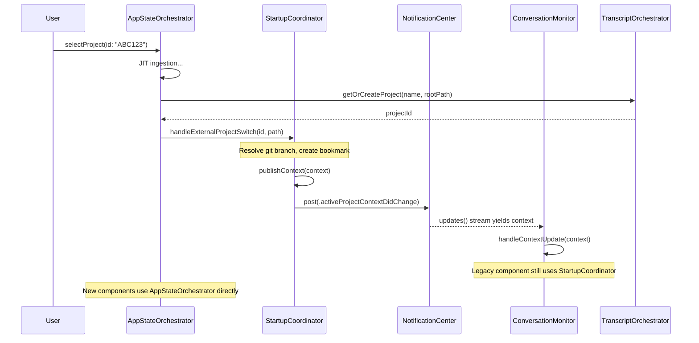

# Startup Coordinator Architecture

**Status:** Legacy compatibility component
**Related:** `sql-backend-architecture.md`, `COMPONENTS.md`

---

## ⚠️ Legacy Component Notice

**StartupCoordinator** is a legacy compatibility shim maintained for backward compatibility with ConversationMonitor and other legacy components.

**Primary Coordinator:** `AppStateOrchestrator`
- Central state coordinator with state machine pattern
- Owns project selection, discovery, and ingestion orchestration
- See: `build/docs/architecture/COMPONENTS.md` - "Application State Coordination"

**StartupCoordinator (Legacy):**
- Receives project switch notifications from AppStateOrchestrator via `handleExternalProjectSwitch()`
- Publishes `ActiveProjectContext` updates for legacy subscribers (ConversationMonitor)
- **Note:** Partial ConversationMonitor split is complete (Phase 1–3), but StartupCoordinator remains in use until remaining CM subsystems move out

**For New Development:** Use AppStateOrchestrator directly. Only use StartupCoordinator if integrating with legacy components that haven't been migrated to current patterns.

---

## Executive Summary

The **Startup Coordinator** provides a single source of truth for project identity via the ActiveProjectContext struct, which is published to legacy components that haven't yet migrated to AppStateOrchestrator.

**Key Role:**
- Receives notifications from AppStateOrchestrator about project changes
- Publishes ActiveProjectContext updates via AsyncStream for legacy subscribers
- Provides stable project ID as primary identity (not filesystem path)
- Maintains backward compatibility during architectural transition

---

## Architecture Overview

### Components

```
┌─────────────────────────────────────────────────────────────┐
│                   StartupCoordinator                         │
│  ┌───────────────────────────────────────────────────────┐ │
│  │  ActiveProjectContext (for legacy subscribers)        │ │
│  │  - id: String (stable DB primary key)                │ │
│  │  - path: String (filesystem location)                │ │
│  │  - displayName, branch, bookmark                     │ │
│  └───────────────────────────────────────────────────────┘ │
│                                                              │
│  Published via updates() -> AsyncStream<ActiveProjectContext>│
└─────────────────────────────────────────────────────────────┘
                              │
                              ├──→ ConversationMonitor (starts monitoring with projectId)
                              └──→ Other legacy subscribers using StartupCoordinator.shared.updates()
```

### Integration with AppStateOrchestrator



### handleExternalProjectSwitch Method

Bridge method that allows AppStateOrchestrator to notify StartupCoordinator of project changes:

```swift
// StartupCoordinator#handleExternalProjectSwitch
public func handleExternalProjectSwitch(id: String, path: String) async throws {
  // Resolve git branch for the project
  let branch = await resolveGitBranch(path: path)

  // Create security-scoped bookmark (required for sandboxed builds)
  let bookmark = await Task.detached {
    let url = URL(fileURLWithPath: path).resolvingSymlinksInPath()
    return try? url.bookmarkData(options: [.withSecurityScope], ...)
  }.value

  // Create context with bookmark
  let context = ActiveProjectContext(
    id: id,
    path: path,
    displayName: URL(fileURLWithPath: path).lastPathComponent,
    branch: branch,
    bookmark: bookmark
  )

  // Publish via standard flow for deduplication
  await publishContext(context)
}
```

**Purpose:** Bridge between current architecture (AppStateOrchestrator) and legacy components (ConversationMonitor).

**When to Use:**
- ✅ ConversationMonitor integration (required until remaining refactor phases complete)
- ✅ Other legacy components using `StartupCoordinator.shared.updates`
- ❌ New components (use AppStateOrchestrator directly)

---

## Current Role: Legacy Compatibility

**Primary Responsibilities:**

1. **Receive External Notifications**
   - `handleExternalProjectSwitch(id:path:)` called by AppStateOrchestrator
   - Creates `ActiveProjectContext` from notification

2. **Publish to Legacy Subscribers**
   - ConversationMonitor still uses `StartupCoordinator.shared.updates`
   - Other legacy components may still subscribe

3. **Maintain Backward Compatibility**
   - Keeps existing APIs working during transition
   - Allows incremental migration to AppStateOrchestrator

**Responsibilities Moved to AppStateOrchestrator:**

1. **Project Discovery** → `LightweightDiscoveryService.discoverProjectsLightweight()`
2. **Ingestion Orchestration** → `FastPathIngestionCoordinator.ingestProjectJIT()`
3. **State Management** → `AppStateOrchestrator.state` (state machine)
4. **Primary Coordinator** → `AppStateOrchestrator` is central coordinator

---

## Key Design Decisions

### 1. Project ID as Primary Identity

**Architecture:**
- Coordinator owns `getOrCreateProject()` database call
- Publishes stable `context.id` to all subscribers
- Filesystem path is metadata only
- All subsystems use ID for database queries

**Benefits:**
- Stable identity (filesystem paths can change)
- No race conditions from path-dependent lookups
- Single source of truth for project identity

### 2. Multicast AsyncStream via Method

**Implementation:**
```swift
// Each call to updates() returns a fresh stream backed by NotificationCenter
// This provides multicast semantics - all subscribers receive all updates
for await context in StartupCoordinator.shared.updates() {
    await handleContextUpdate(context)
}
```

**Why Method Instead of Property:**
- A shared `AsyncStream` property would be unicast (subscribers compete for elements)
- Method pattern creates fresh stream per subscriber (multicast)
- Each stream has its own NotificationCenter observer

**Benefits:**
- Type-safe (compiler-enforced context structure)
- Multicast (all subscribers receive all updates)
- Deduplication handled in `publishContext()` before notification

### 3. Off-Main-Thread Database Operations

All database operations run on background threads:

```swift
private func ensureProjectInDatabase(path: String) async throws -> String {
    let result = await Task.detached(priority: .userInitiated) {
        let orchestrator = try TranscriptOrchestrator(dbManager: .shared)
        return try orchestrator.getOrCreateProject(name: name, rootPath: path)
    }.value
    return result
}
```

**Why:**
- Avoids blocking main thread during startup
- Database I/O can be slow (especially on first launch)
- State updates still happen on MainActor

---

## API Reference

### ActiveProjectContext

```swift
@frozen
public struct ActiveProjectContext: Sendable, Equatable {
    public let id: String          // Stable DB primary key (never changes)
    public let path: String         // Filesystem location (can change)
    public let displayName: String  // UI display name
    public let branch: String?      // Git branch (nil if not a git repo)
    public let bookmark: Data?      // Security-scoped bookmark (sandboxed builds)
    public let createdAt: Date      // Context creation timestamp
}
```

**Key Properties:**
- `id` is the **primary identity** - use for all database queries
- `path` is **metadata** - do not use for lookups
- Immutable value type (thread-safe)

### StartupCoordinator

```swift
@MainActor
@Observable
public final class StartupCoordinator {
    static let shared: StartupCoordinator

    // Current context (observable)
    public private(set) var current: ActiveProjectContext?

    // Pipeline readiness state for gating UI
    public var pipelineReadiness: PipelineReadiness

    // Create fresh update stream (multicast - each caller gets own stream)
    nonisolated public func updates() -> AsyncStream<ActiveProjectContext>

    // Start coordinator (call once from app launch, idempotent)
    public func start() async  // Note: does not throw

    // Wait for initial context (with 5s timeout)
    public func ready() async throws -> ActiveProjectContext

    // Switch to new project (user action)
    public func switchProject(to path: String) async throws

    // Receive notification from AppStateOrchestrator (legacy bridge)
    public func handleExternalProjectSwitch(id: String, path: String) async throws

    // Update pipeline readiness state
    public func updatePipelineReadiness(
        discoveryComplete: Bool? = nil,
        dbUpdated: Bool? = nil,
        watchersReady: Bool? = nil
    )
}
```

**Usage Patterns:**

```swift
// Pattern 1: Start coordinator (app init) - Legacy path
await StartupCoordinator.shared.start()  // Does not throw

// Pattern 2: Block until ready (ContentView.task) - Legacy path
let context = try await StartupCoordinator.shared.ready()

// Pattern 3: Subscribe to updates (ConversationMonitor) - Legacy path
// Note: updates() is a method, returns fresh stream for each caller (multicast)
for await context in StartupCoordinator.shared.updates() {
    await handleContextUpdate(context)
}

// Pattern 4: AppStateOrchestrator notification (current architecture)
try await StartupCoordinator.shared.handleExternalProjectSwitch(id: projectId, path: projectPath)
```

---

## Migration Guide

### For New Components

**DO:**
```swift
// Use AppStateOrchestrator directly
Task {
    for await _ in NotificationCenter.default.notifications(named: .appStateDidChange) {
        let state = AppStateOrchestrator.shared.state
        if case .active(let projectId) = state {
            self.activeProjectId = projectId
            await refreshData()
        }
    }
}
```

**DON'T:**
```swift
// Don't use StartupCoordinator for new code
for await context in StartupCoordinator.shared.updates() {
    self.activeProjectId = context.id
}

// Don't query HUDViewModel for path (stale)
let path = HUDViewModel.shared.projectRootURL

// Don't call getOrCreateProject directly (coordinator owns this)
let projectId = try orchestrator.getOrCreateProject(...)
```

### For Existing Legacy Code

**NotificationCenter observers are kept for backward compatibility:**
- `.projectRootDidChange` still fires (legacy consumers)
- New code should use AppStateOrchestrator directly
- StartupCoordinator bridges AppStateOrchestrator to legacy components

**HUDViewModel still manages:**
- Git branch detection and watchers
- Security-scoped bookmarks
- Persisting paths to UserDefaults
- **But:** Coordinator calls `getOrCreateProject()` (not HUD)

---

## Testing

### Unit Testing StartupCoordinator

```swift
func testStartPublishesContext() async throws {
    let coordinator = StartupCoordinator(/* inject mocks */)
    await coordinator.start()  // Note: start() does not throw

    let context = try await coordinator.ready()
    XCTAssertEqual(context.path, expectedPath)
}

func testSwitchProjectUpdatesContext() async throws {
    await coordinator.start()
    try await coordinator.switchProject(to: "/new/project")

    XCTAssertEqual(coordinator.current?.path, "/new/project")
}
```

### Integration Testing

```swift
func testFullStartupSequence() async throws {
    // 1. Start coordinator
    await StartupCoordinator.shared.start()  // Does not throw

    // 2. Verify legacy subscribers receive context
    XCTAssertNotNil(ProjectSwitcherState.shared.activeProjectId)

    // 3. Verify timeline starts
    let context = try await StartupCoordinator.shared.ready()
    // ... assert timeline monitoring active
}
```

---

## Troubleshooting

### Common Issues

**Issue:** "No project root available" error on startup
**Cause:** No persisted path, no env var, CWD is root
**Fix:** Set `CONTEXTIFY_PROJECT_ROOT` env var or select project in UI

**Issue:** Legacy components show stale project after switch
**Cause:** Legacy component not subscribed to coordinator updates
**Fix:** Ensure `subscribeToContextUpdates()` called in component initialization

**Issue:** Timeline starts before project selected
**Cause:** `ready()` called before `start()` completes
**Fix:** Ensure coordinator started in `ContextifyApp.init()` before ContentView.task

**Issue:** Database queries fail with "project not found"
**Cause:** Using path instead of ID for lookups
**Fix:** Use `context.id` for all database queries

---

## Performance Considerations

### Startup Time

**Target:** <100ms coordinator overhead

**Breakdown:**
- Resolve project root: <10ms (UserDefaults read)
- Database getOrCreateProject: 20-50ms (SQLite write + read)
- Git branch detection: 10-30ms (file I/O + git subprocess)
- Context creation + publish: <5ms

**Optimization:**
- Database operations run on background thread
- Git detection parallelizable with other startup tasks
- Context caching prevents redundant work on re-entry

### Memory Usage

- `ActiveProjectContext`: ~200 bytes (small value type)
- `AsyncStream` continuation: ~80 bytes
- Total coordinator overhead: <1 KB

---

## Future Refactoring

### Planned Refactoring

**When:** After remaining ConversationMonitor split

**Steps:**

1. **Refactor ConversationMonitor** (P0 - Critical, remaining phases)
   - Completed: TimelineDataLoader, TimelineCacheCoordinator, ViewportTrackingCoordinator, HealthMonitoringCoordinator
   - Remaining: watcher lifecycle extraction, session/follow policy isolation, notification hub
   - Update to use AppStateOrchestrator directly (not StartupCoordinator)

2. **Audit Legacy Subscribers** (1 week)
   - Find all uses of `StartupCoordinator.shared.updates()`
   - Migrate to `AppStateOrchestrator.state` observation
   - Remove AsyncStream subscriptions

3. **Remove StartupCoordinator** (1 week)
   - Delete `app/Sources/ContextifyCore/Coordination/StartupCoordinator.swift`
   - Remove from ContextifyApp initialization
   - Update documentation

4. **Consolidate to AppStateOrchestrator** (1 week)
   - Move any remaining unique functionality to AppStateOrchestrator
   - Verify no regressions via integration tests

### Migration Patterns

**Current (Legacy Pattern):**
```swift
// Legacy pattern (StartupCoordinator)
for await context in StartupCoordinator.shared.updates() {
    self.activeProjectId = context.id
    self.projectPath = context.path
    await refreshTimeline()
}
```

**Future (AppStateOrchestrator):**
```swift
// New pattern (AppStateOrchestrator)
for await _ in NotificationCenter.default.notifications(named: .appStateDidChange) {
    let state = AppStateOrchestrator.shared.state

    switch state {
    case .active(let projectId):
        self.activeProjectId = projectId
        await refreshTimeline()
    default:
        break
    }
}
```

**Alternative (Observation Framework):**
```swift
// Using Swift Observation
@Observable
class MyViewModel {
    init() {
        // Observe published state directly
        // (SwiftUI will automatically subscribe)
    }

    func observeOrchestrator() {
        let orchestrator = AppStateOrchestrator.shared

        // Access via published property
        if case .active(let projectId) = orchestrator.state {
            self.activeProjectId = projectId
        }
    }
}
```

### Benefits of Future Migration

✅ **Simplified Architecture**
- One central coordinator (AppStateOrchestrator) instead of two
- Clear ownership of state
- State machine pattern enforces valid transitions

✅ **Reduced Coupling**
- No more StartupCoordinator → AppStateOrchestrator → StartupCoordinator roundtrip
- Direct observation of AppStateOrchestrator

✅ **Better Performance**
- Eliminate intermediate notification layer
- Fewer allocations (no ActiveProjectContext creation)

✅ **Type Safety**
- AppState enum provides compile-time guarantees
- Pattern matching catches unhandled states

---

## Related Documentation

### Architecture Documentation

- **SQL Backend:** `build/docs/architecture/sql-backend.md`
- **State Management:** `build/docs/architecture/conversation-monitor-state.md`
- **ProjectSwitcher integration:** `build/docs/architecture/project-switcher.md`
- **Implementation:** `app/Sources/ContextifyCore/Coordination/StartupCoordinator.swift`

### Current Architecture

**AppStateOrchestrator:**
- Architecture: `build/docs/architecture/COMPONENTS.md` - "Application State Coordination"
- Data flow: `build/docs/architecture/data-pipeline-architecture.md`
- Implementation: `app/Sources/ContextifyCore/Orchestration/AppStateOrchestrator.swift`

**Future Refactoring:**
- Refactoring roadmap: `build/docs/architecture/architecture-refactoring-analysis.md`
- ConversationMonitor split: `architecture-refactoring-analysis.md` (ConversationMonitor section)

---

## Changelog

**Current:**
- Legacy compatibility shim for ConversationMonitor
- Receives notifications from AppStateOrchestrator via handleExternalProjectSwitch()
- Publishes ActiveProjectContext to legacy subscribers
- Planned for removal after ConversationMonitor refactor

**v1.0:**
- Initial implementation
- Replaced notification-based startup with typed AsyncStream
- Coordinator owns `getOrCreateProject()` database call
- Project ID as stable primary identity
