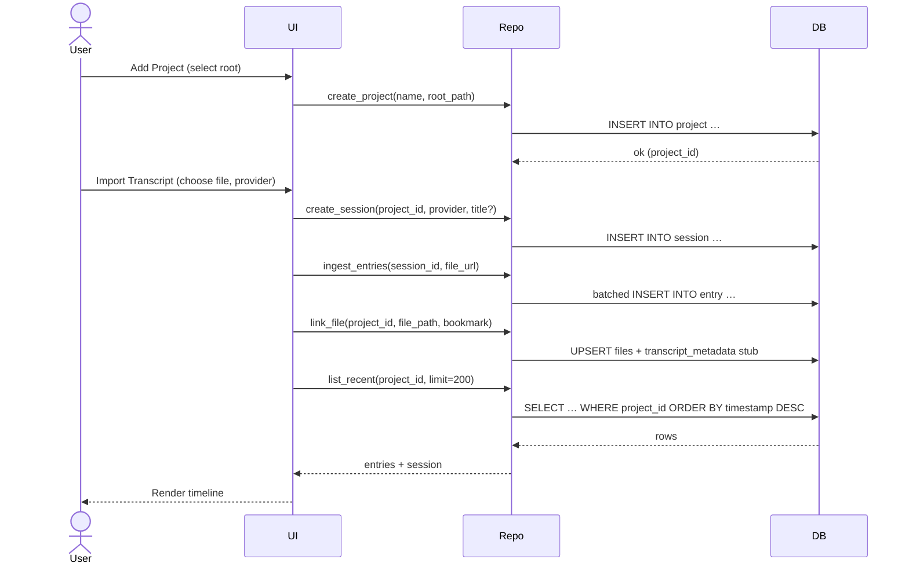
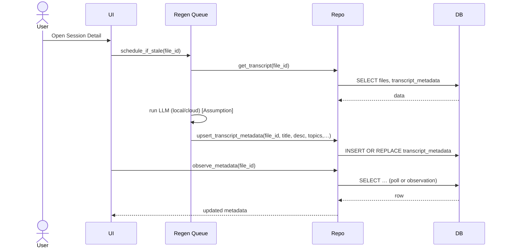
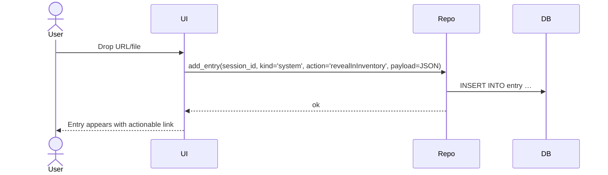
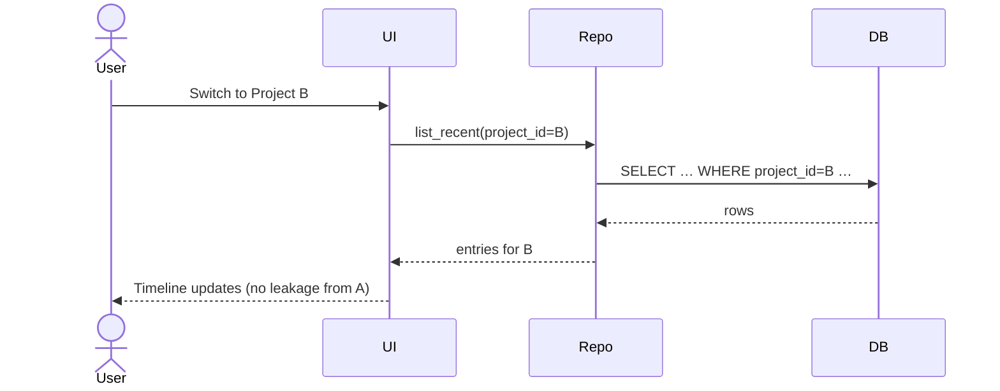
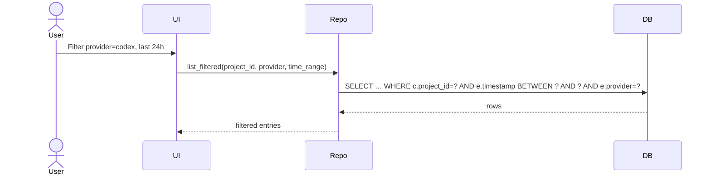
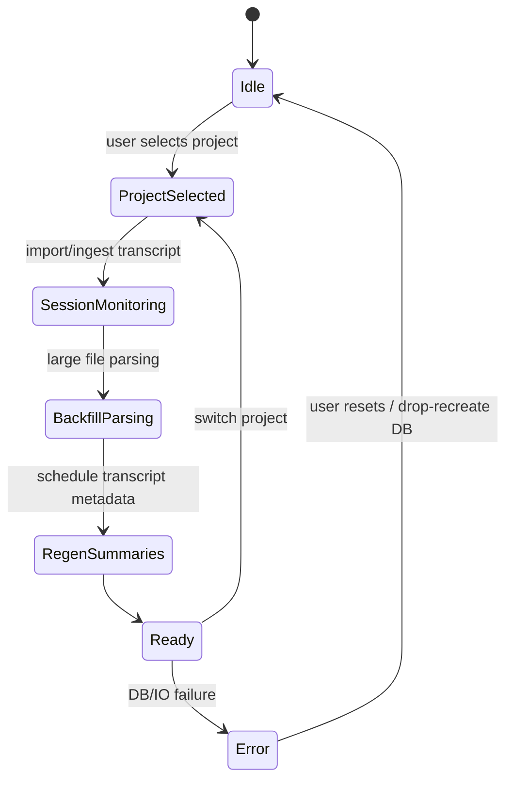

# 0. Non-Goals & Boundaries

> **Out of scope for v1 (macOS):**
>
> * No server, no CloudKit, no sync.
> * No at-rest DB encryption; rely on macOS user sandbox and file perms.
> * No CRDTs or multi-writer replication.
> * No FTS; simple filters only (indexes + LIKE).
> * No rollback path other than **drop/recreate local DB**.
> * No legacy migration; **greenfield create**. Derived data (summaries, labels) are regenerated as needed.
> * No SQL-backed preferences; use UserDefaults.

---

# 1. Preamble for Fresh LLM Context (≤1 page)

**Product:** Contextify is a macOS developer companion that captures session context (transcripts/terminal output), turns it into a navigable timeline, and derives summaries/labels to make “what was I doing?” fast to answer. Users can manage multiple projects, ingest transcripts, drop files/URLs, and review a recent-first feed.

**Audience:** Individual developers/product engineers on macOS; a mobile client is planned to quick-capture ideas and nudge the AI later, but **not shipped in v1**.

**Platform scope (v1):** macOS app, single-user, offline-first, single local SQLite DB via GRDB.swift.

**Vocabulary (v1 canonical names):**

* **project** — a workspace rooted at a code directory.
* **session** — a captured conversation/transcript associated with a project.
* **entry** — a timeline item (user/assistant/system line, event, or derived summary).
* **files** — project-scoped file identities (e.g., transcript paths) with bookmarks.
* **transcript_metadata** — LLM-derived title/description/topics for a transcript file.

**Key constraints:** Greenfield DB; no migration; macOS v1 only. Mobile influences naming only if it improves clarity for later phases.

---

# 2. Product Overview — macOS Application (deep)

## 2.1 Core Value & Primary Use Cases

Top jobs-to-be-done (success criteria in parentheses):

1. **Resume work quickly** by seeing a recent-first timeline per project (open feed ≤5 ms p95 @50k entries).
2. **Capture sessions** from transcripts/terminal logs with minimal friction (ingest 10k lines <2 s).
3. **Derive summaries/labels** per transcript for scan-ability (regen runs asynchronously; UI stays responsive).
4. **Collect artifacts** by dropping files/URLs into timeline (visible immediately; link resolvable).
5. **Filter/search narrowly (non-FTS)** by project, session, provider, time range (index-backed).
6. **Switch projects safely** with no cross-leakage (all reads/writes scoped to project_id).
7. **Operate offline** with crash-safe writes (WAL, idempotent upserts).

## 2.2 Feature Inventory (macOS)

| Feature                     | Purpose                       | Main actions                                      | Inputs → Outputs                         | Background tasks                     | Reads/Writes                     |
| --------------------------- | ----------------------------- | ------------------------------------------------- | ---------------------------------------- | ------------------------------------ | -------------------------------- |
| Multi-project mgmt          | Partition workspaces          | Add/select project; update root path              | root path → project row                  | none                                 | R/W: `project`                   |
| Session capture/ingest      | Bring transcripts into system | Import transcript file; map provider; parse lines | file path/provider → session + entries   | optional async line parsing          | R/W: `session`, `entry`, `files` |
| Transcript/terminal parsing | Normalize raw logs            | Heuristic segmentation; timestamping              | raw text → entries (kind/user/assistant) | none (streaming write)               | W: `entry`                       |
| Artifact capture (file/URL) | Save dropped assets           | Drop to timeline; open in OS                      | path/URL → entry with action payload     | none                                 | W: `entry`                       |
| Summary & label generation  | Derive scan-ability           | Generate title/description/topics                 | transcript → transcript_metadata         | async regeneration queue (in-memory) | W: `transcript_metadata`         |
| Feeds & timelines           | Navigate context              | List recent entries; per-session view             | filters → rows                           | none                                 | R: `entry`, `session`            |
| Filters (non-FTS)           | Narrow results                | By time/provider/session                          | predicates → rows                        | none                                 | R: indexed scans                 |
| Preferences (UserDefaults)  | App settings                  | Toggle behaviors                                  | kv → plist                               | none                                 | n/a (not in DB)                  |

## 2.3 User Flows & Journeys (macOS)

**Flow A — Create project → Ingest transcript → Review timeline**



**Flow B — Generate transcript metadata (async)**



**Flow C — Drop file/URL into timeline**



**Flow D — Switch project safely**



**Flow E — Filter by provider/time (non-FTS)**



## 2.4 Screen & State Map (macOS)

**Sitemap:** Projects List → Project Dashboard (Recent Feed) → Session Detail (Entries) → Transcript Detail (Metadata) → Settings.

**State diagram:**



**UI data contracts (read/write):**

* Projects List: `Repo.projects.list()` / create/update/delete.
* Project Dashboard: `Repo.entries.recent(project_id, limit)`; write via drop-to-add entry.
* Session Detail: `Repo.sessions.get(session_id)` + `Repo.entries.by_session(session_id)`.
* Transcript Detail: `Repo.files.get(file_id)` + `Repo.transcripts.get(file_id)`; write via `Repo.transcripts.upsert`.

## 2.5 Runtime Behaviors

* Offline-first; no network assumptions.
* Writes are transactional; batched inserts; WAL enabled.
* Derived data (transcript metadata) regenerated asynchronously; idempotent; failure is non-fatal.
* Progress reporting for long ingests (line counts).
* Failure surfaces: DB open/migration error, file permission issues, invalid transcript format. Recovery: report, skip, or drop/recreate DB.

## 2.6 Performance Budgets (macOS)

| Action                         | Target (p95) | Notes                               |
| ------------------------------ | ------------ | ----------------------------------- |
| DB open + quick_check          | ≤ 150 ms     | warm cache                          |
| Recent feed (50k entries)      | ≤ 5 ms       | indexed select                      |
| Insert batch 2k entries        | ≤ 150 ms     | single transaction                  |
| Transcript metadata upsert     | ≤ 2 ms       | single row                          |
| Filtered list (provider + 24h) | ≤ 5 ms       | composite coverage via join pattern |
| Slow-query logging threshold   | ≥ 50 ms      | OSLog `db.query.slow`               |

---

# 3. Product Overview — Mobile Application (directional, naming-relevant)

## 3.1 Vision & Use Cases (mobile)

* Quick capture ideas/todos; nudge AI (“continue plan”, “refine brief”).
* Review AI-generated briefs and give lightweight feedback.
* View and branch small artifacts/drafts.

## 3.2 Feature Inventory (directional)

Future entities: **artifact**, **task**, **ai_job**, **feedback**, **branch**, **sync_state**; later **FTS** for on-device search. **Not in v1 DB.**

## 3.3 User Flows (mobile; directional)

**Flow M1 — Capture idea → desktop sees it later**

```mermaid
sequenceDiagram
actor MobileUser
participant Mobile
participant (Future Sync)
MobileUser->>Mobile: Add idea in Project X
Mobile->>(Future Sync): enqueue task(kind=note)
```

**Flow M2 — Review brief → give feedback**

```mermaid
sequenceDiagram
actor MobileUser
participant Mobile
participant (Future Sync)
MobileUser->>Mobile: Open Brief Y
Mobile->>Mobile: Render sections
MobileUser->>Mobile: 👍 + comment
Mobile->>(Future Sync): feedback queued
```

## 3.4 Mobile-Influenced Naming

* **session** (not “conversation”): consistent across platforms.
* **entry** (not “timeline_entry”): shorter, general.
* **project** (plural table name avoided; we use singular).
* These names are used in v1 DB now, to minimize later churn.

---

# 4. Cross-Client Invariants & Contracts

* **Identity:** UUIDv4 strings (`TEXT`) as primary keys; stable across devices if/when synced later.
* **Timestamps:** `INTEGER` epoch seconds; `created_at`, `updated_at` on all mutable rows.
* **Booleans:** `INTEGER` 0/1.
* **Scoping:** Every `session`, `file`, `transcript_metadata`, and `entry` is **owned by `project_id` either directly or via FK chain**.
* **Conflict policy (future):** last-write-wins on `updated_at`; soft-delete via `deleted_at` when added in v1.x.
* **Permissions:** DB lives under `~/Library/Application Support/Contextify/`; files use security-scoped bookmarks; no network access required.
* **Privacy:** Store only data necessary for navigation and summaries; no credentials.

---

# 5. Canonical Domain Model

**Entities (v1):** `project`, `session`, `entry`, `files`, `transcript_metadata`.
**Future (v1.x+):** `artifact`, `task`, `ai_job`, `feedback`, `branch`, `sync_state`, `FTS` tables.

**Plain relationships:**

* A **project** has many **sessions** and **files**.
* A **session** has many **entries**.
* A **file** (transcript) has one **transcript_metadata** row.
* Entries optionally reference resources via `action` + `action_payload`.

**ER diagram:**

```mermaid
erDiagram
  project ||--o{ session : owns
  project ||--o{ files : owns
  session ||--o{ entry : contains
  files ||--|| transcript_metadata : has

  project {
    TEXT id PK
    TEXT name
    TEXT root_path
    BLOB root_bookmark
    INTEGER created_at
    INTEGER updated_at
  }

  session {
    TEXT id PK
    TEXT project_id FK
    TEXT provider
    TEXT title
    TEXT status
    INTEGER started_at
    INTEGER ended_at
    INTEGER created_at
    INTEGER updated_at
  }

  entry {
    INTEGER rowid PK
    TEXT id UNIQUE
    TEXT session_id FK
    TEXT provider
    TEXT kind
    TEXT disposition
    TEXT present_form
    TEXT past_form
    TEXT selected_tense
    TEXT summary
    TEXT detail
    TEXT source_content
    INTEGER is_error
    INTEGER is_completion
    INTEGER is_directive
    TEXT request_id
    TEXT action
    TEXT action_payload
    INTEGER timestamp
    INTEGER generated_at
    INTEGER created_at
    INTEGER updated_at
  }

  files {
    TEXT id PK
    TEXT project_id FK
    TEXT absolute_path
    BLOB bookmark
    INTEGER updated_at
  }

  transcript_metadata {
    TEXT file_id PK, FK
    TEXT title
    TEXT description
    TEXT topics
    REAL confidence
    INTEGER needs_review
    INTEGER generated_at
    TEXT model
    INTEGER prompt_version
    INTEGER generator_version
    INTEGER created_at
    INTEGER updated_at
  }
```

---

# 6. Schema Specification (SQL Contract)

## 6.1 SQLite DDL (GRDB.swift) — Initial Create (v1 only)

```sql
PRAGMA foreign_keys = ON;

-- project
CREATE TABLE project (
  id TEXT PRIMARY KEY,
  name TEXT,
  root_path TEXT NOT NULL,
  root_bookmark BLOB,
  created_at INTEGER NOT NULL,
  updated_at INTEGER NOT NULL
);
CREATE UNIQUE INDEX idx_project_root_path ON project(root_path);
CREATE INDEX idx_project_updated_at ON project(updated_at DESC);

-- session
CREATE TABLE session (
  id TEXT PRIMARY KEY,
  project_id TEXT NOT NULL REFERENCES project(id) ON DELETE CASCADE,
  provider TEXT NOT NULL CHECK (provider IN ('claude.code','codex.cli','other')),
  title TEXT,
  status TEXT NOT NULL DEFAULT 'active' CHECK (status IN ('active','archived')),
  started_at INTEGER,
  ended_at INTEGER,
  created_at INTEGER NOT NULL,
  updated_at INTEGER NOT NULL
);
CREATE INDEX idx_session_project_status ON session(project_id, status, updated_at DESC);

-- entry
CREATE TABLE entry (
  rowid INTEGER PRIMARY KEY,
  id TEXT NOT NULL UNIQUE,
  session_id TEXT NOT NULL REFERENCES session(id) ON DELETE CASCADE,

  provider TEXT,                         -- mirrors session if known
  kind TEXT NOT NULL CHECK (kind IN ('user','assistant','system')),

  -- desktop-derived fields (kept for UI phrasing)
  disposition TEXT,
  present_form TEXT,
  past_form TEXT,
  selected_tense TEXT NOT NULL DEFAULT 'present',

  -- content fields usable by both clients
  summary TEXT,
  detail TEXT,
  source_content TEXT,

  -- flags & correlation
  is_error INTEGER NOT NULL DEFAULT 0,
  is_completion INTEGER NOT NULL DEFAULT 0,
  is_directive INTEGER NOT NULL DEFAULT 0,
  request_id TEXT,

  -- actions for artifacts/URLs
  action TEXT NOT NULL DEFAULT 'none' CHECK (action IN ('none','revealInInventory')),
  action_payload TEXT,

  -- timing
  timestamp INTEGER NOT NULL,            -- event time
  generated_at INTEGER,                  -- when derived

  -- bookkeeping
  created_at INTEGER NOT NULL,
  updated_at INTEGER NOT NULL
);
CREATE INDEX idx_entry_session_time ON entry(session_id, timestamp DESC);
CREATE INDEX idx_entry_request ON entry(request_id);

-- files (per-project file identities; not content-hash keyed)
CREATE TABLE files (
  id TEXT PRIMARY KEY,                   -- stable identity (e.g., bookmark hash)
  project_id TEXT NOT NULL REFERENCES project(id) ON DELETE CASCADE,
  absolute_path TEXT NOT NULL,
  bookmark BLOB,
  updated_at INTEGER NOT NULL
);
CREATE UNIQUE INDEX idx_files_project_path ON files(project_id, absolute_path);
CREATE INDEX idx_files_project ON files(project_id);

-- transcript_metadata (derived; re-buildable)
CREATE TABLE transcript_metadata (
  file_id TEXT PRIMARY KEY REFERENCES files(id) ON DELETE CASCADE,
  title TEXT NOT NULL,
  description TEXT NOT NULL,
  topics TEXT NOT NULL,                  -- JSON array as TEXT
  confidence REAL NOT NULL,
  needs_review INTEGER NOT NULL,
  generated_at INTEGER NOT NULL,
  model TEXT NOT NULL,
  prompt_version INTEGER NOT NULL,
  generator_version INTEGER NOT NULL,
  created_at INTEGER NOT NULL,
  updated_at INTEGER NOT NULL
);
CREATE INDEX idx_tmeta_updated_at ON transcript_metadata(updated_at DESC);
CREATE INDEX idx_tmeta_needs_review ON transcript_metadata(needs_review);
```

## 6.2 Rationale per Table (2–3 lines)

* **project:** first-class scoping; unique `root_path` guards duplicates; bookmark enables sandboxed access.
* **session:** aligns to “thread/transcript”; status supports archive; provider constrained for predictable filters.
* **entry:** unified timeline item; keeps desktop phrasing (present/past_form) plus general `summary/detail`; indexed by session+time; actions carry dropped file/URL behaviors without extra tables.
* **files:** project-scoped identity by path/bookmark; avoids collisions across projects.
* **transcript_metadata:** derived, replaceable; index on `updated_at` for “stale” detection and `needs_review` for moderation queues.

## 6.3 Postgres Sketch (future parity)

* Replace `TEXT id` with `uuid PRIMARY KEY DEFAULT gen_random_uuid()`.
* `INTEGER` epoch seconds → `timestamptz`; add generated columns for day/month if needed.
* `BLOB` → `bytea`; `topics` TEXT → `jsonb`.
* Same FKs and CHECK constraints; indexes mirror SQLite but consider composite indexes with `INCLUDE()` columns for covering scans.

## 6.4 Forward Plan

Minimal v1.x migrations (additive):

1. **Add FTS (optional):** `entry_fts`, triggers; no schema breaks.
2. **Add mobile entities:** `artifact`, `task`, `ai_job`, `feedback`, `branch`.
3. **Add soft-delete:** `deleted_at` on user-mutable tables.
4. **Add sync_state:** `(entity, entity_id, remote_id, is_dirty, last_pushed_at, last_pulled_at)`.

---

# 7. Data Access Layer & App Contracts

**Repository boundaries (Swift protocols; project-scoped):**

```swift
protocol ProjectRepo {
  func create(name: String?, rootPath: String, bookmark: Data?) throws -> String // project_id
  func list() throws -> [Project]
  func get(id: String) throws -> Project?
}

protocol SessionRepo {
  func create(projectID: String, provider: String, title: String?) throws -> String
  func setStatus(id: String, status: String) throws
  func byProject(projectID: String, status: String?, limit: Int) throws -> [Session]
}

protocol EntryRepo {
  func insertBatch(sessionID: String, entries: [NewEntry]) throws
  func recentByProject(projectID: String, limit: Int) throws -> [Entry]     // via join
  func bySession(sessionID: String, limit: Int?) throws -> [Entry]
  func filtered(projectID: String, provider: String?, start: Int?, end: Int?, limit: Int) throws -> [Entry]
}

protocol FilesRepo {
  func upsert(projectID: String, absolutePath: String, bookmark: Data?) throws -> String // file_id
  func get(fileID: String) throws -> FileRow?
}

protocol TranscriptMetadataRepo {
  func upsert(_ row: TranscriptMetadataRow) throws
  func get(fileID: String) throws -> TranscriptMetadataRow?
}
```

**GRDB setup (WAL, sync, foreign keys):**

```swift
var config = Configuration()
config.foreignKeysEnabled = true
config.prepareDatabase { db in
  try db.execute(sql: "PRAGMA journal_mode=WAL;")
  try db.execute(sql: "PRAGMA synchronous=NORMAL;")
  try db.execute(sql: "PRAGMA wal_autocheckpoint=1000;")
  try db.execute(sql: "PRAGMA temp_store=MEMORY;")
}
let db: DatabaseWriter = try DatabaseQueue(path: dbPath, configuration: config)
try migrator.migrate(db)
```

**Background job model (regen):**

* In-memory queue with exponential backoff.
* Idempotency key: `file_id` + `prompt_version` + `generator_version`.
* On success: `upsert` metadata; on failure: retry capped; mark `needs_review=1`.

---

# 8. Operational Behavior (Startup/Validation/Maintenance)

* **First-run create gate:** If DB missing, run schema create before UI shows data.
* **Validation:** `PRAGMA quick_check;` + canary `SELECT 1` at app start; on error, block startup and offer “Drop & Recreate DB”.
* **Checkpointing:** passive checkpoint on idle and app quit; `wal_checkpoint(TRUNCATE)` after large ingests.
* **ANALYZE/VACUUM:** ANALYZE weekly; VACUUM monthly or when DB bloat >25% (user-initiated maintenance).

---

# 9. macOS Multi-Project Support

* **Schema elements:** `session.project_id` FK; `files.project_id` FK; `project` root uniqueness; all reads filter through `project_id` (directly or via join).
* **Indexes:** `idx_session_project_status`, `idx_files_project`, join pattern for entries ensures planner uses `session.project_id`.
* **Path rename/move:** keep `files.id` stable (bookmark hash or OS file ID); update `absolute_path` and `bookmark` on change; no identity drift.
* **Leakage guard:** all list queries accept a `project_id` and assert it in WHERE clause.

---

# 10. Performance & SLOs

| Hot path                  | Indexes                                                | Query shape                                                                                  | SLO                    |
| ------------------------- | ------------------------------------------------------ | -------------------------------------------------------------------------------------------- | ---------------------- |
| Project recent feed       | `idx_session_project_status`, `idx_entry_session_time` | `JOIN session s ON e.session_id=s.id WHERE s.project_id=? ORDER BY e.timestamp DESC LIMIT ?` | ≤5 ms p95 @50k entries |
| Session list              | `idx_session_project_status`                           | `WHERE project_id=? AND status=? ORDER BY updated_at DESC LIMIT ?`                           | ≤3 ms                  |
| Batch insert entries (2k) | — (transaction)                                        | single transaction, prepared statements                                                      | ≤150 ms                |
| Metadata upsert           | `idx_tmeta_updated_at`                                 | single row upsert                                                                            | ≤2 ms                  |
| DB open + quick_check     | —                                                      | PRAGMA + canary                                                                              | ≤150 ms                |

**Slow-query logging:** OSLog `db.query.slow` when elapsed ≥50 ms; sample 1:10 for 10–50 ms.

---

# 11. Security & Privacy (practical)

* **Data stored:** transcripts (paths/bookmarks), derived summaries, timeline text; no credentials or tokens.
* **Paths:** `~/Library/Application Support/Contextify/` for DB; 0600 perms on `*.db*`.
* **Sandbox:** use security-scoped bookmarks for external files; do not persist raw file contents unless explicitly dropped as text.

**Future options:** SQLCipher or APFS encrypted volume; would require key management and perf evaluation; defer.

---

# 12. Observability & Diagnostics

* **OSLog categories:** `db.open`, `db.create`, `db.validate`, `db.query.slow`, `db.checkpoint`, `regen.run`, `ingest.run`.
* **Counters:** ingested_lines_total, entries_total, sessions_total, regen_success_total, regen_failure_total.
* **Health checks:** quick_check result at startup; WAL size sampled; last ANALYZE time.

---

# 13. Quality & Test Plan (lean)

* **Unit:** repo CRUD; FK enforcement; CHECK constraints; upsert idempotency.
* **Golden fixtures:** small corpus (2 projects, 3 sessions each, ~1k entries) + one large transcript (~10k lines).
* **Performance smoke:** batch insert 2k entries; feed query at scale; open+check timing.
* **Failure simulation:** invalid provider, FK violations, missing project on insert; file bookmark decode failure.
* **UI smoke:** project switch, timeline scroll, transcript detail update after regen.

---

# 14. Implementation Phases (Functionality-first)

**Phase 0 (ship macOS v1):**

* Deliverables: DDL create; GRDB setup; repositories; multi-project UI; ingest + timeline + basic filters; transcript metadata regen; indexes; SLO logging.
* Acceptance: SLOs met; no cross-project leakage; derived data appears; slow-query logs sampled.

**Phase 1 (regen surfacing):**

* Improve metadata freshness detection; add needs_review workflows; progress UI polish.

**Phase 2 (optional, post-v1):**

* Add **mobile entities** (`artifact`, `task`, `ai_job`, `feedback`, `branch`) and **FTS** via additive migrations; consider **sync_state** scaffolding.

**Rollback for any phase:** drop/recreate local DB (derived data is reproducible).

---

# 15. Risks, Decisions & Assumptions

**Decisions:**

* Use **session/entry** names for cross-platform coherence.
* No FTS in v1; rely on indexed filters for simplicity.
* No job tables; regen is ephemeral/in-memory (derived data is reproducible).

**Assumptions:**

* **Assumption:** LLM access for summaries is available locally or via user-configured API.
  *Risk:* unavailable leads to empty metadata. *Mitigation:* UI tolerates missing summaries; mark as `needs_review=1`.
* **Assumption:** Transcript files remain accessible after ingest via bookmarks.
  *Risk:* moved/deleted files break regen. *Mitigation:* show resolution UI; keep entries intact.
* **Assumption:** Single user, single writer process.
  *Risk:* future sync will need conflict handling. *Mitigation:* adopt `updated_at` everywhere; plan soft-delete later.

**Top risks & mitigations:**

* **Ingest of very large logs** may exceed budgets → chunked streaming insert; progress UI; consider temporary file mapping.
* **Schema drift** once mobile ships → we already adopted cross-platform naming; mobile tables are additive.
* **Performance regressions** → slow-query logs + ANALYZE cadence; add covering indexes only when measured.

---

## Tables (additional reference)

**Permission matrix**

| Capability          | Store       | Gate                        |
| ------------------- | ----------- | --------------------------- |
| Read/write DB       | App Support | Always; local               |
| Read external files | Bookmark    | User consented              |
| Network (LLM)       | N/A         | Off by default; user config |

**Performance budgets** — see §10.

**Analytics/telemetry events (local logs)**

| Event           | Payload                           |
| --------------- | --------------------------------- |
| `ingest.run`    | project_id, session_id, lines, ms |
| `regen.run`     | file_id, ok/fail, ms              |
| `db.query.slow` | name, ms, bind_count              |
| `db.checkpoint` | wal_bytes_before/after            |

**Background jobs (in-memory)**

| Job                | Key                                          | Idempotency     |
| ------------------ | -------------------------------------------- | --------------- |
| Transcript summary | file_id + prompt_version + generator_version | Upsert metadata |

**Error → recovery mapping**

| Error               | Detection           | Recovery                           |
| ------------------- | ------------------- | ---------------------------------- |
| DB invalid          | quick_check fail    | Block UI; drop/recreate            |
| FK violation        | insert/update error | Guard in repos; log; show toast    |
| File bookmark stale | open error          | Prompt re-locate; update bookmark  |
| LLM unavailable     | exception           | Mark `needs_review=1`; retry later |

