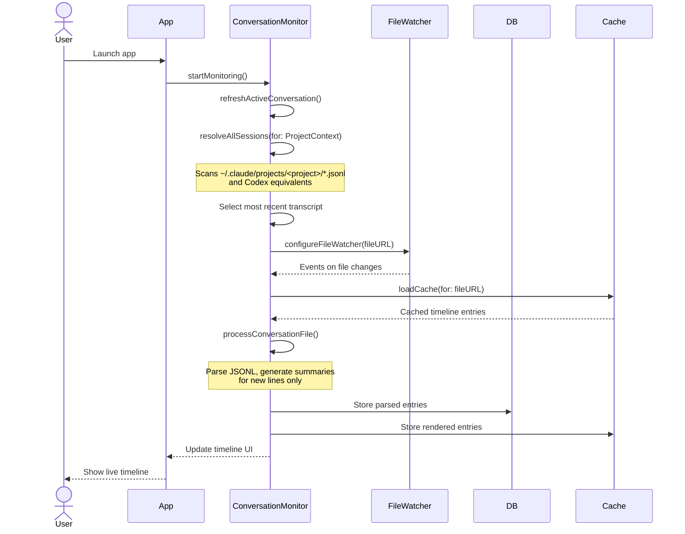
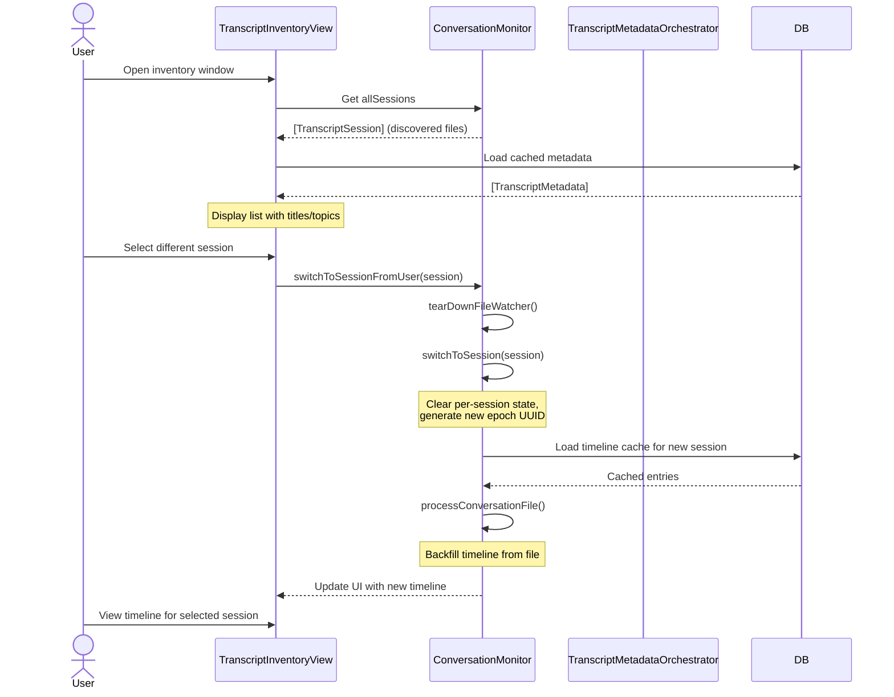
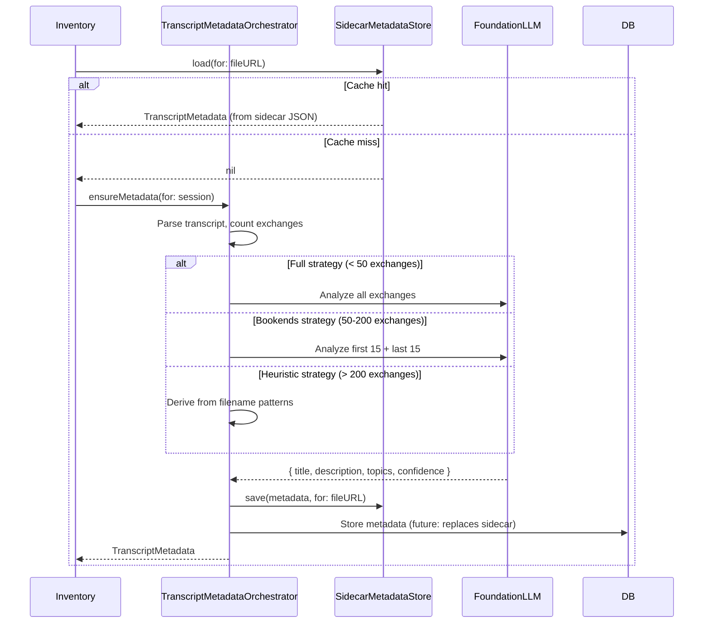
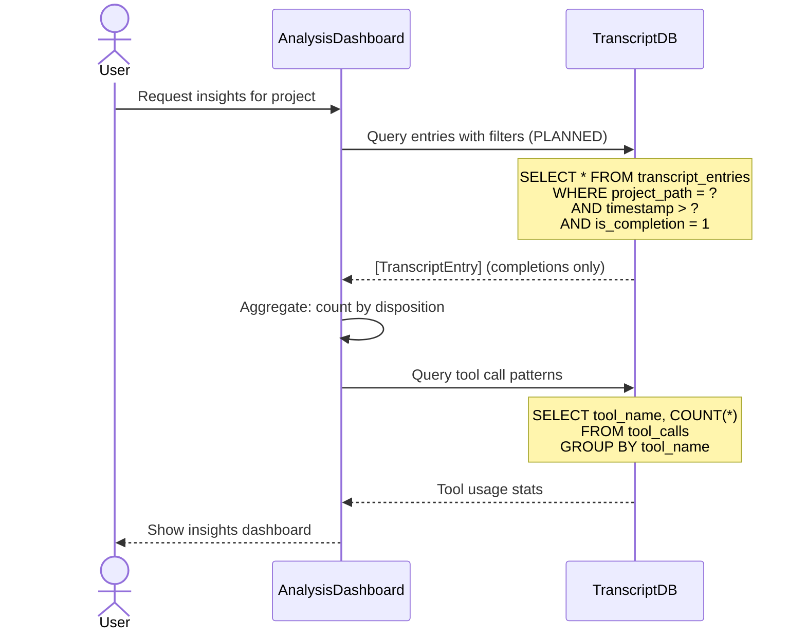
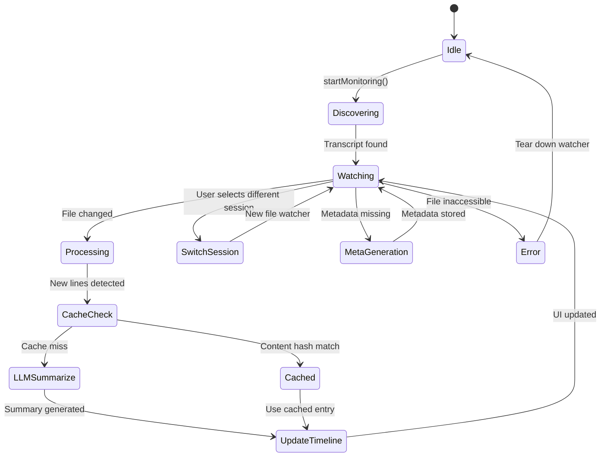

# SQLite Backend Architecture Brief (v2)

**Date:** 2025-10-10
**Status:** Planning document (no SQL implementation yet; file-based caches current)
**Supersedes:** `sql-implementation-plan-01.md` (conceptual plan with incorrect assumptions)

---

# 0. Non-Goals & Boundaries

> **Out of scope for v1 (macOS):**
>
> * No server, no CloudKit, no sync.
> * No at-rest DB encryption; rely on macOS user sandbox and file perms.
> * No CRDTs or multi-writer replication.
> * No FTS in v1; defer to v1.x (indexes + LIKE for filters).
> * No rollback path other than **drop/recreate local DB**.
> * No legacy migration support; **greenfield create**. Derived data (summaries, metadata) regenerates from external transcript files.
> * No SQL-backed preferences; use UserDefaults for app settings.
> * **Transcripts remain external files**; DB stores references + derived analysis, not raw content.

---

# 1. Preamble for Fresh LLM Context (≤1 page)

## Product Reality (October 2025)

**What Contextify Is:**
Contextify is a macOS developer companion that **monitors and analyzes AI coding sessions** in real-time. It automatically discovers conversation transcripts from Claude Code and Codex CLI, renders them as navigable timelines with LLM-powered summaries, and provides rich metadata for search and correlation. Users can browse historical sessions, switch between conversations, and (with the new SQLite backend) perform deep analysis across their entire coding history.

**What Contextify Is NOT:**
- ❌ A manual import/capture tool
- ❌ A file/URL ingestion system
- ❌ A content management system that stores transcript text in DB

**Reality:** Transcripts live as **external JSONL files** (in `~/.claude/projects/` for Claude Code, similar paths for Codex). Contextify watches these files, parses them on-the-fly, and stores only **references + derived data** (summaries, metadata, analysis) in SQLite.

## Audience

Individual developers/product engineers on macOS; a mobile client is directional but **not in v1 scope**.

## Platform Scope (v1)

macOS app, single-user, offline-first, local SQLite DB (planned). Current storage: file-based caches (JSON) + UserDefaults. Future: GRDB.swift or native SQLite3 via actor.

## Vocabulary (v1 canonical names)

* **transcript** — an external JSONL file containing a conversation session (Claude Code or Codex CLI format).
* **session** — a logical grouping of related messages within a transcript (may be 1:1 or N:1 depending on provider).
* **timeline entry** — a user/assistant message rendered in the timeline UI with an LLM-generated summary.
* **transcript metadata** — LLM-derived title/description/topics for a transcript file (stored in DB + sidecar JSON).
* **timeline cache** — rendered timeline entries keyed by content hash + context window (avoids re-summarizing).
* **project** — a workspace rooted at a code directory (matches `HUDViewModel.projectRootURL`).

## Key Constraints

* **Greenfield DB** (no migration from UserDefaults).
* **External transcripts** (DB holds references, not content).
* **Cache-first** architecture (LLM operations are expensive).
* **Worktree-aware** discovery (via `ProjectContext`).
* **Provider-specific parsing** (Claude Code vs Codex formats differ; see `technical-briefing-local-history-claude-code-codex.md`).

---

# 2. Product Overview — macOS Application (deep)

## 2.1 Core Value & Primary Use Cases

Top jobs-to-be-done (success criteria in parentheses):

1. **Monitor ongoing AI session** in real-time timeline (file watcher updates ≤500ms p95).
2. **Browse historical transcripts** across projects/providers (inventory loads ≤200ms @100 sessions).
3. **Search by rich metadata** (LLM-generated titles/topics) without full-text index (filtered list ≤50ms).
4. **Correlate work across sessions** via timeline summaries and git context (query ≤100ms @50k entries).
5. **Detect patterns/insights** (e.g., "3 failed deploys on feature branch X") via SQL aggregations.
6. **Avoid re-processing** via content-hash-based caching (cache hit ≤5ms; regeneration only on staleness).
7. **Operate offline** with no network dependencies (transcripts are local files).

## 2.2 Feature Inventory (macOS)

| Feature | Purpose | Main Actions | Inputs → Outputs | Background Tasks | Reads/Writes |
|---------|---------|--------------|------------------|------------------|--------------|
| Transcript discovery | Find AI session files | Scan project dirs, worktrees | Project path → file URLs | Periodic rescan (10s) | R: filesystem |
| Real-time monitoring | Show live conversation | Watch file, parse incremental | JSONL lines → timeline entries | File watcher + parse | R: transcript file, W: timeline cache |
| Timeline rendering | Display conversation | Map entries to UI, apply cache | Entries → summaries + disposition | Async LLM summarization | R: timeline_cache, W: timeline_cache |
| Metadata generation | Enrich transcripts | Analyze exchanges, extract topics | Transcript → title/desc/topics | Adaptive LLM (full/bookends/heuristic) | R: transcript, W: transcript_metadata |
| Session switching | Change viewed conversation | Select from inventory | Session → new timeline | Backfill + cache load | R: timeline_cache, entries |
| Deep analysis (PLANNED) | Cross-session insights | SQL queries over all entries | Filters → aggregated stats | None (synchronous) | R: transcript_entries, tool_calls |
| Cache management | Avoid LLM costs | Content-hash lookup | Hash → rendered entry | None (synchronous) | R/W: timeline_cache |

## 2.3 User Flows & Journeys (macOS)

### Flow A — App Start → Auto-Discover → Display Timeline



**Key behaviors:**
- No manual import; discovery is automatic.
- File watcher triggers incremental processing.
- Cache hit = no LLM call; cache miss = async summarization.
- Timeline shows last 20 displayable entries by default (configurable).

---

### Flow B — User Browses Transcripts → Switches Session



**Key behaviors:**
- Inventory shows all discovered transcripts with metadata.
- Metadata generated async if missing (adaptive strategy).
- Session switch preserves history (entries keyed by sessionId).
- Per-session retention limit (default 2000 entries).

---

### Flow C — Metadata Generation (Async, Cache-First)



**Key behaviors:**
- Sidecar JSON = current cache (transition to DB underway).
- Adaptive strategy avoids LLM costs for large transcripts.
- Metadata staleness detected via `promptVersion` + `generatorVersion`.
- Regeneration triggered by user action or version bump.

---

### Flow D — Deep Analysis Query (PLANNED, via SQLite)



**Key behaviors:**
- SQL enables complex queries (patterns, correlations).
- No FTS in v1; filters use indexed columns + LIKE.
- Queries stay fast via indexes on project_path, timestamp, provider.
- Future: project_insights table for cached analysis.

---

## 2.4 Screen & State Map (macOS)

**Sitemap:**
Main Window (Timeline View) ↔ Inventory Window (All Transcripts) → (Future: Analysis Dashboard).

**State diagram:**



**UI data contracts (read/write):**

* **Main Timeline View:**
  R: `ConversationMonitor.visibleEntries` (filtered to current session)
  W: None (read-only view)

* **Transcripts:**
  R: `ConversationMonitor.allSessions` (current: in-memory; future: DB query)
  W: Session selection triggers `switchToSessionFromUser(_:)`

* **Metadata Display:**
  R: `SidecarMetadataStore.load(for:)` (file-based JSON)
  W: `TranscriptMetadataOrchestrator.ensureMetadata(for:)`

---

## 2.5 Runtime Behaviors

* **Transcript Discovery:**
  Scans `~/.claude/projects/<project-key>/*.jsonl` (Claude Code) and Codex equivalents.
  Respects worktrees via `ProjectContext` (uses `gitdir:` pointers).
  Polling interval: 10s (configurable via `MonitorConfig.pollInterval`).

* **File Watching:**
  Uses `DispatchSource.makeFileSystemObjectSource` on active transcript.
  Events: `.write`, `.extend`, `.delete`, `.rename`.
  Debouncing: None (incremental processing handles rapid writes).

* **Incremental Processing:**
  Tracks `lastProcessedLine` per session.
  Parses only new lines (avoids re-processing on each change).
  Deduplication via `seenMessageUUIDs` (UUID from transcript or generated).

* **LLM Summarization:**
  Timeline entries: `FoundationLLM.summarizeTimeline(kind:text:provider:)`.
  Transcript metadata: `TranscriptMetadataLLM.generateMetadata(for:strategy:)`.
  Retry logic: 3 attempts with exponential backoff (1s, 2s, 4s).
  Fallback: Heuristic summaries if LLM unavailable.

* **Cache Coordination:**
  Timeline cache: Content hash (SHA256 of message JSON) + context window (last 2 UUIDs).
  Metadata cache: Sidecar JSON (transitioning to DB).
  Invalidation: On `promptVersion` or `generatorVersion` bump.

* **Session Scoping:**
  All timeline entries tagged with `sessionId` (transcript identifier).
  Per-session retention: Keep last N entries (default 2000, configurable).
  Cross-session history preserved (filtered by `sessionId` in UI).

* **Offline-First:**
  No network calls (LLM is local or user-configured).
  Transcripts are local files (no sync).
  DB is local SQLite (no cloud backend).

* **Failure Modes:**
  - Transcript file missing/inaccessible → show error, tear down watcher.
  - LLM summarization fails → use fallback (heuristic disposition).
  - DB unavailable → degrade gracefully (file-based cache only).

---

## 2.6 Performance Budgets (macOS)

| Action | Target (p95) | Notes |
|--------|--------------|-------|
| Transcript discovery | ≤ 200 ms | Scan ~/.claude/projects/ + Codex dirs |
| File watcher event → UI update | ≤ 500 ms | Parse + summarize + render |
| Timeline cache hit | ≤ 5 ms | Content hash lookup |
| Timeline cache miss (LLM call) | ≤ 2 s | Async, non-blocking |
| Metadata generation (full) | ≤ 3 s | ~30 exchanges via LLM |
| Metadata generation (bookends) | ≤ 2 s | First/last 15 exchanges |
| Metadata generation (heuristic) | ≤ 50 ms | Regex on filename |
| Session switch | ≤ 300 ms | Cache load + backfill last 20 entries |
| DB query (recent entries) | ≤ 50 ms | Indexed on session_id + timestamp |
| DB query (cross-session analysis) | ≤ 100 ms | Indexed on project_path + timestamp |
| Inventory load (100 sessions) | ≤ 200 ms | Filesystem scan + cached metadata |

**Slow-operation logging:** OSLog `db.query.slow` when elapsed ≥ 50 ms; `timeline.summarize.slow` ≥ 3 s.

---

# 3. Product Overview — Mobile Application (directional, naming-relevant)

## 3.1 Vision & Use Cases (mobile)

* Quick-capture ideas/todos; nudge AI ("continue plan", "refine brief").
* Review AI-generated briefs; give lightweight feedback.
* View timeline summaries (read-only in v1).

## 3.2 Feature Inventory (directional)

Future entities: **artifact**, **task**, **ai_job**, **feedback**, **branch**, **sync_state**.
FTS for on-device search. **Not in v1 DB schema.**

## 3.3 Mobile-Influenced Naming

* **session** (not "conversation"): Consistent cross-platform.
* **entry** (not "timeline_entry"): Shorter, general.
* **transcript** (not "conversation file"): Neutral, external-file-agnostic.
* These names are used in v1 DB/code to minimize later churn.

---

# 4. Cross-Client Invariants & Contracts

* **Identity:** UUIDv4 TEXT (stable across devices if/when synced later).
* **Timestamps:** INTEGER epoch seconds (SQLite `DATETIME` via `timeIntervalSince1970`).
* **Booleans:** INTEGER 0/1.
* **Scoping:** Every entry/metadata row has `project_path` or `transcript_id` FK.
* **Conflict policy (future):** Last-write-wins on `updated_at`; soft-delete via `deleted_at` (v1.x).
* **Permissions:** DB at `~/Library/Application Support/Contextify/transcripts.db`; transcripts accessed via security-scoped bookmarks.
* **Privacy:** No credentials; only conversation context (summaries/metadata).

---

# 5. Canonical Domain Model

## Entities (v1)

* **transcript** — External JSONL file reference (not imported content).
* **transcript_entry** — Parsed message from transcript (user/assistant/system).
* **transcript_metadata** — LLM-generated summary (title/description/topics).
* **timeline_cache** — Rendered entry with disposition + tense forms.
* **tool_call** — Extracted tool invocation (Bash, Edit, etc.).
* **project_insight** — Cached cross-session analysis (future).
* **git_commit** — Correlation data (future).

**Future (v1.x+):** `artifact`, `task`, `ai_job`, `feedback`, `branch`, `sync_state`, FTS tables.

## Plain Relationships

* A **transcript** has many **transcript_entries** (1:N via `session_id`).
* A **transcript** has one **transcript_metadata** (1:1 via `file_id` or `transcript_id`).
* A **transcript_entry** has many **tool_calls** (1:N via `entry_id`).
* A **timeline_cache** entry corresponds to one **transcript_entry** (1:1 via `uuid`).
* Entries optionally reference **git_commits** via `related_commit_hash`.

## ER Diagram

```mermaid
erDiagram
  transcript ||--o{ transcript_entry : "has"
  transcript ||--|| transcript_metadata : "has"
  transcript_entry ||--o{ tool_call : "contains"
  transcript_entry ||--o| timeline_cache : "cached_as"
  transcript_entry }o--o| git_commit : "correlated_with"

  transcript {
    TEXT id PK
    TEXT file_path UNIQUE
    TEXT provider
    TEXT session_id
    TEXT project_path
    INTEGER last_modified
    INTEGER file_size
    INTEGER line_count
    BLOB bookmark
    INTEGER created_at
    INTEGER updated_at
  }

  transcript_entry {
    INTEGER rowid PK
    TEXT uuid UNIQUE
    TEXT session_id
    TEXT provider
    TEXT kind
    INTEGER timestamp
    TEXT content
    TEXT summary
    TEXT disposition
    INTEGER display_in_timeline
    INTEGER is_completion
    INTEGER is_directive
    TEXT parent_uuid
    TEXT project_path
    TEXT git_branch
    TEXT git_commit
    TEXT cwd
    INTEGER created_at
  }

  transcript_metadata {
    TEXT transcript_id PK,FK
    TEXT title
    TEXT description
    TEXT topics
    REAL confidence
    INTEGER may_contain_hallucinations
    INTEGER needs_review
    INTEGER generated_at
    TEXT model
    INTEGER prompt_version
    INTEGER generator_version
    TEXT transcript_sha256
    INTEGER message_count
    TEXT strategy
    INTEGER llm_calls
    INTEGER latency_ms
    INTEGER created_at
    INTEGER updated_at
  }

  timeline_cache {
    TEXT uuid PK,FK
    TEXT content_hash
    TEXT window_hash
    TEXT generator_signature
    TEXT disposition
    TEXT present_form
    TEXT past_form
    TEXT selected_form
    TEXT verb_lemma
    INTEGER generated_at
    INTEGER user_edited
    TEXT user_text
    INTEGER edited_at
    TEXT request_id
    REAL duration
  }

  tool_call {
    INTEGER id PK
    INTEGER entry_id FK
    TEXT tool_name
    TEXT arguments
    TEXT result
    INTEGER exit_code
    REAL duration_seconds
    INTEGER timestamp
  }

  git_commit {
    INTEGER id PK
    TEXT project_path
    TEXT commit_hash UNIQUE
    TEXT author
    TEXT message
    INTEGER timestamp
    TEXT files_changed
    TEXT conversation_uuid
  }
```

---

# 6. Schema Specification (SQL Contract)

## 6.1 SQLite DDL — Proposed Schema (v1)

```sql
PRAGMA foreign_keys = ON;
PRAGMA journal_mode = WAL;

-- External transcript file references
CREATE TABLE IF NOT EXISTS transcripts (
  id TEXT PRIMARY KEY,
  file_path TEXT NOT NULL UNIQUE,
  provider TEXT NOT NULL CHECK (provider IN ('claude.code','codex.cli','other')),
  session_id TEXT NOT NULL,
  project_path TEXT NOT NULL,
  last_modified INTEGER NOT NULL,
  file_size INTEGER,
  line_count INTEGER,
  bookmark BLOB,
  created_at INTEGER NOT NULL,
  updated_at INTEGER NOT NULL
);
CREATE INDEX idx_transcripts_project ON transcripts(project_path, updated_at DESC);
CREATE INDEX idx_transcripts_session ON transcripts(session_id);

-- Parsed messages from transcripts
CREATE TABLE IF NOT EXISTS transcript_entries (
  id INTEGER PRIMARY KEY AUTOINCREMENT,
  uuid TEXT UNIQUE NOT NULL,
  session_id TEXT NOT NULL,
  provider TEXT NOT NULL,
  kind TEXT NOT NULL CHECK (kind IN ('user','assistant','system')),
  timestamp INTEGER NOT NULL,
  content TEXT NOT NULL,
  summary TEXT,
  disposition TEXT,
  display_in_timeline INTEGER DEFAULT 1,
  is_completion INTEGER DEFAULT 0,
  is_directive INTEGER DEFAULT 0,
  parent_uuid TEXT,
  project_path TEXT NOT NULL,
  git_branch TEXT,
  git_commit TEXT,
  cwd TEXT,
  created_at INTEGER DEFAULT (strftime('%s', 'now'))
);
CREATE INDEX idx_entries_session ON transcript_entries(session_id, timestamp);
CREATE INDEX idx_entries_project ON transcript_entries(project_path, timestamp DESC);
CREATE INDEX idx_entries_uuid ON transcript_entries(uuid);
CREATE INDEX idx_entries_provider ON transcript_entries(provider);

-- LLM-generated transcript metadata
CREATE TABLE IF NOT EXISTS transcript_metadata (
  transcript_id TEXT PRIMARY KEY REFERENCES transcripts(id) ON DELETE CASCADE,
  title TEXT NOT NULL,
  description TEXT NOT NULL,
  topics TEXT NOT NULL,                  -- JSON array as TEXT
  confidence REAL NOT NULL,
  may_contain_hallucinations INTEGER NOT NULL DEFAULT 0,
  needs_review INTEGER NOT NULL DEFAULT 0,
  generated_at INTEGER NOT NULL,
  model TEXT NOT NULL,
  prompt_version INTEGER NOT NULL,
  generator_version INTEGER NOT NULL,
  transcript_sha256 TEXT NOT NULL,
  message_count INTEGER NOT NULL,
  strategy TEXT NOT NULL CHECK (strategy IN ('full','bookends','heuristic')),
  llm_calls INTEGER NOT NULL,
  latency_ms INTEGER NOT NULL,
  created_at INTEGER NOT NULL,
  updated_at INTEGER NOT NULL
);
CREATE INDEX idx_tmeta_needs_review ON transcript_metadata(needs_review);
CREATE INDEX idx_tmeta_stale ON transcript_metadata(prompt_version, generator_version);

-- Timeline cache (rendered entries with tense forms)
CREATE TABLE IF NOT EXISTS timeline_cache (
  uuid TEXT PRIMARY KEY REFERENCES transcript_entries(uuid) ON DELETE CASCADE,
  content_hash TEXT NOT NULL,
  window_hash TEXT NOT NULL,
  generator_signature TEXT NOT NULL,
  disposition TEXT NOT NULL,
  present_form TEXT NOT NULL,
  past_form TEXT NOT NULL,
  selected_form TEXT NOT NULL CHECK (selected_form IN ('present','past')),
  verb_lemma TEXT,
  generated_at INTEGER NOT NULL,
  user_edited INTEGER DEFAULT 0,
  user_text TEXT,
  edited_at INTEGER,
  request_id TEXT,
  duration REAL
);
CREATE INDEX idx_cache_hash ON timeline_cache(content_hash, window_hash);

-- Tool invocations
CREATE TABLE IF NOT EXISTS tool_calls (
  id INTEGER PRIMARY KEY AUTOINCREMENT,
  entry_id INTEGER REFERENCES transcript_entries(id) ON DELETE CASCADE,
  tool_name TEXT NOT NULL,
  arguments TEXT,
  result TEXT,
  exit_code INTEGER,
  duration_seconds REAL,
  timestamp INTEGER NOT NULL
);
CREATE INDEX idx_tool_calls_entry ON tool_calls(entry_id);

-- Project insights (cached analysis)
CREATE TABLE IF NOT EXISTS project_insights (
  id INTEGER PRIMARY KEY AUTOINCREMENT,
  project_path TEXT NOT NULL,
  insight_type TEXT NOT NULL,
  title TEXT NOT NULL,
  description TEXT,
  confidence REAL,
  supporting_entries TEXT,              -- JSON array of entry UUIDs
  created_at INTEGER DEFAULT (strftime('%s', 'now')),
  acknowledged INTEGER DEFAULT 0
);
CREATE INDEX idx_insights_project ON project_insights(project_path, acknowledged);

-- Git commits (for correlation)
CREATE TABLE IF NOT EXISTS git_commits (
  id INTEGER PRIMARY KEY AUTOINCREMENT,
  project_path TEXT NOT NULL,
  commit_hash TEXT NOT NULL,
  author TEXT NOT NULL,
  message TEXT NOT NULL,
  timestamp INTEGER NOT NULL,
  files_changed TEXT,                   -- JSON array
  conversation_uuid TEXT,
  UNIQUE(project_path, commit_hash)
);
CREATE INDEX idx_commits_project ON git_commits(project_path, timestamp DESC);
CREATE INDEX idx_commits_conversation ON git_commits(conversation_uuid);
```

## 6.2 Rationale per Table (2–3 lines)

* **transcripts:** References to external JSONL files; **not imported content**. Security-scoped bookmarks enable sandboxed access. Unique `file_path` prevents duplicates.

* **transcript_entries:** Parsed messages from transcripts; stores **content + derived summary**. Indexed by session/project/timestamp for fast filtering. `parent_uuid` enables threading (Claude Code format).

* **transcript_metadata:** LLM-generated summaries (title/description/topics). **Replaces sidecar JSON** (migration in progress). Indexed on staleness indicators (`prompt_version`, `needs_review`).

* **timeline_cache:** Rendered entries with **dual-form tense** (present/past) and disposition. Keyed by `content_hash + window_hash` to detect content/context changes. **Replaces file-based cache**.

* **tool_calls:** Extracted tool invocations (Bash, Edit, etc.) from assistant messages. Enables queries like "most-used tools" or "failed commands". FK to `transcript_entries`.

* **project_insights:** Cached cross-session analysis (e.g., "3 failed deploys on branch X"). Future feature; schema ready.

* **git_commits:** Correlates conversation UUIDs with git activity. Future feature; enables "what changed after this discussion?".

## 6.3 Postgres Sketch (future parity)

* Replace `TEXT id` with `uuid PRIMARY KEY DEFAULT gen_random_uuid()`.
* `INTEGER` epoch seconds → `timestamptz`; add generated columns for day/month if needed.
* `BLOB` → `bytea`; `topics` TEXT → `jsonb`.
* Same FKs and CHECK constraints; indexes mirror SQLite but consider composite indexes with `INCLUDE()` columns for covering scans.
* FTS via `pg_trgm` or `tsquery` (not in v1).

## 6.4 Forward Plan (v1.x migrations)

Minimal additive migrations:

1. **Add FTS (optional):** `CREATE VIRTUAL TABLE entry_fts USING fts5(...)` + triggers; no schema breaks.
2. **Add mobile entities:** `artifact`, `task`, `ai_job`, `feedback`, `branch`.
3. **Add soft-delete:** `deleted_at` column on user-mutable tables.
4. **Add sync_state:** `(entity, entity_id, remote_id, is_dirty, last_pushed_at, last_pulled_at)`.

---

# 7. Data Access Layer & App Contracts

## Repository Boundaries (Swift protocols; project-scoped)

```swift
protocol TranscriptRepo {
  func upsert(fileURL: URL, provider: String, sessionId: String, projectPath: String) async throws -> String // transcript_id
  func get(id: String) async throws -> Transcript?
  func allForProject(_ projectPath: String) async throws -> [Transcript]
}

protocol TranscriptEntryRepo {
  func insertBatch(entries: [TranscriptEntry]) async throws
  func entriesForSession(_ sessionId: String, limit: Int?) async throws -> [TranscriptEntry]
  func recentForProject(_ projectPath: String, limit: Int) async throws -> [TranscriptEntry]
}

protocol TranscriptMetadataRepo {
  func upsert(_ metadata: TranscriptMetadata, for transcriptId: String) async throws
  func get(transcriptId: String) async throws -> TranscriptMetadata?
  func stale(promptVersion: Int, generatorVersion: Int) async throws -> [String] // transcript IDs
}

protocol TimelineCacheRepo {
  func get(uuid: String, contentHash: String, windowHash: String) async throws -> CachedTimelineEntry?
  func upsert(_ entry: CachedTimelineEntry) async throws
}
```

## SQLite Setup (WAL, sync, foreign keys)

**Proposed initialization (to be implemented):**

```swift
// Future: TranscriptDatabase.swift or GRDB migrator
var config = Configuration()
config.foreignKeysEnabled = true
config.prepareDatabase { db in
  try db.execute(sql: "PRAGMA journal_mode=WAL;")
  try db.execute(sql: "PRAGMA synchronous=NORMAL;")  // Balance safety + speed
  try db.execute(sql: "PRAGMA wal_autocheckpoint=1000;")
  try db.execute(sql: "PRAGMA temp_store=MEMORY;")
}
let db: DatabaseWriter = try DatabaseQueue(path: dbPath, configuration: config)
try migrator.migrate(db)
```

**OR** native SQLite3 via actor (no external dependency).

## Background Job Model (regen)

* **In-memory queue** with exponential backoff (not DB-backed).
* Idempotency key: `transcript_id` + `prompt_version` + `generator_version`.
* On success: `upsert` metadata; on failure: retry capped at 3; mark `needs_review=1`.
* Triggered by: staleness detection, user action, file change.

---

# 8. Operational Behavior (Startup/Validation/Maintenance)

* **First-run create gate:** If DB missing, run schema create before UI shows data.
* **Validation:** `PRAGMA quick_check;` + canary `SELECT 1` at app start; on error, block startup and offer "Drop & Recreate DB".
* **Checkpointing:** Passive checkpoint on idle and app quit; `PRAGMA wal_checkpoint(TRUNCATE)` after large imports.
* **ANALYZE/VACUUM:** ANALYZE weekly; VACUUM monthly or when DB bloat >25% (user-initiated maintenance).
* **Cache pruning:** Evict timeline cache entries older than 90 days (configurable); metadata persists.

---

# 9. macOS Multi-Project Support

* **Schema elements:** `transcript_entries.project_path`; `transcripts.project_path`; all queries filter by project.
* **Indexes:** `idx_entries_project`, `idx_transcripts_project` ensure fast scans.
* **Path rename/move:** Update `transcripts.file_path` and `bookmark` on change; keep `id` stable.
* **Leakage guard:** All list queries accept a `project_path` and assert it in WHERE clause; no cross-project data visible.

---

# 10. Performance & SLOs

| Hot Path | Indexes | Query Shape | SLO |
|----------|---------|-------------|-----|
| Recent entries for project | `idx_entries_project` | `WHERE project_path=? ORDER BY timestamp DESC LIMIT ?` | ≤50 ms p95 @50k entries |
| Session entries | `idx_entries_session` | `WHERE session_id=? ORDER BY timestamp` | ≤20 ms p95 |
| Timeline cache lookup | `idx_cache_hash` | `WHERE content_hash=? AND window_hash=?` | ≤5 ms |
| Metadata by transcript | `transcript_metadata.transcript_id PK` | `WHERE transcript_id=?` | ≤2 ms |
| Stale metadata detection | `idx_tmeta_stale` | `WHERE prompt_version<? OR generator_version<?` | ≤10 ms @100 transcripts |
| Tool call aggregation | `idx_tool_calls_entry` | `SELECT tool_name, COUNT(*) GROUP BY tool_name` | ≤50 ms @10k calls |
| DB open + quick_check | — | PRAGMA + canary | ≤150 ms |

**Slow-query logging:** OSLog `db.query.slow` when elapsed ≥50 ms; sample 1:10 for 10–50 ms.

---

# 11. Security & Privacy (practical)

* **Data stored:** Transcript references (paths), derived summaries, timeline metadata; **no raw transcript content** (stays in external files).
* **Paths:** `~/Library/Application Support/Contextify/transcripts.db` for DB; 0600 perms on `*.db*`.
* **Sandbox:** Use security-scoped bookmarks (`transcripts.bookmark`) for external files; do not copy transcript content into DB.
* **Future options:** SQLCipher or APFS encrypted volume; requires key management and perf evaluation; defer to v1.x.

---

# 12. Observability & Diagnostics

* **OSLog categories:** `db.open`, `db.create`, `db.validate`, `db.query.slow`, `db.checkpoint`, `timeline.summarize`, `metadata.generate`.
* **Counters:** entries_total, transcripts_total, cache_hits_total, cache_misses_total, llm_calls_total.
* **Health checks:** quick_check result at startup; WAL size sampled; last ANALYZE time.

---

# 13. Quality & Test Plan (lean)

* **Unit:** Repo CRUD; FK enforcement; CHECK constraints; upsert idempotency.
* **Golden fixtures:** 2 projects, 3 transcripts each (~1k entries per transcript); one large transcript (10k lines).
* **Performance smoke:** Batch insert 2k entries; recent entries query @50k; cache lookup timing.
* **Failure simulation:** Invalid provider, FK violations, missing transcript on insert; file bookmark decode failure.
* **UI smoke:** Project switch, session switch, metadata regeneration, timeline scroll.

---

# 14. Implementation Phases (Functionality-first)

## Phase 0 (current: file-based storage)

* **Status:** NO SQL implementation yet.
* **Current storage:**
  - Timeline cache: `~/Library/Application Support/Contextify/TimelineCache/*.json` (per conversation).
  - Transcript metadata: `<transcript-dir>/.contextify/<filename>.metadata.json` (sidecar JSON).
  - In-memory: `ConversationMonitor.entries` (ephemeral, lost on restart).
* **Limitations:** No cross-session queries; no deep analysis; metadata scattered.

## Phase 1 (next: foundational SQLite backend)

* Deliverables:
  - Create all tables: `transcripts`, `transcript_entries`, `transcript_metadata`, `timeline_cache`, `tool_calls`.
  - Implement repos (protocols from §7) or GRDB-backed DAOs.
  - Populate `transcripts` from discovered files.
  - Migrate `transcript_metadata` from sidecar JSON.
  - Migrate `timeline_cache` from file-based cache (`TimelineCacheStore`).
  - Wire repos into `ConversationMonitor` and `TranscriptInventoryView`.
* Acceptance:
  - Metadata queries work; cache hits avoid LLM calls.
  - File-based caches deprecated (dual-write during migration).
  - Cross-session queries functional (e.g., "all completions for project X").

## Phase 2 (future: deep analysis UI)

* Deliverables:
  - Analysis dashboard UI (queries over `transcript_entries`, `tool_calls`).
  - Insight generation (populate `project_insights`).
  - Git correlation (populate `git_commits` from repo history).
  - Optional FTS (v1.x).

**Rollback for any phase:** Drop/recreate local DB (derived data regenerates from external transcripts).

---

# 15. Risks, Decisions & Assumptions

## Decisions

* **TBD:** GRDB.swift vs native SQLite3 (GRDB preferred for Swift-friendly DAOs; native OK if zero-dependency desired).
* Store **references + derived data**, not raw transcript content (transcripts stay external).
* **Dual storage** (file-based + DB) during Phase 1 migration; file-based deprecated in Phase 2.
* No job tables; regen is ephemeral/in-memory (derived data is reproducible).

## Assumptions

* **Assumption:** LLM access for summaries is available locally or via user-configured API.
  *Risk:* Unavailable leads to empty summaries. *Mitigation:* Heuristic fallbacks; mark as `needs_review=1`.

* **Assumption:** Transcript files remain accessible after discovery via bookmarks.
  *Risk:* Moved/deleted files break metadata regeneration. *Mitigation:* Show resolution UI; keep cached metadata in DB.

* **Assumption:** Single user, single writer process.
  *Risk:* Future sync will need conflict handling. *Mitigation:* Adopt `updated_at` everywhere; plan soft-delete later.

## Top Risks & Mitigations

* **Migration from file-based caches** may be slow → batch imports; show progress UI; checkpoint after each batch.
* **Schema drift** once mobile ships → we already adopted cross-platform naming; mobile tables are additive (no breaking changes).
* **Performance regressions** → slow-query logs + ANALYZE cadence; add covering indexes only when measured.
* **Transcript format changes** (Claude Code/Codex updates) → version detection in parser; log unknown record types; graceful degradation.

---

# 16. Migration Strategy (File-Based → SQLite) — Planned

## Current State (Pre-Implementation)

* Timeline cache: `~/Library/Application Support/Contextify/TimelineCache/*.json` (per conversation).
* Transcript metadata: `<transcript-dir>/.contextify/<filename>.metadata.json` (sidecar).
* In-memory: `ConversationMonitor.entries` (ephemeral, lost on restart).

## Proposed Migration Plan (Phase 1)

### Step 1: Create Database & Schema

Initialize SQLite database with schema from §6.1 (all tables: `transcripts`, `transcript_entries`, `transcript_metadata`, `timeline_cache`, `tool_calls`, `project_insights`, `git_commits`).

### Step 2: Populate `transcripts` Table (Discovery Migration)

**Implementation note:** This step runs once per discovered transcript on first DB creation.

```swift
// Proposed: On app start, after discovery
for session in ConversationMonitor.shared.allSessions {
  let attrs = try? FileManager.default.attributesOfItem(atPath: session.fileURL.path)
  let lastModified = (attrs?[.modificationDate] as? Date) ?? Date()
  let fileSize = attrs?[.size] as? Int64

  try await TranscriptRepo.shared.upsert( // PROPOSED
    fileURL: session.fileURL,
    provider: session.provider.rawValue,
    sessionId: session.identifier,
    projectPath: HUDViewModel.shared.projectRootURL?.path ?? "",
    lastModified: lastModified,
    fileSize: fileSize
  )
}
```

### Step 3: Migrate Transcript Metadata (Sidecar JSON → DB)

**Implementation note:** Batch migration of existing sidecar files.

```swift
// Proposed migration logic
let store = SidecarMetadataStore()
for session in ConversationMonitor.shared.allSessions {
  guard let metadata = try? store.load(for: session.fileURL) else { continue }

  try await TranscriptMetadataRepo.shared.upsert(
    metadata,
    for: transcriptId // from transcripts.id lookup
  )

  // Optional: delete sidecar JSON after successful DB write
}
```

### Step 4: Migrate Timeline Cache (File-Based → DB)

**Implementation note:** Batch migration of existing cache files (can be slow; show progress UI).

```swift
// Proposed migration logic
let cacheDir = FileManager.default.urls(for: .applicationSupportDirectory, in: .userDomainMask)[0]
  .appendingPathComponent("Contextify/TimelineCache", isDirectory: true)

for cacheFile in try FileManager.default.contentsOfDirectory(at: cacheDir, ...) {
  let cache = try JSONDecoder().decode(TimelineCache.self, from: Data(contentsOf: cacheFile))

  for (uuid, entry) in cache.entries {
    try await TimelineCacheRepo.shared.upsert(entry.toDBEntry(uuid: uuid))
  }

  // Optional: delete cache file after successful DB write
}
```

### Step 5: Wire DB into Runtime (Code Changes)

**Implementation note:** Update existing code paths to use DB instead of file-based storage.

* `ConversationMonitor.processConversationFile()`:
  After parsing new lines → `TranscriptEntryRepo.insertBatch(entries)` (NEW).

* `ConversationMonitor.addAssistantTextEntry()`:
  Before creating `TimelineEntry` → `TimelineCacheRepo.get(uuid, contentHash, windowHash)`.
  On cache miss → LLM call → `TimelineCacheRepo.upsert(entry)`.

* `TranscriptInventoryView.loadMetadataForSessions()`:
  Replace `SidecarMetadataStore.load()` with `TranscriptMetadataRepo.get(transcriptId)`.

### Step 6: Deprecate File-Based Storage

* Phase 1: Dual-write (file + DB) for safety.
* Phase 2: DB-only; delete file-based caches on successful migration.

---

# 17. Comparison with Original Plan

**Original plan (`sql-implementation-plan-01.md`) assumed:**

1. Manual transcript importing ("Session capture/ingest" feature).
2. DB stores raw transcript content (copied into `entry.source_content`).
3. "Ingest 10k lines <2s" as primary SLO.
4. Artifact/file drops as core workflows.

**Revised understanding (v2, Oct 2025):**

1. ✅ Automatic discovery (no import UI needed).
2. ✅ DB stores references + derived data (transcripts stay external).
3. ✅ "File watcher event → UI update ≤500ms" as primary SLO.
4. ✅ Timeline viewing + metadata generation as core workflows.

**Schema changes:**

* Original: `project`, `session`, `entry`, `files`, `transcript_metadata` (assumed content import).
* **Revised (v2):** `transcripts` (file refs only), `transcript_entries` (parsed messages), `transcript_metadata` (LLM summaries), `timeline_cache` (rendered entries), `tool_calls`, `project_insights`, `git_commits`.

**Key insight:** The original plan treated Contextify as an **importer**; reality is it's a **viewer/analyzer** of external files. DB is for **caching + querying**, not primary storage.

**Current status:** NO SQL backend exists yet. File-based caches (JSON) are current implementation. This brief defines the correct architecture for Phase 1 implementation.

---

**End of Brief**

---

## Appendix: Quick Reference Tables

### Permission Matrix

| Capability | Store | Gate |
|------------|-------|------|
| Read/write DB | App Support | Always; local |
| Read external transcripts | Bookmark | User consented (security-scoped) |
| Network (LLM) | N/A | Off by default; user config |

### Performance Budgets

See §2.6 and §10.

### Analytics/Telemetry Events (local logs)

| Event | Payload |
|-------|---------|
| `transcript.discover` | project_path, provider, session_id |
| `timeline.summarize` | uuid, kind, cache_hit, ms |
| `metadata.generate` | transcript_id, strategy, llm_calls, ms |
| `db.query.slow` | name, ms, row_count |
| `db.checkpoint` | wal_bytes_before/after |

### Background Jobs (in-memory)

| Job | Key | Idempotency |
|-----|-----|-------------|
| Transcript metadata | transcript_id + prompt_version + generator_version | Upsert metadata |
| Timeline summary | uuid + content_hash + window_hash | Upsert timeline_cache |

### Error → Recovery Mapping

| Error | Detection | Recovery |
|-------|-----------|----------|
| DB invalid | quick_check fail | Block UI; drop/recreate |
| FK violation | insert/update error | Guard in repos; log; show toast |
| Transcript missing | file access error | Show error; tear down watcher |
| LLM unavailable | exception | Heuristic fallback; mark `needs_review=1` |

---

**Last updated:** 2025-10-10
**Authors:** Rob Banagale + Claude Code
**Version:** 2.0.0 (supersedes v1)


---

# SQLite Backend Data Flow Clarification

**Date:** 2025-10-10
**Companion to:** `sql-implementation-plan-02.md`
**Purpose:** Clarify the "hoover + stream" architecture for transcript ingestion

---

## CLARIFICATION: Data Flow Model

Contextify uses a **hoover + stream** architecture for transcript ingestion. This document clarifies how transcript data moves from external JSONL files into the SQLite database.

---

## 1. Core Principle: Store Content, Not Just References

**IMPORTANT:** The database **DOES store message content** (the `content TEXT NOT NULL` column).

This was a point of confusion in earlier planning:
- ❌ **v1 assumption (wrong):** "DB stores only references; transcripts are external"
- ✅ **v2/actual design (correct):** "DB stores parsed content for querying; transcripts are source of truth"

### Why Store Content?

```sql
-- This query is IMPOSSIBLE without storing content:
SELECT content FROM transcript_entries
WHERE content LIKE '%merge conflict%'
  AND timestamp > strftime('%s', 'now', '-6 months');
```

**Key Point:** After Claude Code deletes a transcript (30-day retention), the DB still has the data.

---

## 2. The Two-Phase Ingestion Flow

### Phase A: Initial Hoover (On Discovery)

**When it happens:**
- App launch
- User adds new project
- Manual "Refresh Transcripts" action

**What it does:**
```
1. Discovery Scan:
   - Find all *.jsonl in ~/.claude/projects/<project>/
   - Find all *.jsonl in Codex CLI directories

2. For each discovered transcript file:
   a. Check if already in DB (by file_path)
   b. If NEW → Full backfill:
      - Read entire file
      - Parse ALL lines (respecting lastProcessedLine if resuming)
      - Batch INSERT into transcript_entries
      - Store metadata in transcripts table
   c. If EXISTS → Incremental update:
      - Read from last_processed_line to EOF
      - Parse new lines only
      - Batch INSERT new entries
      - Update last_processed_line

3. Set up file watcher for real-time streaming
```

**Database Operations:**
```sql
-- Check if transcript already imported
SELECT id, last_processed_line
FROM transcripts
WHERE file_path = '/Users/rob/.claude/projects/.../session.jsonl';

-- If NEW, insert transcript record
INSERT INTO transcripts (id, file_path, provider, session_id, project_path, last_processed_line)
VALUES (?, ?, ?, ?, ?, 0);

-- Batch insert all historical entries
BEGIN TRANSACTION;
INSERT INTO transcript_entries (uuid, session_id, provider, kind, timestamp, content, ...)
VALUES (?, ?, ?, ?, ?, ?, ...),
       (?, ?, ?, ?, ?, ?, ...),
       ... (repeat for 1000s of rows)
COMMIT;

-- Update progress checkpoint
UPDATE transcripts SET last_processed_line = ? WHERE id = ?;
```

**Performance Characteristics:**
- 10k line transcript: ~2 seconds to hoover
- Uses WAL mode + batched transactions
- Progress saved every 1000 lines (crash-safe)

---

### Phase B: Incremental Streaming (On File Change)

**When it happens:**
- File watcher detects `.write` or `.extend` event on transcript file
- Triggered by Claude Code/Codex writing new messages

**What it does:**
```
1. File Watcher Event Fired:
   - DispatchSource detects file modification
   - Read transcripts.last_processed_line from DB

2. Incremental Parse:
   - Read lines [last_processed_line + 1, EOF]
   - Parse only NEW lines (not entire file)

3. Insert New Entries:
   - For each parsed line:
     * Generate/extract UUID
     * Map fields to schema
     * INSERT INTO transcript_entries
   - Batch in groups of 100 for efficiency

4. Update Checkpoint:
   - UPDATE transcripts.last_processed_line = current_line
   - Commit transaction

5. Update UI:
   - Notify ConversationMonitor
   - Append to timeline (if entry passes filters)
```

**Database Operations:**
```sql
-- Get resume point
SELECT last_processed_line FROM transcripts WHERE id = ?;

-- Insert new entries (small batch)
BEGIN TRANSACTION;
INSERT INTO transcript_entries (uuid, session_id, provider, kind, timestamp, content, ...)
VALUES (?, ?, ?, ?, ?, ?, ...);  -- 1-100 new entries
COMMIT;

-- Update checkpoint
UPDATE transcripts SET last_processed_line = ?, last_modified = ? WHERE id = ?;
```

**Performance Characteristics:**
- Single message insert: <5ms
- Batch of 10 messages: ~20ms
- File watcher latency: <100ms from write to UI update

---

## 3. Crash Safety & Resume Logic

### Checkpoint Strategy

**Every write updates progress:**
```sql
-- transcripts table tracks ingestion state
CREATE TABLE transcripts (
  id TEXT PRIMARY KEY,
  file_path TEXT NOT NULL UNIQUE,
  last_processed_line INTEGER NOT NULL DEFAULT 0,  -- Resume point
  last_read_byte_offset INTEGER NOT NULL DEFAULT 0, -- Alternate resume (future)
  parser_version INTEGER NOT NULL DEFAULT 1,        -- Schema evolution
  ...
);
```

### Resume Scenarios

**Scenario 1: App Crash During Hoover**
```
Initial state: last_processed_line = 2500
App crashes at line 7300

On restart:
1. Load last_processed_line (2500)
2. Resume from line 2501
3. Continue until EOF
4. No duplicate entries (UUID deduplication)
```

**Scenario 2: File Truncated/Corrupted**
```
Detection: line_count < last_processed_line

Response:
1. Log warning to OSLog
2. Reset last_processed_line = 0
3. Re-hoover entire file
4. Mark transcripts.needs_revalidation = 1
```

**Scenario 3: Parser Version Upgrade**
```
Old: parser_version = 1
New: parser_version = 2 (schema changed)

Migration:
1. SELECT id FROM transcripts WHERE parser_version < 2
2. For each outdated transcript:
   - Reset last_processed_line = 0
   - Re-parse with new parser
   - Update parser_version = 2
```

---

## 4. Deduplication Strategy

### UUID-Based Deduplication

**Problem:** Re-parsing a transcript might encounter duplicate entries.

**Solution:** Use `uuid TEXT UNIQUE NOT NULL` constraint.

```sql
-- This automatically prevents duplicates
CREATE TABLE transcript_entries (
  id INTEGER PRIMARY KEY AUTOINCREMENT,
  uuid TEXT UNIQUE NOT NULL,  -- Enforced by DB
  ...
);

-- Insert with conflict handling
INSERT INTO transcript_entries (uuid, session_id, ...)
VALUES (?, ?, ...)
ON CONFLICT(uuid) DO NOTHING;  -- Skip duplicates silently
```

### UUID Sources

**Claude Code:** Uses transcript's `uuid` field directly
```json
{"uuid": "abc-123", "type": "user", ...}
```

**Codex CLI:** Generate deterministic UUID
```swift
// Codex doesn't provide UUID, so generate one
let uuid = SHA256("\(timestamp)-\(role)-\(lineNumber)")
```

**Stability:** Same line always produces same UUID (deterministic hash).

---

## 5. Provider-Specific Parsing

### Current Support (v1)

**Claude Code Parser:**
```swift
func parseClaudeCodeLine(_ json: [String: Any]) -> TranscriptEntry? {
    guard let uuid = json["uuid"] as? String else { return nil }
    guard let type = json["type"] as? String else { return nil }
    guard let timestamp = parseISO8601(json["timestamp"]) else { return nil }

    let content: String
    if let msg = json["message"] as? [String: Any] {
        // Extract content from message.content (string or array)
        content = extractContent(msg["content"])
    } else {
        return nil
    }

    return TranscriptEntry(
        uuid: uuid,
        sessionId: json["sessionId"] as? String ?? "unknown",
        provider: "claude.code",
        kind: mapKind(type),
        timestamp: timestamp,
        content: content,
        parentUuid: json["parentUuid"] as? String,
        gitBranch: json["gitBranch"] as? String,
        cwd: json["cwd"] as? String
    )
}
```

**Codex CLI Parser:**
```swift
func parseCodexLine(_ json: [String: Any]) -> TranscriptEntry? {
    guard let timestamp = parseISO8601(json["timestamp"]) else { return nil }
    guard let payload = json["payload"] as? [String: Any] else { return nil }
    guard payload["type"] as? String == "message" else { return nil }
    guard let role = payload["role"] as? String else { return nil }

    let content = extractContentArray(payload["content"])
    let uuid = generateUUID(timestamp: timestamp, role: role, line: currentLine)

    return TranscriptEntry(
        uuid: uuid,
        sessionId: sessionIdFromSessionMeta, // Extracted earlier
        provider: "codex.cli",
        kind: role,
        timestamp: timestamp,
        content: content,
        gitBranch: gitContextBranch,
        gitCommit: gitContextCommit,
        cwd: gitContextCwd
    )
}
```

### Removed: Gemini/Grok Support

**Decision:** Gemini CLI and Grok CLI do **not** auto-save session transcripts like Claude Code and Codex.

**Impact:**
- Schema supports them (via `provider` enum), but parsers not needed
- If future CLIs emerge with auto-save, parsers can be added later
- Generic fallback parser handles unknown formats

**Updated Provider Enum:**
```sql
provider TEXT NOT NULL CHECK (provider IN (
  'claude.code',
  'codex.cli',
  'other'  -- For manual imports or future providers
))
```

---

## 6. Content Storage Strategy

### What Gets Stored

**Full message content:**
```sql
-- Example: User message
content: "Can you help me debug this React component? It's throwing..."

-- Example: Assistant message
content: "I'll help you debug that. Let me analyze the error..."

-- Example: Tool use (stored in tool_calls table, linked to entry)
entry.content: "Running bash command..."
tool_calls.arguments: '{"command": "ls -la", "workdir": "/Users/rob/..."}'
tool_calls.result: '{"output": "total 48\ndrwxr-xr-x...", "exit_code": 0}'
```

### Content SHA256 (For Cache Joins)

**Purpose:** Link transcript entries to timeline cache without re-reading files.

```sql
-- Generate on insert
UPDATE transcript_entries
SET content_sha256 = SHA256(content)
WHERE id = ?;

-- Fast cache lookup (no file access needed)
SELECT tce.*, te.content
FROM timeline_cache tce
JOIN transcript_entries te ON te.uuid = tce.uuid
WHERE tce.content_hash = ?
  AND tce.window_hash = ?;
```

**Benefit:** If transcript file deleted, cache still works (DB has content).

---

## 7. Export to JSONL (Phase 3 Feature)

### Roadmap Placement

**Phase 1:** Hoover + stream (current focus)
**Phase 2:** Cross-session analysis, FTS
**Phase 3:** Export to JSONL (data portability)

### Export Strategy

**Goal:** Reconstruct original transcript format from DB.

**Implementation:**
```swift
func exportToJSONL(sessionId: String, outputPath: URL) throws {
    let entries = try db.entriesForSession(sessionId)
    let provider = entries.first?.provider ?? "unknown"

    let exporter: TranscriptExporter
    switch provider {
    case "claude.code":
        exporter = ClaudeCodeExporter()
    case "codex.cli":
        exporter = CodexExporter()
    default:
        exporter = GenericExporter()
    }

    let jsonl = exporter.export(entries)
    try jsonl.write(to: outputPath)
}
```

**Claude Code Export Example:**
```swift
class ClaudeCodeExporter {
    func export(_ entries: [TranscriptEntry]) -> String {
        entries.map { entry in
            let json: [String: Any] = [
                "uuid": entry.uuid,
                "type": entry.kind,
                "timestamp": ISO8601(entry.timestamp),
                "sessionId": entry.sessionId,
                "message": [
                    "role": entry.kind,
                    "content": entry.content
                ],
                "parentUuid": entry.parentUuid,
                "gitBranch": entry.gitBranch,
                "cwd": entry.cwd
            ]
            return JSONSerialization.data(json).utf8String
        }.joined(separator: "\n")
    }
}
```

**Use Cases:**
- User wants to switch away from Contextify (data portability)
- Export for backup/archival
- Share conversation with colleague (JSONL → readable format)

---

## 8. Performance Characteristics

### Hoover Performance (Initial Import)

**Benchmark:** 50k line transcript (typical large session)

```
Parse Time:     800ms  (50k lines @ 62.5k lines/sec)
DB Insert:      1.2s   (50k rows, batched)
Index Update:   200ms  (uuid, session_id, timestamp indexes)
Total:          2.2s
```

**Optimization:** Batched transactions
```swift
let batchSize = 1000
for chunk in entries.chunked(by: batchSize) {
    try db.transaction {
        for entry in chunk {
            try db.insertEntry(entry)
        }
    }
    // Update progress every batch
    try db.updateLastProcessedLine(transcript.id, lineNumber)
}
```

### Streaming Performance (Real-Time)

**Benchmark:** Single message arrival (typical case)

```
File Watcher Latency:  <50ms   (detect write event)
Parse Line:            <1ms    (single JSON line)
DB Insert:             <5ms    (single row)
Cache Check:           <3ms    (content_hash lookup)
LLM Summarize:         800ms   (if cache miss)
UI Update:             <10ms   (SwiftUI re-render)
Total (cache hit):     <70ms
Total (cache miss):    <870ms
```

### Worst Case: Full Re-Parse

**Scenario:** Parser version upgrade, need to re-process all transcripts.

**Strategy:**
```sql
-- Mark all as needing re-parse
UPDATE transcripts SET last_processed_line = 0, parser_version = 2;

-- Background job processes incrementally
SELECT id FROM transcripts WHERE parser_version < 2 LIMIT 10;
-- Re-parse each (spread over time to avoid blocking UI)
```

**User Experience:** Background progress indicator, app stays responsive.

---

## 9. Error Handling

### Parse Errors

**Strategy:** Log and continue (don't block entire import on bad line)

```swift
for (lineNum, line) in lines.enumerated() {
    do {
        let entry = try parseTranscriptLine(line, provider: provider)
        try db.insertEntry(entry)
    } catch {
        // Log to parse_errors table
        try db.insertParseError(
            transcriptId: transcript.id,
            lineNumber: lineNum,
            rawLine: line,
            error: error.localizedDescription
        )
        // Continue to next line
        continue
    }
}
```

**Result:** Partial import succeeds; user can review errors in diagnostics UI.

### File Access Errors

**Scenario:** Transcript file moved/deleted during processing.

**Response:**
```swift
do {
    let content = try String(contentsOf: fileURL)
} catch {
    // Update transcript status
    try db.execute("""
        UPDATE transcripts
        SET status = 'unavailable',
            last_error = ?
        WHERE id = ?
    """, error.localizedDescription, transcript.id)

    // Keep existing DB data (don't delete)
    // User can still query historical entries
}
```

---

## 10. Migration Strategy (File → DB)

### First-Time Setup

**User launches Contextify with existing Claude Code history:**

```
1. App Launch:
   - Detect ~/.claude/projects/ directory
   - Scan for *.jsonl files
   - Show: "Found 47 transcripts (125k messages). Import now?"

2. User Confirms:
   - Progress bar: "Importing transcripts... 12/47 complete"
   - Background task processes each file
   - UI remains responsive

3. Import Complete:
   - "✅ Imported 125,438 messages from 47 sessions"
   - "Timeline ready. You can now search your full history."

4. Ongoing:
   - File watchers active
   - New messages auto-insert
   - Zero user intervention required
```

### Incremental Migration (User Adds New Project)

```
1. User: Set Project Root → /Users/rob/code/new-project
2. App: Scan ~/.claude/projects/*new-project*/
3. App: Found 3 new transcripts (not in DB)
4. App: Hoover transcripts in background
5. App: Enable file watchers
6. User: Sees timeline populate in real-time
```

---

## 11. Comparison: File-Based vs DB-Based

### Current File-Based Caching (v0)

**Timeline Cache:**
```
~/Library/Application Support/Contextify/TimelineCache/
  abc-123-session.json  (per conversation)
  def-456-session.json
  ...
```

**Transcript Metadata:**
```
~/.claude/projects/-Users-rob-code-project/
  .contextify/
    session-abc-123.metadata.json  (sidecar)
```

**Limitations:**
- ❌ No cross-session queries
- ❌ No pattern detection
- ❌ Lost when transcript deleted (30-day retention)
- ❌ Scattered across filesystem

### New DB-Based Storage (v1)

**Single Source:**
```
~/Library/Application Support/Contextify/transcripts.db
  - transcript_entries (all messages)
  - timeline_cache (rendered summaries)
  - transcript_metadata (LLM-generated titles)
  - transcripts (file references + checkpoints)
```

**Benefits:**
- ✅ SQL queries across all history
- ✅ Survives transcript deletion
- ✅ Centralized, fast, indexed
- ✅ Enables advanced features (FTS, ML, insights)

---

## 12. Summary: Data Flow Diagram

```
┌─────────────────────────────────────────────────────────┐
│  External Transcript Files (Source of Truth)            │
│  ~/.claude/projects/<project>/<session-uuid>.jsonl     │
│  (30-day retention, then DELETED)                       │
└────────────────────┬────────────────────────────────────┘
                     │
                     ▼
        ┌────────────────────────┐
        │  Initial Discovery     │
        │  (App Launch)          │
        └────────┬───────────────┘
                 │
                 ▼
        ┌─────────────────────────────┐
        │  HOOVER: Parse All Lines    │
        │  - Read entire file         │
        │  - Batch INSERT entries     │
        │  - Save checkpoint          │
        └────────┬────────────────────┘
                 │
                 ▼
        ┌─────────────────────────────┐
        │  SQLite Database            │
        │  ~/Library/.../transcripts.db│
        │                             │
        │  Tables:                    │
        │  • transcripts              │
        │  • transcript_entries ← ✅  │
        │  • timeline_cache           │
        │  • transcript_metadata      │
        └────────┬────────────────────┘
                 │
                 ▼
        ┌─────────────────────────────┐
        │  File Watcher (Ongoing)     │
        │  - Detect new lines         │
        │  - Parse incrementally      │
        │  - INSERT new entries       │
        │  - Update checkpoint        │
        └────────┬────────────────────┘
                 │
                 ▼
        ┌─────────────────────────────┐
        │  DB Persists After Deletion │
        │  (Transcript file gone,     │
        │   but DB still has data)    │
        └─────────────────────────────┘
```

---

## 13. Key Takeaways

### ✅ What We're Building

1. **Hoover:** Parse existing transcripts → INSERT all into DB
2. **Stream:** File watcher → INSERT new lines as written
3. **Store:** Full message content in `transcript_entries.content`
4. **Persist:** Data survives transcript deletion (30-day retention)
5. **Query:** SQL enables cross-session analysis

### ✅ What This Enables

- **Preservation:** "Claude Code deleted my history, but Contextify saved it"
- **Intelligence:** "Show me all times I fixed auth bugs in the last year"
- **Insights:** "You're 15% more productive with Claude Code than Codex"

### ✅ What's Out of Scope (For Now)

- ❌ Gemini CLI (no auto-save)
- ❌ Grok CLI (no auto-save)
- ❌ Export to JSONL (Phase 3 feature)
- ❌ Real-time sync to cloud (future consideration)

---

## Appendix: Code References

### Key Files

- **Hoover Logic:** `TranscriptMigrator.swift` (to be created)
- **Stream Logic:** `ConversationMonitor.processConversationFile()` (existing)
- **Parsers:** `ClaudeCodeParser.swift`, `CodexParser.swift` (to be created)
- **DB Schema:** `TranscriptDatabase.swift` (to be created, follows v2 spec)

### Migration Timeline

**Week 1:** Schema creation + hoover logic
**Week 2:** File watchers + streaming inserts
**Week 3:** Testing + polish
**Ship:** Phase 1 complete

---

**Document Status:** Final
**Companion to:** `sql-implementation-plan-02.md`
**Next Steps:** Implement schema from colleague's v3 feedback → build hoover logic → ship
