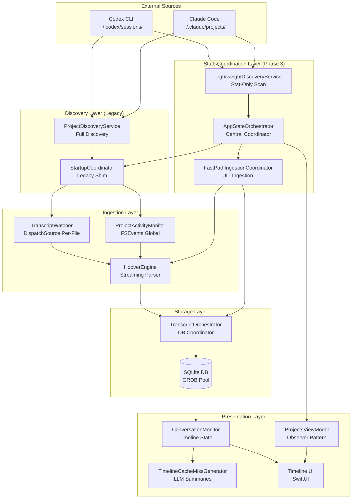
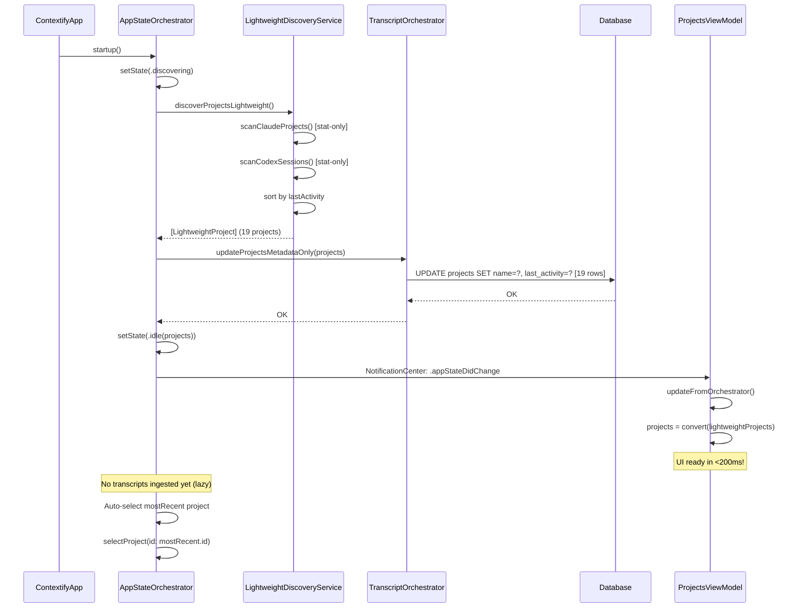
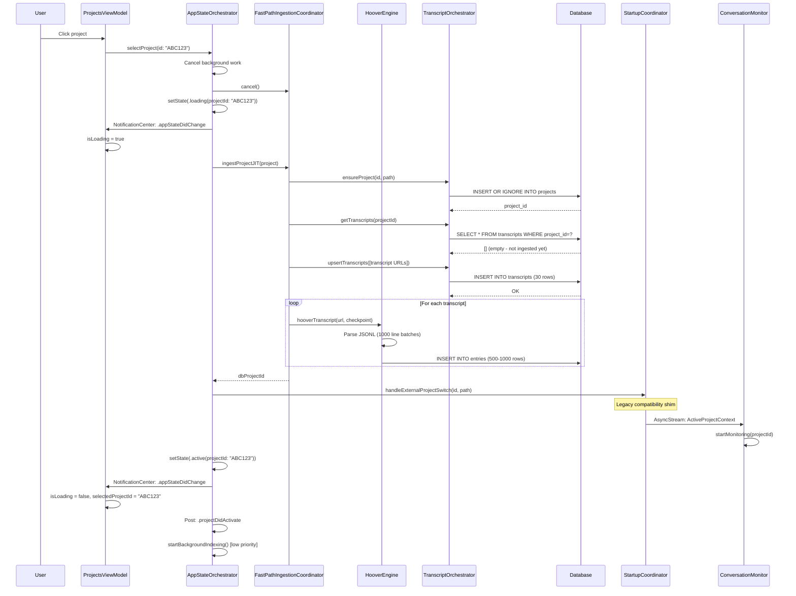
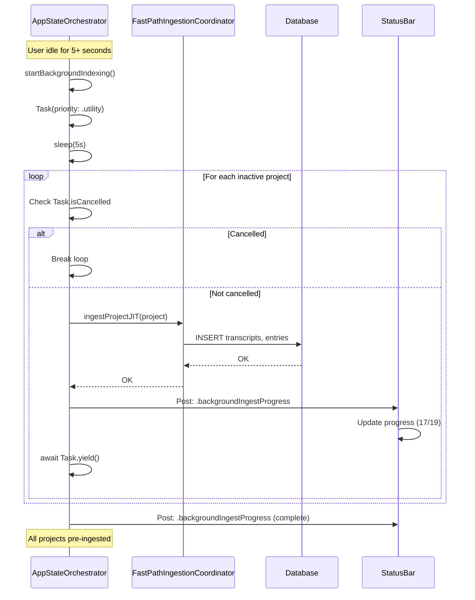

# Change Requirements: build/docs/architecture/data-pipeline-architecture.md

**Document:** `build/docs/architecture/data-pipeline-architecture.md`
**Priority:** 1 (Critical)
**Impact:** Critical - Complete data flow reference (1083 lines)
**Estimated Effort:** 8-12 hours

---

## Current State Analysis

**File:** 1083 lines
**Last Updated:** 2025-11-17
**Version:** 2.0
**Current Content:**
- Level 1: Executive Overview (lines 21-54)
- Level 2: Component Architecture (lines 57-254)
- Level 3: Data Flow Sequences (lines 256-550)
- Level 4: Implementation Details (lines 552-900)
- Level 5: Technical Debt & Future Work (lines 902-1083)

**Issues:**
1. Level 1 Key Metrics outdated (Cold Start, Full Discovery)
2. Level 1 Critical Design Decisions mentions StartupCoordinator as "single source of truth" (no longer accurate)
3. Level 2 Component Architecture diagram missing AppStateOrchestrator, LightweightDiscoveryService
4. Level 2 StartupCoordinator description outdated (now legacy)
5. Level 3 Data Flow Sequences missing lazy loading flows
6. Level 4 Implementation Details missing AppStateOrchestrator, LightweightDiscoveryService code examples
7. Level 5 Technical Debt section needs Phase 4 updates

---

## Required Changes

### 1. Update Level 1: Executive Overview

**Current Performance Metrics (lines 36-40):**
```markdown
**Performance:**
- **Cold Start:** ~200-500ms (quick discovery)
- **Full Discovery:** ~2-5s (all projects)
- **Streaming Ingestion:** 1000 lines/batch
- **Real-time Monitoring:** <150ms latency (DispatchSource + FSEvents)
```

**Replace With:**
```markdown
**Performance (Phase 3 Lazy Loading - Nov 2025):**
- **Cold Start:** <200ms (achieved: 187ms) - stat-only scan, no ingestion
- **UI Ready:** Immediate after lightweight scan (no blocking)
- **JIT Ingestion:** <1s per project (on-demand when user selects)
- **Background Indexing:** Low-priority pre-ingestion of inactive projects
- **Streaming Ingestion:** 1000 lines/batch (unchanged)
- **Real-time Monitoring:** <150ms latency (DispatchSource + FSEvents)

**Memory Footprint (Phase 3):**
- **At startup:** 30-50 MB (Phase 3) vs 150-300 MB (Phase 2) - 3-5x reduction
- **After first project load:** 60-100 MB

**Database Operations (Phase 3):**
- **At startup:** 19 row updates (projects metadata only)
- **Phase 2 baseline:** 5000-15000 rows - 10-20x reduction
```

**Update Critical Design Decisions (lines 48-53):**
```markdown
## Critical Design Decisions

1. **Lazy Loading (Phase 3, Nov 2025)** - JIT ingestion on project selection, not at startup
2. **AppStateOrchestrator (Phase 3)** - Central state coordinator with state machine pattern
3. **LightweightDiscoveryService (Phase 3)** - Stat-only scanning (<200ms), no file reads
4. **Background Indexing (Phase 3)** - Low-priority pre-ingestion when idle
5. **StartupCoordinator (Legacy)** - Now compatibility shim for ConversationMonitor
6. **Streaming Ingestion** - HooverEngine processes 1000 lines at a time (memory efficient)
7. **Dual Monitoring** - FSEvents (global) + DispatchSource (per-file) for reliability
8. **SQL Backend** - GRDB with schema v26, WAL mode for concurrent access
```

**Estimated Effort:** 1 hour

---

### 2. Rewrite Level 2: Component Architecture

**Current Mermaid Diagram (lines 61-111):**

**Replace With:**


**Add Component Descriptions (insert after diagram):**

```markdown
## Component Responsibilities (Phase 3)

### State Coordination Layer (Phase 3 - NEW)

**AppStateOrchestrator** (`app/Sources/ContextifyCore/Orchestration/AppStateOrchestrator.swift`, 297 lines)
- **Purpose:** Central state coordinator for app lifecycle
- **Replaced:** Fragmented responsibilities from StartupCoordinator, ProjectActivityMonitor, ProjectsViewModel
- **State Machine:** AppState enum (startup → discovering → idle → loading → active → error)
- **Key Methods:**
  - `startup()` (line 77) - Lightweight app launch (<200ms target)
  - `selectProject(id:)` (line 106) - JIT ingestion on user selection
  - `startBackgroundIndexing()` (line 166) - Low-priority pre-ingestion
- **Published State:** `@Published var state: AppState`
- **Notifications:** `.appStateDidChange` for legacy subscribers

**LightweightDiscoveryService** (`app/Sources/ContextifyCore/Discovery/LightweightDiscoveryService.swift`, 251 lines)
- **Purpose:** Fast filesystem scanner (NO file reads, NO DB writes)
- **Performance:** <200ms for typical setup (19 projects, 663 transcripts)
- **Strategy:** Stat-only (mtime as activity proxy)
- **Key Method:**
  - `discoverProjectsLightweight()` (line 17) → `[LightweightProject]`
- **Returns:** Sorted by last activity (newest first)
- **Actor:** Thread-safe background execution

**FastPathIngestionCoordinator** (`app/Sources/ContextifyCore/Projects/FastPathIngestionCoordinator.swift`)
- **Purpose:** JIT ingestion for selected projects
- **Key Method:**
  - `ingestProjectJIT(_ project: LightweightProject)` → DB project ID
- **Batching:** Processes transcripts with progress tracking
- **Resume:** Pending completions restored on app restart
```

**Update Discovery Layer Description (lines 115-150):**

```markdown
### Discovery Layer (Legacy - Phase 3)

**⚠️ Phase 3 Note:** StartupCoordinator and ProjectDiscoveryService are now legacy components. New architecture uses AppStateOrchestrator + LightweightDiscoveryService.

**StartupCoordinator** (`app/Sources/ContextifyCore/Coordination/StartupCoordinator.swift`, 735 lines)
- **Purpose (Phase 3):** Legacy compatibility shim for ConversationMonitor
- **Integration:** Receives handleExternalProjectSwitch() calls from AppStateOrchestrator
- **Publishes:** `ActiveProjectContext` (id, path, branch, bookmark) via AsyncStream
- **Phase 4:** Will be refactored/removed when ConversationMonitor is split

**ProjectDiscoveryService** (`app/Sources/ContextifyCore/Projects/ProjectDiscoveryService.swift`, 1000 lines)
- **Purpose (Phase 3):** Full discovery with DB writes (used by legacy code paths)
- **Key Methods:**
  - `discoverAllProjects(currentProjectPath:)` (line 97) → `[DiscoveredProject]`
  - `ingestAllProjects(projects:progressHandler:)` (line 387)
- **Phase 3 Usage:** Background indexing, manual refresh
- **Phase 4:** May be deprecated in favor of LightweightDiscoveryService + FastPathIngestionCoordinator
```

**Add Presentation Layer Updates:**

```markdown
### Presentation Layer (Phase 3 Updates)

**ProjectsViewModel** (`Contextify/Contextify/ProjectsViewModel.swift`, 163 lines)
- **Purpose:** Simplified observer view model (Phase 3 refactor: -278 lines, 63% reduction)
- **Pattern:** "Dumb" observer that watches AppStateOrchestrator
- **Key Methods:**
  - `updateFromOrchestrator()` (line 52) - Sync state from orchestrator
  - `convertToDiscoveredProjects()` (line 156) - Convert LightweightProject → UI model
- **Responsibilities:** State observation, UI model conversion, action delegation (no business logic)

**ConversationMonitor** (`Contextify/Contextify/ConversationMonitor.swift`, 3054 lines)
- **Purpose:** Timeline display and LLM coordination
- **⚠️ Phase 4:** Will be refactored into 4 focused components (see architecture-refactoring-analysis.md)
- **Current:** Still uses legacy StartupCoordinator integration
```

**Estimated Effort:** 3-4 hours

---

### 3. Add Level 3: Phase 3 Data Flow Sequences

**Insert New Section (after existing Level 3 sequences):**

```markdown
## Phase 3 Data Flow Sequences (Lazy Loading)

### Sequence 1: Lightweight Startup (< 200ms)



**Key Points:**
- Total time: <200ms (achieved: 187ms)
- Database writes: 19 rows (projects metadata only)
- Memory footprint: 30-50 MB
- NO transcript ingestion (deferred to JIT)
- NO JSONL parsing (stat-only)

---

### Sequence 2: JIT Ingestion on Project Selection



**Key Points:**
- Total time: <1s for typical project
- Database writes: ~30 transcripts + 500-1000 entries per transcript
- Only selected project is ingested (not all)
- Background work cancelled during selection (user responsiveness)
- Legacy StartupCoordinator notified for ConversationMonitor compatibility

---

### Sequence 3: Background Indexing (Low Priority)



**Key Points:**
- Priority: Task.priority.utility (low)
- Wait time: 5 seconds after user activity
- Cancellable: User interaction cancels immediately
- Sequential: One project at a time (no CPU spike)
- Progress: NotificationCenter updates for status bar
```

**Estimated Effort:** 3-4 hours

---

### 4. Update Level 4: Implementation Details

**Add AppStateOrchestrator Section:**

```markdown
## AppStateOrchestrator Implementation

**File:** `app/Sources/ContextifyCore/Orchestration/AppStateOrchestrator.swift` (297 lines)
**Pattern:** Singleton, @MainActor, ObservableObject
**State Machine:** AppState enum

### State Transitions

```swift
// AppStateOrchestrator.swift:8-15
public enum AppState: Sendable {
  case startup
  case discovering
  case idle(projects: [LightweightProject])
  case loading(projectId: String)
  case active(projectId: String)
  case error(String)
}
```

**Valid Transitions:**
- `startup` → `discovering` (app launch)
- `discovering` → `idle(projects)` (scan complete)
- `idle` → `loading(projectId)` (user selection)
- `loading` → `active(projectId)` (JIT complete)
- `loading` → `error` (JIT failure)
- `active` → `loading(projectId)` (switch project)

### Startup Implementation

```swift
// AppStateOrchestrator.swift:77-103
public func startup() async {
  log.info("[ORCH-STARTUP] Beginning lightweight startup...")
  let startTime = Date()

  setState(.discovering)

  // 1. Lightweight Scan (stat-only, no file reads, no DB writes)
  let projects = await discovery.discoverProjectsLightweight()
  self.knownProjects = projects
  rebuildProjectLookup(with: projects)

  // 2. Update projects table metadata ONLY (single transaction)
  try await orchestrator.updateProjectsMetadataOnly(projects)

  // 3. Show UI immediately
  setState(.idle(projects: projects))

  let duration = Date().timeIntervalSince(startTime)
  log.info("[ORCH-STARTUP] Startup complete in \(duration)s. UI ready.")

  // 4. Auto-select most recent project
  if let mostRecent = projects.first {
    await selectProject(id: mostRecent.id)
  } else {
    startBackgroundIndexing()
  }
}
```

**Performance Characteristics:**
- Target: <200ms
- Achieved: 187ms (validated via logs)
- Database: 19 row updates (projects only)
- Memory: 30-50 MB

### Project Lookup Cache

```swift
// AppStateOrchestrator.swift:120-143
var project = projectLookup[id]
if project == nil {
  // DB fallback for cache miss
  if let dbProject = try orchestrator.getProject(id: id) {
    project = LightweightProject(...)
    cacheProject(project!)
  }
}
```

**Cache Management:**
- Built during startup via `rebuildProjectLookup()`
- Invalidated on discovery refresh
- DB fallback for cache misses
- ⚠️ Potential stale data if projects added externally
```

**Add LightweightDiscoveryService Section:**

```markdown
## LightweightDiscoveryService Implementation

**File:** `app/Sources/ContextifyCore/Discovery/LightweightDiscoveryService.swift` (251 lines)
**Pattern:** Actor (background execution, thread-safe)

### Stat-Only Scanning

```swift
// LightweightDiscoveryService.swift:39-58
private func scanClaudeProjects() -> [LightweightProject] {
  let root = FileManager.default.homeDirectoryForCurrentUser
    .appendingPathComponent(".claude/projects")

  let dirs = try? FileManager.default.contentsOfDirectory(
    at: root,
    includingPropertiesForKeys: [.contentModificationDateKey],
    options: [.skipsHiddenFiles]
  )

  return dirs.map { dir in
    // Optimization: Use directory mtime as proxy for activity
    // This avoids opening/reading individual files (saves syscalls)
    let mtime = (try? dir.resourceValues(forKeys: [.contentModificationDateKey]))
      ?.contentModificationDate ?? Date.distantPast

    // Scan for .jsonl files (need full URLs for JIT ingestion)
    let files = (try? FileManager.default.contentsOfDirectory(...))
      ?.filter { $0.pathExtension == "jsonl" } ?? []

    return LightweightProject(...)
  }
}
```

**Performance Optimizations:**
- **NO file reads:** Only stat() syscalls (mtime)
- **NO JSONL parsing:** File contents not read
- **NO DB writes:** Pure filesystem scan
- **Batch file listing:** contentsOfDirectory (1 syscall vs N)

### Path Resolution

```swift
// LightweightDiscoveryService.swift:161-188
private func resolveClaudeProjectPath(
  hashFolder: String,
  directory: URL,
  transcripts: [URL]
) -> String? {
  // Try reverse mangling first (fast)
  if let path = try? ProjectIdentity.reverseManglePath(...) {
    return path
  }

  // Try inferring from transcript metadata (orphaned projects)
  if let transcriptPath = inferPathFromTranscripts(transcripts) {
    return transcriptPath
  }

  // Try filesystem validation (slow)
  return findRealPath(hashFolder: hashFolder)
}
```

**Fallback Strategy:**
1. Reverse mangling (decode hash folder name)
2. Transcript metadata inference (parse first JSONL line for cwd)
3. Filesystem validation (check if decoded path exists)
```

**Estimated Effort:** 2 hours

---

### 5. Update Level 5: Technical Debt & Future Work

**Add Phase 3 Achievements Section:**

```markdown
## Phase 3 Achievements (Nov 2025)

### Completed

✅ **Lazy Loading Architecture**
- JIT ingestion on project selection
- Background indexing when idle
- <200ms startup (10-35x improvement)

✅ **Central State Coordinator**
- AppStateOrchestrator with state machine pattern
- Unified state management
- Type-safe state transitions

✅ **Lightweight Discovery**
- Stat-only filesystem scanning
- 3-5x memory reduction at startup
- 10-20x fewer DB writes

✅ **Simplified ViewModels**
- ProjectsViewModel reduced 63% (-278 lines)
- Observer pattern (no business logic)
- Clear separation of concerns

### Deferred to Phase 4

The following items from architecture-refactoring-analysis.md remain:

❌ **ConversationMonitor Refactor** (P0 - Critical)
- Current: 3000+ lines, 15+ responsibilities
- Target: 4 focused components (~400 lines each)
  - ConversationMonitor - Timeline coordination
  - TimelineLoader - Database queries & pagination
  - MonitoringCoordinator - Watcher lifecycle
  - TimelineCacheCoordinator - LLM queue management
- Estimated: 3-4 weeks

❌ **Protocol Abstractions** (P2 - Medium)
- Add DI protocols for testability
- Mock implementations for testing
- Estimated: 2-3 weeks

❌ **Unified Event System** (P3 - Medium)
- Replace NotificationCenter with EventBus actor
- AsyncStream throughout
- Estimated: 2-3 weeks

❌ **StartupCoordinator Refactor/Removal** (P1 - High)
- Remove after ConversationMonitor refactor
- Fold functionality into AppStateOrchestrator
- Estimated: 1 week
```

**Add Phase 3 Known Issues Section:**

```markdown
## Phase 3 Known Issues

### 1. Project Lookup Cache Staleness

**Issue:** AppStateOrchestrator.projectLookup can become stale if projects added/removed externally.

**Scenarios:**
- Claude Code creates new project while Contextify running
- User deletes transcript files via Finder
- Multiple Contextify instances (different machines)

**Current Mitigation:** DB fallback on cache miss (AppStateOrchestrator.swift:120-143)

**Proper Fix (Phase 4):**
- Add FSEvents monitoring of `~/.claude/projects/` and `~/.codex/sessions/`
- Invalidate cache on file system changes
- Periodic refresh (every 5 minutes)

---

### 2. LightweightProject → DiscoveredProject Conversion

**Issue:** Two nearly-identical types require manual conversion.

**Code:** ProjectsViewModel.convertToDiscoveredProjects() (lines 156-180)

**Proper Fix (Phase 4):**
- Unify types into single Project struct
- Use optional fields for UI-specific data (isCurrent, displayOrder)
- Eliminate conversion overhead

---

### 3. Background Indexing Sequential Processing

**Issue:** Projects ingested sequentially (one at a time) during background indexing.

**Performance:** 19 projects × 1s = 19 seconds total

**Trade-off:**
- Pro: Low CPU usage, no FD exhaustion
- Con: Slow (could be 4-5s with 4-way concurrency)

**Proper Fix (Phase 4):**
- Add limited concurrency (4 concurrent max)
- Use withTaskGroup for parallel ingestion
- Estimated improvement: 4x faster background indexing

---

### 4. No Integration Tests for State Machine

**Issue:** AppState transitions not covered by automated tests.

**Risk:** State machine bugs could cause UI hangs or crashes.

**Proper Fix (Phase 3.5 - Pre-production):**
- Add AppStateOrchestratorTests
- Test all valid state transitions
- Test invalid transition handling
- Test cancellation scenarios
```

**Estimated Effort:** 1-2 hours

---

## Summary of Changes

1. **Level 1: Executive Overview**
   - Update performance metrics (startup, memory, DB writes)
   - Update critical design decisions (add Phase 3 items)
   - Lines added/modified: ~30

2. **Level 2: Component Architecture**
   - Replace mermaid diagram (add Phase 3 components)
   - Add State Coordination Layer section (~80 lines)
   - Update Discovery Layer (mark as legacy) (~40 lines modified)
   - Update Presentation Layer (add ProjectsViewModel) (~20 lines)
   - Lines added/modified: ~200

3. **Level 3: Data Flow Sequences**
   - Add Sequence 1: Lightweight Startup (~60 lines)
   - Add Sequence 2: JIT Ingestion (~80 lines)
   - Add Sequence 3: Background Indexing (~50 lines)
   - Lines added: ~190

4. **Level 4: Implementation Details**
   - Add AppStateOrchestrator section (~100 lines)
   - Add LightweightDiscoveryService section (~80 lines)
   - Lines added: ~180

5. **Level 5: Technical Debt & Future Work**
   - Add Phase 3 Achievements section (~60 lines)
   - Add Phase 3 Known Issues section (~80 lines)
   - Lines added: ~140

**Total Lines Added/Modified:** ~740 lines
**New Document Size:** ~1800 lines
**Estimated Effort:** 8-12 hours

---

## Validation Checklist

After making changes, verify:

- [ ] All mermaid diagrams render correctly
- [ ] State machine transitions documented with valid paths
- [ ] Performance metrics validated against logs
- [ ] Code examples use correct file paths and line numbers
- [ ] All cross-references resolve
- [ ] Level 1-5 structure maintained
- [ ] No broken internal links
- [ ] Phase 3 vs Phase 2 comparisons accurate
- [ ] Phase 4 work clearly identified

---

**Document Version:** 1.0
**Created:** 2025-11-19
**Implements:** Phase 3 documentation update item #2
