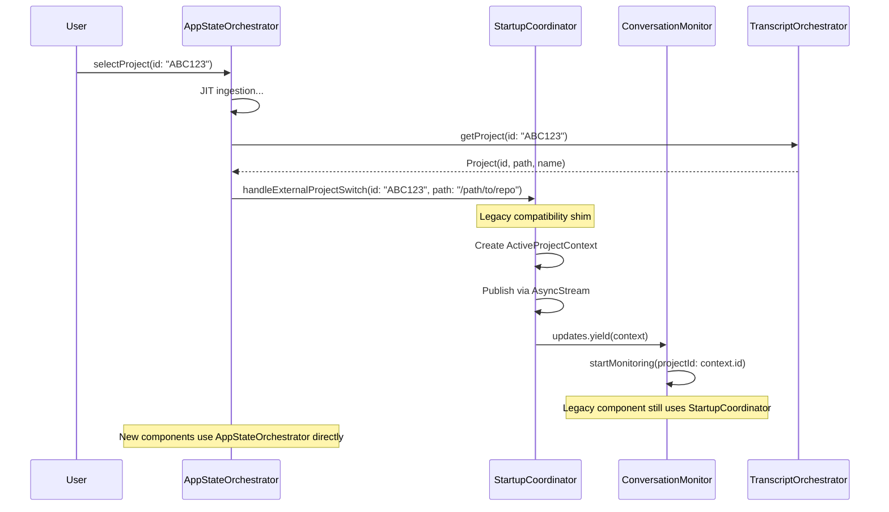

# Change Requirements: build/docs/architecture/startup-coordinator.md

**Document:** `build/docs/architecture/startup-coordinator.md`
**Priority:** 1 (Critical)
**Impact:** High - Describes startup sequencing (role changed in Phase 3)
**Estimated Effort:** 3-4 hours

---

## Current State Analysis

**File:** Comprehensive startup coordinator documentation
**Current Description:** StartupCoordinator as "single source of truth" for project identity
**Current Content:**
- Describes StartupCoordinator as primary project identity coordinator
- Documents ActiveProjectContext
- Explains initialization flow
- Details resolution algorithm

**Issues:**
1. **Outdated Role:** Describes StartupCoordinator as primary coordinator (now legacy shim)
2. **Missing Context:** No mention of AppStateOrchestrator (actual primary coordinator)
3. **Integration Unclear:** Doesn't explain how StartupCoordinator integrates with Phase 3 architecture
4. **No Deprecation Notice:** Doesn't warn that this will be refactored in Phase 4

---

## Required Changes

### 1. Add Deprecation/Role Change Notice at Top

**Location:** Insert immediately after title/metadata

**Content:**

```markdown
---

## ⚠️ Phase 3 Architecture Change (Nov 2025)

**Role Changed:** StartupCoordinator is now a **legacy compatibility shim** for backward compatibility with ConversationMonitor and other pre-Phase 3 components.

**Primary Coordinator (Phase 3):** `AppStateOrchestrator`
- Central state coordinator with state machine pattern
- Owns project selection, discovery, and ingestion orchestration
- See: `build/docs/architecture/COMPONENTS.md` - "Application State Coordination"

**StartupCoordinator (Legacy):**
- Receives project switch notifications from AppStateOrchestrator via `handleExternalProjectSwitch()`
- Publishes `ActiveProjectContext` updates for legacy subscribers (ConversationMonitor)
- Will be refactored/removed in Phase 4 when ConversationMonitor is split

**For New Development:** Use AppStateOrchestrator directly. Only use StartupCoordinator if integrating with legacy components that haven't been updated to Phase 3 patterns.

**Phase 4 Plan:** Remove StartupCoordinator after ConversationMonitor refactor completes (see `build/docs/architecture/architecture-refactoring-analysis.md`).

---
```

**Estimated Effort:** 30 minutes

---

### 2. Add Integration with AppStateOrchestrator Section

**Location:** Insert before "Component Responsibilities" section

**Content:**

```markdown
## Integration with AppStateOrchestrator (Phase 3)

### Architecture Flow



### handleExternalProjectSwitch Method

**Added in Phase 3** to allow AppStateOrchestrator to notify StartupCoordinator of project changes:

```swift
// StartupCoordinator.swift (Phase 3 addition)
public func handleExternalProjectSwitch(id: String, path: String) async throws {
  // Create ActiveProjectContext from AppStateOrchestrator notification
  let context = ActiveProjectContext(
    id: id,
    path: path,
    displayName: URL(fileURLWithPath: path).lastPathComponent,
    branch: nil, // Git detection handled separately
    bookmark: nil
  )

  // Notify legacy subscribers
  updates.yield(context)
}
```

**Purpose:** Bridge between Phase 3 architecture (AppStateOrchestrator) and legacy components (ConversationMonitor).

**When to Use:**
- ✅ ConversationMonitor integration (required until Phase 4 refactor)
- ✅ Other legacy components using `StartupCoordinator.shared.updates`
- ❌ New components (use AppStateOrchestrator directly)
```

**Estimated Effort:** 1 hour

---

### 3. Update Component Responsibilities Section

**Current:** Describes StartupCoordinator as primary

**Add Subsection:**

```markdown
### Phase 3 Role: Legacy Compatibility Shim

**Primary Responsibilities (Phase 3):**

1. **Receive External Notifications**
   - `handleExternalProjectSwitch(id:path:)` called by AppStateOrchestrator
   - Creates `ActiveProjectContext` from notification

2. **Publish to Legacy Subscribers**
   - ConversationMonitor still uses `StartupCoordinator.shared.updates`
   - Other pre-Phase 3 components may still subscribe

3. **Maintain Backward Compatibility**
   - Keeps existing APIs working during Phase 3 transition
   - Allows incremental migration to AppStateOrchestrator

**Deprecated Responsibilities (Moved to AppStateOrchestrator):**

1. ~~**Project Discovery**~~ → `LightweightDiscoveryService.discoverProjectsLightweight()`
2. ~~**Ingestion Orchestration**~~ → `FastPathIngestionCoordinator.ingestProjectJIT()`
3. ~~**State Management**~~ → `AppStateOrchestrator.state` (state machine)
4. ~~**Primary Coordinator**~~ → `AppStateOrchestrator` is now central coordinator
```

**Estimated Effort:** 30 minutes

---

### 4. Add Phase 4 Migration Guide Section

**Location:** End of document (before "References")

**Content:**

```markdown
## Phase 4 Migration Guide

### Refactoring Plan

**When:** Phase 4 (after ConversationMonitor split)
**Estimated:** Q1 2026 (2-4 months after Phase 3 production release)

**Steps:**

1. **Refactor ConversationMonitor** (P0 - Critical, 3-4 weeks)
   - Split into 4 focused components (TimelineLoader, MonitoringCoordinator, TimelineCacheCoordinator, ConversationMonitor)
   - Update to use AppStateOrchestrator directly (not StartupCoordinator)

2. **Audit Legacy Subscribers** (1 week)
   - Find all uses of `StartupCoordinator.shared.updates`
   - Migrate to `AppStateOrchestrator.state` observation
   - Remove AsyncStream subscriptions

3. **Remove StartupCoordinator** (1 week)
   - Delete `app/Sources/ContextifyCore/Coordination/StartupCoordinator.swift`
   - Remove from ContextifyApp initialization
   - Update documentation

4. **Consolidate to AppStateOrchestrator** (1 week)
   - Move any remaining unique functionality to AppStateOrchestrator
   - Verify no regressions via integration tests

### Migration Patterns

**Before (Phase 3 - StartupCoordinator):**
```swift
// Legacy pattern
for await context in StartupCoordinator.shared.updates {
    self.activeProjectId = context.id
    self.projectPath = context.path
    await refreshTimeline()
}
```

**After (Phase 4 - AppStateOrchestrator):**
```swift
// New pattern
for await _ in NotificationCenter.default.notifications(named: .appStateDidChange) {
    let state = AppStateOrchestrator.shared.state

    switch state {
    case .active(let projectId):
        self.activeProjectId = projectId
        await refreshTimeline()
    default:
        break
    }
}
```

**Alternative (Observation Framework):**
```swift
// Using Swift Observation
@Observable
class MyViewModel {
    init() {
        // Observe published state directly
        // (SwiftUI will automatically subscribe)
    }

    func observeOrchestrator() {
        let orchestrator = AppStateOrchestrator.shared

        // Access via published property
        if case .active(let projectId) = orchestrator.state {
            self.activeProjectId = projectId
        }
    }
}
```

### Benefits of Migration

✅ **Simplified Architecture**
- One central coordinator (AppStateOrchestrator) instead of two
- Clear ownership of state
- State machine pattern enforces valid transitions

✅ **Reduced Coupling**
- No more StartupCoordinator → AppStateOrchestrator → StartupCoordinator roundtrip
- Direct observation of AppStateOrchestrator

✅ **Better Performance**
- Eliminate intermediate notification layer
- Fewer allocations (no ActiveProjectContext creation)

✅ **Type Safety**
- AppState enum provides compile-time guarantees
- Pattern matching catches unhandled states
```

**Estimated Effort:** 1 hour

---

### 5. Update All Code Examples

**Throughout Document:**

Add comments to code examples indicating Phase 3 status:

```swift
// Phase 3: Legacy pattern (will be removed in Phase 4)
for await context in StartupCoordinator.shared.updates {
    // ...
}

// Phase 4: Prefer AppStateOrchestrator directly
for await _ in NotificationCenter.default.notifications(named: .appStateDidChange) {
    let state = AppStateOrchestrator.shared.state
    // ...
}
```

**Estimated Effort:** 30 minutes

---

### 6. Add Cross-References Section

**Location:** End of document

**Content:**

```markdown
## Phase 3 Cross-References

**AppStateOrchestrator:**
- Architecture: `build/docs/architecture/COMPONENTS.md` - "Application State Coordination"
- Data flow: `build/docs/architecture/data-pipeline-architecture.md`
- Implementation: `app/Sources/ContextifyCore/Orchestration/AppStateOrchestrator.swift`

**Phase 3 Comparison:**
- Refactor analysis: `build/notes/phase3-refactor-comparison-analysis.md`
- Documentation tracker: `build/notes/phase3-documentation-update-master-list.md`

**Phase 4 Planning:**
- Refactoring roadmap: `build/docs/architecture/architecture-refactoring-analysis.md`
- ConversationMonitor split: `architecture-refactoring-analysis.md` (lines 489-601)
```

**Estimated Effort:** 15 minutes

---

## Summary of Changes

1. **Add:** Deprecation/role change notice at top (~25 lines)
2. **Add:** Integration with AppStateOrchestrator section (~60 lines with mermaid)
3. **Update:** Component Responsibilities (mark deprecated items) (~30 lines)
4. **Add:** Phase 4 Migration Guide (~100 lines with code examples)
5. **Update:** Code examples throughout (add Phase 3/4 comments) (~20 annotations)
6. **Add:** Cross-references section (~15 lines)

**Total Lines Added/Modified:** ~250 lines
**Estimated Effort:** 3-4 hours

---

## Validation Checklist

After making changes, verify:

- [ ] Deprecation notice prominently displayed at top
- [ ] AppStateOrchestrator integration clearly explained
- [ ] Mermaid diagram shows Phase 3 architecture flow
- [ ] Phase 4 migration patterns include working code examples
- [ ] All code examples annotated with Phase 3/4 status
- [ ] Cross-references resolve correctly
- [ ] No contradictions with COMPONENTS.md or data-pipeline-architecture.md
- [ ] Benefits of migration clearly articulated

---

**Document Version:** 1.0
**Created:** 2025-11-19
**Implements:** Phase 3 documentation update item #3
