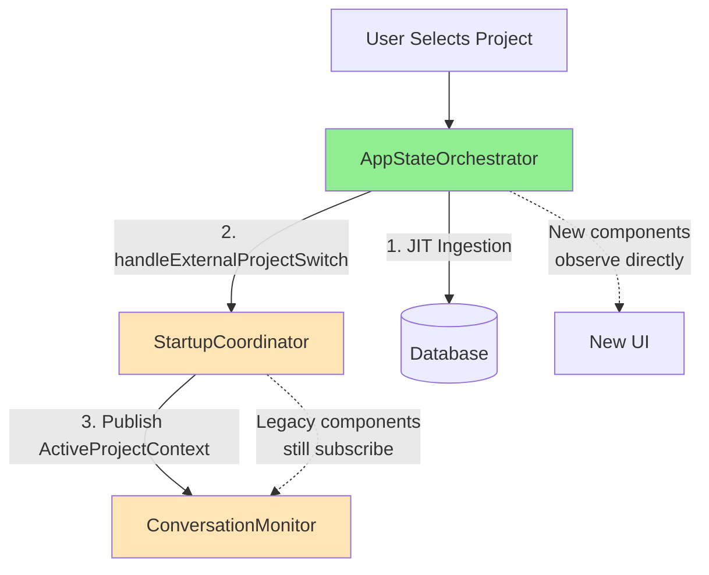

# Change Requirements: build/docs/components/startup-coordinator-implementation.md

**Document:** `build/docs/components/startup-coordinator-implementation.md`
**Priority:** 2 (Medium)
**Impact:** Medium - Implementation guide (role changed in Phase 3)
**Estimated Effort:** 2-3 hours

---

## Current State Analysis

**File:** Detailed implementation guide for StartupCoordinator
**Current Content:**
- Describes StartupCoordinator as primary project coordinator
- Implementation patterns
- AsyncStream usage
- Resolution algorithms

**Issues:**
1. Describes StartupCoordinator as primary (now legacy shim)
2. No mention of AppStateOrchestrator (actual primary)
3. No documentation of handleExternalProjectSwitch() integration
4. No Phase 4 deprecation timeline

---

## Required Changes

### 1. Add Role Change Notice

**Location:** Top of document (after title/metadata)

**Content:**

```markdown
---

## ⚠️ Phase 3 Role Change (Nov 2025)

**Status:** StartupCoordinator is now a **legacy compatibility shim**.

**Primary Coordinator:** `AppStateOrchestrator`
- See: `build/docs/architecture/COMPONENTS.md` - "Application State Coordination"
- See: `app/Sources/ContextifyCore/Orchestration/AppStateOrchestrator.swift`

**This Document:** Covers legacy integration patterns for components not yet migrated to Phase 3 architecture.

**For New Development:** Use AppStateOrchestrator directly.

**Phase 4:** StartupCoordinator will be removed after ConversationMonitor refactor completes.

---
```

**Estimated Effort:** 15 minutes

---

### 2. Add AppStateOrchestrator Integration Section

**Location:** Insert before existing implementation sections

**Content:**

```markdown
## Phase 3 Integration with AppStateOrchestrator

### Architecture Pattern

In Phase 3, StartupCoordinator is called BY AppStateOrchestrator (not the other way around):



**Flow:**
1. User interaction → AppStateOrchestrator
2. AppStateOrchestrator performs JIT ingestion
3. AppStateOrchestrator calls StartupCoordinator.handleExternalProjectSwitch()
4. StartupCoordinator publishes ActiveProjectContext
5. Legacy components (ConversationMonitor) receive update

---

### handleExternalProjectSwitch Implementation

**Added in Phase 3** for AppStateOrchestrator integration:

```swift
// StartupCoordinator.swift (Phase 3 addition)
@MainActor
public func handleExternalProjectSwitch(id: String, path: String) async throws {
  logger.info("[COORD-EXTERNAL] Received project switch: id=\(id) path=\(path)")

  // 1. Create ActiveProjectContext from notification
  let context = ActiveProjectContext(
    id: id,
    path: path,
    displayName: URL(fileURLWithPath: path).lastPathComponent,
    branch: nil,  // Git detection may be done separately
    bookmark: nil
  )

  // 2. Update internal state
  self._current = context

  // 3. Notify legacy subscribers via AsyncStream
  continuation?.yield(context)

  logger.debug("[COORD-EXTERNAL] Context published to legacy subscribers")
}
```

**When Called:**
```swift
// AppStateOrchestrator.swift:145-152
try await StartupCoordinator.shared.handleExternalProjectSwitch(
  id: dbProjectId,
  path: realPath  // Use cwd if available (for Codex), else filesystem path
)
```

**Purpose:**
- Bridges AppStateOrchestrator (Phase 3) and ConversationMonitor (pre-Phase 3)
- Maintains backward compatibility during transition
- Will be removed in Phase 4

---

### Legacy Subscriber Pattern

**Components Still Using StartupCoordinator:**

```swift
// ConversationMonitor.swift (legacy pattern)
private func startObservingCoordinator() {
  coordinatorObservationTask = Task { @MainActor [weak self] in
    for await context in StartupCoordinator.shared.updates {
      logger.info("[MONITOR-COORD] Received project context: \(context.id)")
      await self?.handleContextUpdate(context)
    }
  }
}
```

**Will Migrate to AppStateOrchestrator in Phase 4:**

```swift
// ConversationMonitor.swift (Phase 4 pattern)
private func startObservingOrchestrator() {
  Task { @MainActor [weak self] in
    for await _ in NotificationCenter.default.notifications(named: .appStateDidChange) {
      let state = AppStateOrchestrator.shared.state

      if case .active(let projectId) = state {
        await self?.handleProjectActivation(projectId)
      }
    }
  }
}
```

---
```

**Estimated Effort:** 1 hour

---

### 3. Update Implementation Patterns Section

**Add Subsection:**

```markdown
### Phase 3 Pattern: Legacy Shim

**Current Role (Phase 3):**

StartupCoordinator receives notifications from AppStateOrchestrator and forwards to legacy components.

**Implementation:**

```swift
// StartupCoordinator.swift structure (simplified)
@MainActor
@Observable
public final class StartupCoordinator {
  // State
  private var _current: ActiveProjectContext?
  private var continuation: AsyncStream<ActiveProjectContext>.Continuation?

  // AsyncStream for legacy subscribers
  public var updates: AsyncStream<ActiveProjectContext> {
    AsyncStream { continuation in
      self.continuation = continuation
      if let current = _current {
        continuation.yield(current)  // Yield current state immediately
      }
    }
  }

  // Phase 3: Receive external notifications
  public func handleExternalProjectSwitch(id: String, path: String) async throws {
    let context = ActiveProjectContext(id: id, path: path, ...)
    self._current = context
    continuation?.yield(context)  // Notify subscribers
  }

  // Legacy: Direct project switching (pre-Phase 3 API)
  public func switchProject(to path: String) async throws {
    // NOTE: In Phase 3, this calls AppStateOrchestrator
    await AppStateOrchestrator.shared.selectProject(id: /* derived from path */)
    // AppStateOrchestrator will call handleExternalProjectSwitch
  }
}
```

**Key Points:**
- `updates` AsyncStream still works (backward compatibility)
- `handleExternalProjectSwitch()` is the new integration point
- Legacy `switchProject()` redirects to AppStateOrchestrator

---
```

**Estimated Effort:** 30 minutes

---

### 4. Add Phase 4 Deprecation Section

**Location:** End of document

**Content:**

```markdown
## Phase 4 Deprecation Plan

### Timeline

**Phase 3 (Current):** StartupCoordinator as legacy shim
**Phase 3.5 (2-3 weeks):** Testing and stabilization
**Phase 4 (2-4 months):** ConversationMonitor refactor + StartupCoordinator removal

### Removal Steps

**Prerequisites:**
1. ✅ AppStateOrchestrator shipped (Phase 3)
2. ⏸️ ConversationMonitor split into 4 components (Phase 4)
3. ⏸️ All legacy subscribers migrated to AppStateOrchestrator
4. ⏸️ Integration tests confirm no regressions

**Step 1: Audit Subscribers (1 week)**
```bash
# Find all uses of StartupCoordinator
grep -r "StartupCoordinator.shared.updates" app/
grep -r "StartupCoordinator.shared.ready" app/
grep -r "StartupCoordinator.shared.switchProject" app/
```

Expected results:
- ConversationMonitor.swift (will be refactored)
- HUDViewModel.swift (may need migration)
- ProjectSwitcherState.swift (may need migration)

**Step 2: Migrate Components (2-3 weeks)**

For each subscriber:
```swift
// Before (StartupCoordinator)
for await context in StartupCoordinator.shared.updates {
  self.activeProjectId = context.id
}

// After (AppStateOrchestrator)
for await _ in NotificationCenter.default.notifications(named: .appStateDidChange) {
  if case .active(let projectId) = AppStateOrchestrator.shared.state {
    self.activeProjectId = projectId
  }
}
```

**Step 3: Remove StartupCoordinator (1 week)**
1. Delete `app/Sources/ContextifyCore/Coordination/StartupCoordinator.swift`
2. Delete `app/Sources/ContextifyCore/Models/ActiveProjectContext.swift`
3. Remove from ContextifyApp initialization
4. Update all documentation
5. Run full test suite

**Step 4: Verify (1 week)**
- Integration tests pass
- Manual QA (startup, project switching, timeline)
- Performance regression tests
- Documentation review

---

### Migration Benefits

✅ **Simplified Architecture**
- One central coordinator (AppStateOrchestrator)
- No dual state management

✅ **Better Performance**
- Eliminate intermediate notification layer
- Direct state observation

✅ **Type Safety**
- AppState enum vs opaque ActiveProjectContext
- Pattern matching catches unhandled states

✅ **Reduced Coupling**
- No circular dependency (ASO → SC → ASO)

---
```

**Estimated Effort:** 45 minutes

---

### 5. Update Code Examples Throughout

**Add Phase Status Comments:**

```swift
// Phase 3: Legacy pattern (will be removed in Phase 4)
for await context in StartupCoordinator.shared.updates {
  // ...
}

// Phase 4: Preferred pattern
for await _ in NotificationCenter.default.notifications(named: .appStateDidChange) {
  let state = AppStateOrchestrator.shared.state
  // ...
}
```

**Estimated Effort:** 15 minutes

---

## Summary of Changes

1. **Add:** Role change notice (~10 lines)
2. **Add:** AppStateOrchestrator integration section (~100 lines with mermaid)
3. **Update:** Implementation patterns (legacy shim) (~50 lines)
4. **Add:** Phase 4 deprecation plan (~80 lines)
5. **Update:** Code examples (Phase 3/4 annotations) (~15 annotations)

**Total Lines Added/Modified:** ~255 lines
**Estimated Effort:** 2-3 hours

---

## Validation Checklist

After making changes, verify:

- [ ] Role change notice prominently displayed
- [ ] handleExternalProjectSwitch() documented with code
- [ ] Mermaid diagram shows Phase 3 flow
- [ ] Legacy subscriber pattern explained
- [ ] Phase 4 migration steps detailed
- [ ] Code examples annotated with Phase status
- [ ] Removal prerequisites listed
- [ ] Migration benefits articulated
- [ ] Cross-references to AppStateOrchestrator

---

**Document Version:** 1.0
**Created:** 2025-11-19
**Implements:** Phase 3 documentation update item #6
