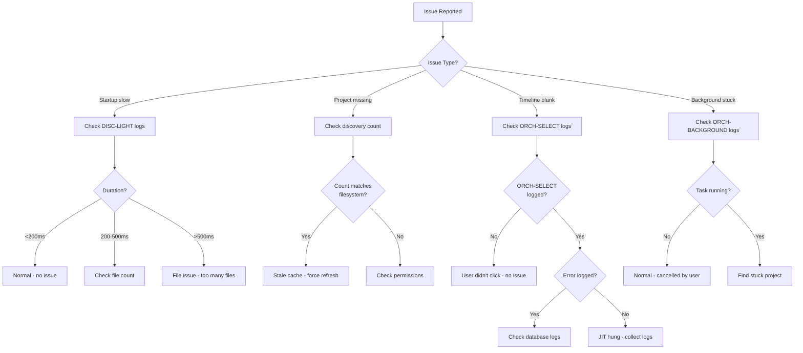

# Change Requirements: build/docs/guides/debugging-workflows.md

**Document:** `build/docs/guides/debugging-workflows.md`
**Priority:** 3 (User Guides)
**Impact:** Medium - Debugging guide (747 lines)
**Estimated Effort:** 3-4 hours

---

## Current State Analysis

**File:** 747 lines comprehensive debugging guide
**Current Content:**
- General debugging strategies
- Log analysis patterns
- Component-specific workflows
- Performance debugging

**Issues:**
1. No section for debugging lazy loading issues
2. No AppStateOrchestrator state transition debugging
3. Missing common Phase 3-specific failure modes
4. Log patterns don't include [ORCH-*] prefixes

---

## Required Changes

### 1. Add "Debugging Lazy Loading Issues" Section

**Location:** Insert after existing debugging sections

**Content:**

```markdown
## Debugging Lazy Loading Issues (Phase 3)

### Issue: Projects Not Appearing

**Symptoms:**
- Project exists in filesystem (`~/.claude/projects/` or `~/.codex/sessions/`)
- Not visible in Projects window
- No errors in logs

**Debug Workflow:**

**Step 1: Verify Discovery Ran**
```bash
# Check if lightweight scan completed
tail -100 ~/Library/Logs/Contextify/app.log | grep "DISC-LIGHT"

# Expected output:
# [DISC-LIGHT] Starting lightweight scan...
# [DISC-LIGHT] Found 663 Codex transcripts
# [DISC-LIGHT] Scan complete in 0.143s. Found 19 projects.
```

**Step 2: Check Project Count**
```bash
# Count should match filesystem
ls ~/.claude/projects/ | wc -l  # Claude projects
find ~/.codex/sessions -name "*.jsonl" | wc -l  # Codex transcripts

# Compare to log count
grep "Found.*projects" ~/Library/Logs/Contextify/app.log | tail -1
```

**Step 3: Examine State Transitions**
```bash
# Check orchestrator state flow
grep "ORCH-STATE" ~/Library/Logs/Contextify/app.log | tail -10

# Expected sequence:
# [ORCH-STATE] State changed to: discovering
# [ORCH-STATE] State changed to: idle(projects: ...)
# [ORCH-STATE] State changed to: loading(projectId: ...)
# [ORCH-STATE] State changed to: active(projectId: ...)
```

**Common Causes & Fixes:**

| Cause | Symptom | Fix |
|-------|---------|-----|
| Empty directory | No `.jsonl` files | Add transcript files |
| Permissions | "Access denied" in logs | Grant folder access (Settings > Permissions) |
| Hash folder decode failure | Wrong project name | Manual rename or wait for JIT |
| Stale cache | Count mismatch | Force refresh (Cmd+R) |

---

### Issue: JIT Ingestion Hangs

**Symptoms:**
- Project visible in list
- Click project → "Loading..." forever
- Timeline never appears

**Debug Workflow:**

**Step 1: Check Ingestion Started**
```bash
# Verify JIT ingestion began
tail -f ~/Library/Logs/Contextify/app.log | grep "ORCH-SELECT"

# Should see within 1s of click:
# [ORCH-SELECT] User selected project: <id>
# [ORCH-SELECT] Loading project: <name>
```

**Step 2: Check for Errors**
```bash
# Look for ingestion failures
grep -A5 "ORCH-SELECT.*Failed" ~/Library/Logs/Contextify/app.log

# Common errors:
# - "Project not found after DB fallback"
# - "Failed to load project: Database error"
# - "Ingestion failed: Parse error at line X"
```

**Step 3: Monitor Progress**
```bash
# Watch HooverEngine batches (should update every 1-2s)
tail -f ~/Library/Logs/Contextify/app.log | grep "HooverEngine"

# Expected:
# [HooverEngine] Processing batch 1/10 (1000 lines)
# [HooverEngine] Processing batch 2/10 (1000 lines)
# ...
```

**Common Causes & Fixes:**

| Cause | Symptom | Fix |
|-------|---------|-----|
| Corrupt JSONL | Parse error at line X | Repair transcript (see transcript-corruption-detection.md) |
| Database locked | "Database is locked" | Close other Contextify instances |
| Network drive | Very slow (>10s) | Move database to local disk |
| Out of memory | App crash during ingestion | Reduce batch size (requires code change) |

---

### Issue: Background Indexing Never Completes

**Symptoms:**
- Status bar shows "Indexing 5/19" indefinitely
- Projects remain unindexed
- No errors visible

**Debug Workflow:**

**Step 1: Check If Running**
```bash
# Verify background task is active
grep "ORCH-BACKGROUND" ~/Library/Logs/Contextify/app.log | tail -20

# Should see periodic updates:
# [ORCH-BACKGROUND] Starting background indexing...
# [ORCH-BACKGROUND] Ingested project: <id1>
# [ORCH-BACKGROUND] Ingested project: <id2>
```

**Step 2: Check for Cancellation**
```bash
# Look for cancellation events
grep "ORCH-BACKGROUND.*cancel" ~/Library/Logs/Contextify/app.log

# Cancellation triggers:
# - User clicked another project
# - App went to background
# - User quit app
```

**Step 3: Find Stuck Project**
```bash
# Identify which project is stuck
grep "ORCH-BACKGROUND" ~/Library/Logs/Contextify/app.log | tail -50 | grep -v "Ingested"

# Last project mentioned before silence is likely stuck
```

**Common Causes & Fixes:**

| Cause | Symptom | Fix |
|-------|---------|-----|
| Task cancelled | "Indexing cancelled" in logs | Normal - wait for idle period |
| Ingestion error | Silent failure | Check specific project logs |
| Very large project | Stuck on one project >30s | Normal for 10k+ entry projects |
| FD exhaustion | "Too many open files" | Restart app (rare) |

---

### Issue: State Machine Stuck

**Symptoms:**
- UI stuck in "Loading..." state
- Can't switch projects
- App unresponsive

**Debug Workflow:**

**Step 1: Check Current State**
```bash
# Get last known state
grep "ORCH-STATE" ~/Library/Logs/Contextify/app.log | tail -1

# If stuck in .loading(projectId:), ingestion failed
```

**Step 2: Look for Error State**
```bash
# Check if error state was reached
grep "ORCH-STATE.*error" ~/Library/Logs/Contextify/app.log

# Error states should show user-facing message
```

**Step 3: Check for Missing Transition**
```bash
# Trace state transitions
grep "ORCH-STATE" ~/Library/Logs/Contextify/app.log | tail -20

# Valid sequence:
# startup → discovering → idle → loading → active

# Invalid (stuck):
# startup → discovering → loading → (no further transition)
```

**Common Causes & Fixes:**

| Cause | Symptom | Fix |
|-------|---------|-----|
| Uncaught exception | State frozen | Bug - file issue with logs |
| Missing setState() | No state change logged | Bug - file issue |
| Deadlock | App completely frozen | Force quit, file issue |

**Emergency Fix:** Restart app (state machine reinitializes)

---
```

**Estimated Effort:** 2 hours

---

### 2. Add "Debugging AppStateOrchestrator" Section

**Location:** After lazy loading section

**Content:**

```markdown
## Debugging AppStateOrchestrator State Transitions

### Understanding State Machine

**AppState enum:**
```swift
case startup               // Initial launch
case discovering           // Lightweight scan in progress
case idle(projects: [...]) // UI ready, no project active
case loading(projectId:)   // JIT ingestion in progress
case active(projectId:)    // Project fully loaded
case error(String)         // Error state
```

**Valid Transitions:**
```
startup → discovering → idle → loading → active
                         ↓        ↓
                       error ← ─ ┘
```

**Invalid Transitions (bugs if seen):**
- startup → loading (skipped discovery)
- loading → idle (failed without error)
- active → discovering (restart without cleanup)

### Trace State Transitions

**Real-time Monitoring:**
```bash
# Watch state changes live
tail -f ~/Library/Logs/Contextify/app.log | grep "ORCH-STATE"

# Expected startup sequence:
# [ORCH-STATE] State changed to: discovering
# [ORCH-STATE] State changed to: idle(projects: [count=19])
# [ORCH-STATE] State changed to: loading(projectId: "ABC123")
# [ORCH-STATE] State changed to: active(projectId: "ABC123")
```

**Post-Mortem Analysis:**
```bash
# Extract all state transitions from session
grep "ORCH-STATE" ~/Library/Logs/Contextify/app.log | \
  awk '{print $1, $2, $NF}' | \
  uniq

# Should show clean progression (no loops or skips)
```

### Validate State Invariants

**Check 1: Startup Always Completes**
```bash
# Every session should have idle state
grep "ORCH-STATE.*idle" ~/Library/Logs/Contextify/app.log | wc -l

# Should be >= 1 (at least one startup)
```

**Check 2: Loading Always Resolves**
```bash
# Every loading should have matching active or error
grep "ORCH-STATE.*loading" ~/Library/Logs/Contextify/app.log | wc -l
grep -E "ORCH-STATE.*(active|error)" ~/Library/Logs/Contextify/app.log | wc -l

# Counts should match (every load resolves)
```

**Check 3: No Invalid Transitions**
```bash
# Look for impossible sequences
grep "ORCH-STATE" ~/Library/Logs/Contextify/app.log | \
  awk '{print $NF}' | \
  paste - - | \
  grep -E "(loading.*discovering|active.*startup)"

# Should return nothing (no invalid transitions)
```

### Common State Machine Bugs

| Bug | Symptom | Detection | Fix |
|-----|---------|-----------|-----|
| Missing setState() | Silent failure | No state change logged | Add setState() call |
| Double transition | Skipped state | Gap in sequence | Add intermediate state |
| Uncaught error | Stuck in loading | No error/active logged | Add error handling |
| Race condition | Non-deterministic | Different runs show different sequences | Add synchronization |

---
```

**Estimated Effort:** 1 hour

---

### 3. Update Log Patterns Section

**Add Phase 3 Prefixes:**

```markdown
## Phase 3 Log Prefixes

**AppStateOrchestrator:**
- `[ORCH-STARTUP]` - Startup flow
- `[ORCH-SELECT]` - Project selection (JIT ingestion)
- `[ORCH-BACKGROUND]` - Background indexing
- `[ORCH-STATE]` - State machine transitions

**LightweightDiscoveryService:**
- `[DISC-LIGHT]` - Stat-only scanning
- `[DISC-LIGHT]` - Found project counts

**Legacy (will change in Phase 4):**
- `[COORD-*]` - StartupCoordinator (legacy shim)

**Examples:**
```
[ORCH-STARTUP] Beginning lightweight startup...
[DISC-LIGHT] Scan complete in 0.143s. Found 19 projects.
[ORCH-STATE] State changed to: idle(projects: ...)
[ORCH-SELECT] User selected project: ABC123
[ORCH-BACKGROUND] Starting background indexing...
```
```

**Estimated Effort:** 15 minutes

---

### 4. Add Troubleshooting Flowchart

**Location:** After debugging sections

**Content:**

```markdown
## Phase 3 Troubleshooting Flowchart


```

**Estimated Effort:** 45 minutes

---

## Summary of Changes

1. **Add:** Debugging lazy loading section (~200 lines)
2. **Add:** Debugging AppStateOrchestrator section (~120 lines)
3. **Update:** Log patterns (Phase 3 prefixes) (~30 lines)
4. **Add:** Troubleshooting flowchart (~40 lines)

**Total Lines Added/Modified:** ~390 lines
**New Document Size:** ~1140 lines (up from 747)
**Estimated Effort:** 3-4 hours

---

## Validation Checklist

After making changes, verify:

- [ ] All log patterns tested against actual logs
- [ ] State machine transitions validated
- [ ] Debug commands work as documented
- [ ] Flowchart renders correctly (mermaid)
- [ ] Common causes/fixes accurate
- [ ] Cross-references resolve
- [ ] Bash commands tested
- [ ] File paths correct

---

**Document Version:** 1.0
**Created:** 2025-11-19
**Implements:** Phase 3 documentation update item #9
